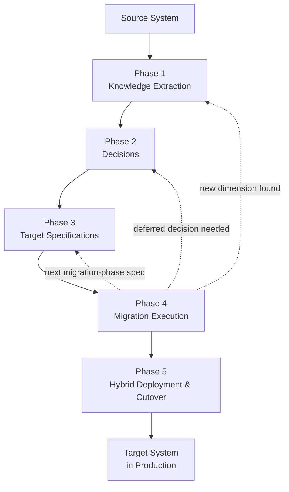
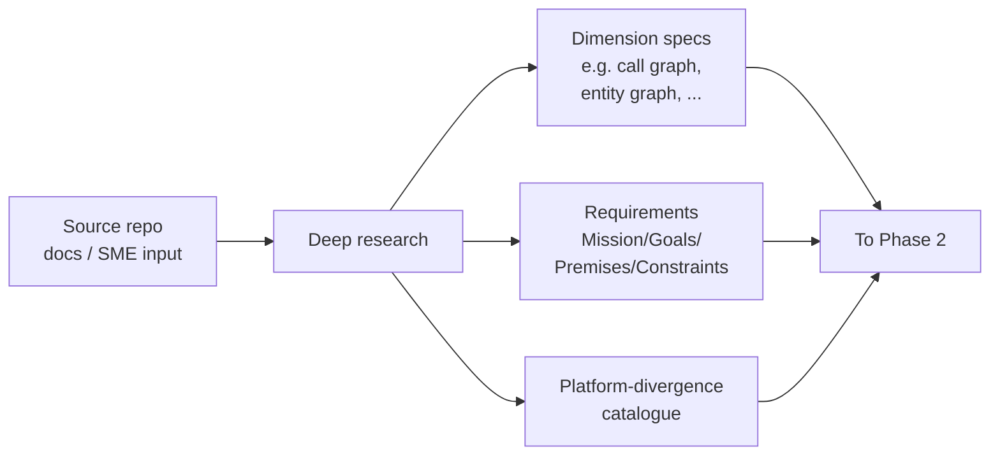
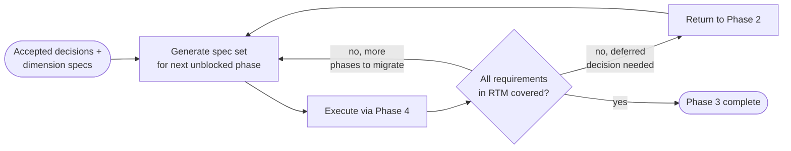
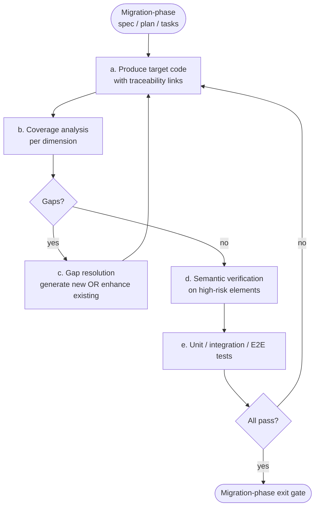
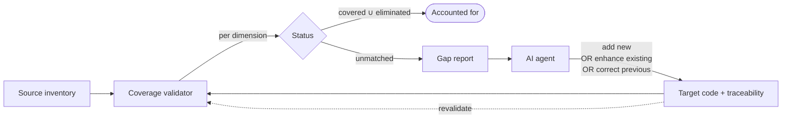
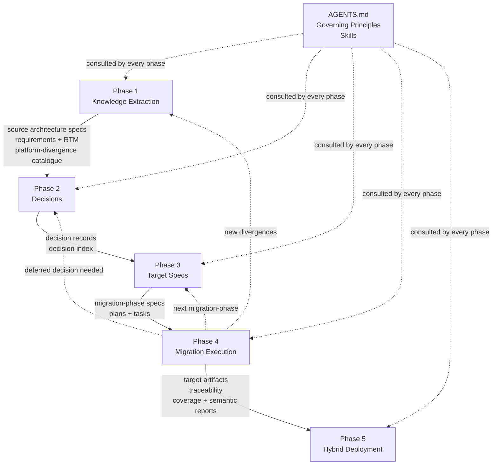

# AI-Assisted Software Migration Architecture

**A Dimension-Driven, Traceability-First Framework for Migrating Software Systems Across Technology Stacks**

---

## Abstract

This document describes a reproducible architecture for large-scale, AI-assisted software migration.
The framework is technology-agnostic: the same pipeline applies to language migrations,
framework shifts, monolith-to-microservices decompositions, data pipeline rewrites,
protocol library ports, and modernisations in which a single source repository
becomes many target repositories (or many sources consolidate into one).

The framework rests on one foundational concept and three operational mechanisms.

**Foundational concept — Dimensional Analysis.**
A _dimension_ is a structural axis along which source elements are related
(dependency graph, data-model graph, service graph, event flow, protocol state machine,
security surface, and so on). Dimensions are **discovered per project**, not prescribed.
They are the substrate on which the mechanisms below operate:
they drive knowledge extraction in Phase 1, partition work into migration phases in Phase 3,
and define the per-axis correspondence checks performed during coverage and semantic verification.
See the [Phase 1](#phase-1--knowledge-extraction) section for how
dimensions are inferred and the full catalogue in
[Appendix A](#appendix-a--dimension-catalogue).

**Supporting artifact — Platform-Divergence Catalogue.**
Alongside the dimension specifications, Phase 1 produces a project-specific
catalogue of platform-specific behavioural divergences mined from
deep research on the source and target technologies (for example,
"source-platform falsy-value semantics differ from target-platform",
"source-platform implicit transaction nesting is not portable",
"source-platform HTTP header handling requires explicit retention in target").
The catalogue grows through every later phase as new divergences surface during
semantic verification, and it feeds back into Gap Resolution and audit checklists.
See [Appendix F](#appendix-f--semantic-discrepancy-taxonomy) for a representative catalogue from one end-to-end reference project.

**Three operational mechanisms.**

- **Traceability** — every meaningful target element carries a link back to
  the source element(s) that shaped it _and_ to the specification(s) and decision(s)
  under which it was produced.
- **Coverage Validation** — programmatic comparison of the source inventory
  against the target traceability graph, producing a categorical status
  (covered / eliminated / unmatched) for every source element, broken down
  _per dimension_.
- **Gap Resolution** — a review cycle in which unmatched source elements
  are interpreted by an AI agent, placed into the target architecture,
  and either generate new target code or enhance existing target code.
  The same cycle rewrites or corrects previously generated target code
  when coverage analysis exposes behavioural or structural defects in it.

Together these mechanisms turn AI-assisted migration from a probabilistic,
best-effort activity into an auditable, measurable process
with an explicit and verifiable notion of _completeness_.

For a catalogue of artifacts produced by an end-to-end application of the framework,
see [Appendix B](#appendix-b--artifacts--lifecycle).

---

## Pipeline Overview

The framework is a five-phase pipeline. Phases 1–3 run once at project inception
(though they may be re-entered iteratively as evidence accumulates).
Phase 4 executes repeatedly — one migration phase per working session.
Phase 5 begins once enough of the target is ready to run alongside the source.

```text
  +--------------------------------------------------------------------+
  | PHASE 1. Knowledge Extraction                                      |
  |   Deep analysis of the source system across all relevant           |
  |   dimensions; mining of platform-divergence patterns.         |
  |   -> Source architecture specifications (one per dimension)        |
  |   -> Requirements document (Mission / Goals / Premises /           |
  |      Constraints) + Requirements Traceability Matrix               |
  |   -> Platform-divergence catalogue (platform-specific behavioural          |
  |      divergences discovered during research; grows through Phases 2-4) |
  +--------------------------------------------------------------------+
                              v
  +--------------------------------------------------------------------+
  | PHASE 2. Decisions                                                 |
  |   Propose target-architecture and migration-strategy options;      |
  |   accept each decision with product team, project architect, SMEs. |
  |   -> Decision records (priority-ordered; acceptance may be         |
  |      up-front, just-in-time, or parallel with implementation)      |
  +--------------------------------------------------------------------+
                              v
  +--------------------------------------------------------------------+
  | PHASE 3. Target Specifications                                     |
  |   ONE unified set of specs covering both the target architecture   |
  |   AND migration strategy (order, partitioning, exit gates).        |
  |   Generated iteratively from accepted decisions; specs for later   |
  |   migration phases may defer on decisions not yet needed.          |
  |   -> Migration-phase specifications (spec + plan + tasks)          |
  +--------------------------------------------------------------------+
                              v
  +--------------------------------------------------------------------+
  | PHASE 4. Migration Execution (per-migration-phase loop)            |
  |   Traceability + Coverage Validation + Gap Resolution +            |
  |   Semantic verification + Integration / End-to-end testing.        |
  |   Loops once per migration phase; each run produces target         |
  |   artifacts, reports, and a handoff note.                          |
  |   -> Target artifacts (code, schema, IaC, CI/CD, manifests)        |
  |   -> Coverage and semantic verification reports                    |
  |   -> Updates to the platform-divergence catalogue as new divergences surface      |
  +--------------------------------------------------------------------+
                              v
  +--------------------------------------------------------------------+
  | PHASE 5. Hybrid Deployment & Cutover                               |
  |   Staging deployment; source and target coexist in production;     |
  |   traffic is shifted progressively; the source system is           |
  |   decommissioned when all its responsibilities are covered.        |
  |   -> Coexistence architecture; cutover plan; sunset schedule       |
  +--------------------------------------------------------------------+
```

Every arrow in the diagram is a concrete artifact hand-off, not a narrative transition.
The pipeline is iterative: a Phase-4 discovery can send work back to Phase 3
(new migration-phase spec), Phase 2 (a deferred decision becomes needed),
or Phase 1 (a new dimension or pattern is discovered).
A complete artifact inventory is given in [Appendix B](#appendix-b--artifacts--lifecycle).

---

## Phase 1 — Knowledge Extraction

**Goal.** Produce a complete, evidence-based model of the source system
and bind it to the business intent of the migration.
Everything downstream is derived from what Phase 1 finds.

**Inputs.** Source repository (treated as read-only), domain documentation,
subject-matter-expert interviews, recorded walkthroughs, production configuration samples,
operational logs, and any external specifications or contracts the system implements.

**Outputs (three artifact families).**

1. **Source architecture specifications** — one per dimension discovered in the source
   (see the dimension sub-sections below).
2. **Requirements document** — Mission / Goals / Premises / Constraints
   plus a Requirements Traceability Matrix (RTM).
3. **Platform-divergence catalogue** — behavioural divergences between the source and target platforms
   (40+ categories in the reference project; see
   [Appendix F](#appendix-f--semantic-discrepancy-taxonomy)).
   The catalogue starts in Phase 1 and grows through every later phase.

Each output is self-contained and cross-references the source by relative path
and line number rather than duplicating source content.

### 1.1 Dimensions — what they are and what they are for

A _dimension_ is any axis along which source elements are related in a way that
materially constrains migration. Every software system exposes its own set;
the framework does not fix the list in advance.
Dimensions serve four operational purposes across the pipeline:

| Purpose               | Used in phase                                                       | Effect                                                                                        |
| --------------------- | ------------------------------------------------------------------- | --------------------------------------------------------------------------------------------- |
| Knowledge extraction  | Phase 1                                                             | Each dimension becomes a separate specification; together they form the complete source model |
| Phase ordering        | Phase 3 ([Appendix C](#appendix-c--flow-variants))                  | The "driving dimension" chosen as primary determines the flow variant and phase sequence      |
| Coverage verification | Phase 4                                                             | Coverage is reported _per dimension_ — edges, entities, endpoints, hook sites, pipeline steps |
| Semantic verification | Phase 4 ([Appendix G](#appendix-g--integration-pipeline-contracts)) | Integration-pipeline contracts are expressed as traversals of specific dimensions             |

#### Common dimensions

Real projects typically infer six to twelve dimensions; the catalogue in
[Appendix A](#appendix-a--dimension-catalogue) lists twenty-plus,
and [Appendix B](#appendix-b--artifacts--lifecycle) shows
the concrete set produced for one worked example.

| Dimension (examples)                             | Primary purpose it serves                                          |
| ------------------------------------------------ | ------------------------------------------------------------------ |
| Dependency graph between code elements           | Phase ordering + coverage per call-site                            |
| Data-model / entity graph                        | Phase ordering (models before business logic) + schema coverage    |
| Module / package graph                           | Phase ordering + build-order verification                          |
| File relationship graph (include / dynamic load) | File-level partitioning + coverage                                 |
| Frontend / backend coupling graph                | Semantic verification of cross-boundary contracts                  |
| Service dependency graph                         | Phase ordering for microservice decomposition                      |
| Event / message flow graph                       | Phase ordering + topic-by-topic cutover                            |
| Plugin and extension-point graph                 | Hook-site coverage + semantic parity for third-party integrations  |
| Data-pipeline topology (sources → sinks)         | Phase ordering for DAG migrations + pipeline-contract verification |
| Protocol state machine                           | Semantic parity for state transitions and timer behaviour          |
| Configuration / feature-flag surface             | Coverage of runtime toggles                                        |
| Security surface (auth, crypto, session)         | Semantic verification of trust boundaries                          |
| Concurrency and scheduling model                 | Semantic parity for ordering and deadline behaviour                |
| Regulatory / compliance boundary                 | Coverage of mandatory controls                                     |
| Hardware-abstraction layer                       | Phase ordering for embedded / IoT migrations                       |
| API contract surface (inbound / outbound)        | Coverage and semantic parity for external consumers                |

**On the source-file inventory.** Because the file relationship graph is itself a dimension,
there is no separate "table of files" artifact. The file-level view is one dimension
specification among others, produced by the same inventory and analysis step.

### 1.2 Requirements document

The requirements document has four mandatory components. They are **abstract and generic**:
the concrete name of the containing artifact depends on the governance model adopted.
Most current agent tooling (including the widely-adopted spec-kit) defaults to
Agile-flavoured containers; the framework is neutral over the choice — see
[Appendix B.1](#appendix-b--artifacts--lifecycle) for a short list of equivalents.

| Component       | Definition                                                             |
| --------------- | ---------------------------------------------------------------------- |
| **Mission**     | Single-sentence terminal value answering _why_ the migration exists    |
| **Goals**       | Concrete objectives that, if changed, change the solution type         |
| **Premises**    | Assumptions that must hold for the goals to be achievable              |
| **Constraints** | Hard (violation = rejection) and soft (violation = penalty) boundaries |

The four components are produced by combining bottom-up knowledge expansion
(which surfaces implicit Premises and Constraints) with top-down intent inference
(which identifies the Mission and freezes the Goals). The concrete prompt-engineering
method is documented in the [`requirements-extractor`](.agents/skills/requirements-extractor/)
skill; the framework cares only about the four-component output, not the procedure
that produced it.

Phase 1 also produces a **requirements traceability matrix** linking every requirement
to the dimension specification where it was discovered, the decision record(s)
where trade-offs about it will be resolved (Phase 2), and the migration-phase
specification(s) where it will be satisfied (Phase 3). The RTM is the primary device
that keeps every later phase mutually consistent.

#### The requirements framework is itself replaceable

The four-component shape (Mission / Goals / Premises / Constraints) is the
framework default because it fits nearly every established governance framework.
Projects with strong prior art in a different tradition may substitute any
equivalent quadruple. In practice even less-structured inputs work — a free-form
narrative inferred by the LLM directly from source, docs, and SME input can
stand in for the four-component document, as long as Phase 2 can still cite
stable "why?", "what?", "assumes?" and "must hold?" elements.

| Tradition               | **Terminal value**    | **Frozen objectives** | **Assumptions**       | **Constraints**        |
| ----------------------- | --------------------- | --------------------- | --------------------- | ---------------------- |
| Default (this document) | Mission               | Goals                 | Premises              | Constraints            |
| RUP Vision Document     | Vision                | Objectives            | Assumptions           | Constraints            |
| PMBOK Project Charter   | Purpose               | Objectives            | Assumptions           | Constraints            |
| Lean canvases           | Problem / Opportunity | Solution              | Key metrics           | Unfair advantages      |
| INCOSE                  | Stakeholder need      | System requirements   | Interface assumptions | Regulatory constraints |

The framework requires only that the substitute preserves three invariants:

- a **terminal value** that justifies all downstream work;
- a **set of frozen objectives** whose change forces re-planning;
- **auditable assumptions** and **auditable constraints** that feed Phase 2 decisions.

When the three invariants hold, the substitute slots in without further adaptation.
When they do not, the framework is either extended or the substitution is rejected
as a Phase-2 decision.

#### Governance-model neutrality

The choice of governance model is itself a first-phase decision.
Different models use different artifact containers for the four components:

| Governance model    | Typical container for the four components             |
| ------------------- | ----------------------------------------------------- |
| Agile               | Project charter; sprint zero charter                  |
| Waterfall           | Project definition plan plus work-breakdown structure |
| PRINCE2             | Project brief plus project initiation document        |
| PMBOK               | Project charter                                       |
| SAFe                | Portfolio vision plus solution intent                 |
| RUP                 | Vision document                                       |
| Regulated programme | Programme vision plus statement of architecture work  |
| Bespoke             | Project-specific container                            |

The framework is neutral over the container; the four components are mandatory;
the container name and the surrounding governance artifacts are project-specific.

### 1.3 Platform-divergence catalogue

Deep research on the source and target platforms invariably surfaces patterns
where the two behave differently despite superficially similar code.
These patterns are the most common source of silent semantic defects during migration,
and a project-specific catalogue of them pays for itself very quickly.
See [Appendix F](#appendix-f--semantic-discrepancy-taxonomy) for a representative
taxonomy, and [Appendix B](#appendix-b--artifacts--lifecycle) for how a concrete
catalogue was stored in one reference project.

Each catalogue entry records, at minimum:

- a stable code and name;
- the source-platform behaviour;
- the target-platform behaviour and where they diverge;
- a representative source / target code pair;
- an estimated frequency in the codebase;
- the recommended remediation.

The catalogue is a living artifact. It is seeded in Phase 1 from research
and SME input, grows in Phase 4 as new divergences surface during semantic verification,
and feeds every audit checklist thereafter.

---

## Phase 2 — Decisions

**Goal.** Propose every non-trivial target-architecture and migration-strategy choice,
accept each decision with the right stakeholders, and record the rationale
so that the decision is auditable and re-openable if circumstances change.

### 2.1 Decision records

Each decision is captured as a formal record
(MADR, ISO/IEC/IEEE 42010, Y-statements, or bespoke templates all work)
with the shape: context, considered options, trade-off analysis,
decision, consequences, confirmation criteria.
An index (and where useful, a dependency graph between decisions) is kept
alongside the records so that readers can navigate the full decision log.

### 2.2 Stakeholder acceptance

Decisions are not accepted by the framework — they are accepted by the people
responsible for the outcome. Each decision record nominates the deciders
and the parties consulted and informed. Typical roles are:

| Role                         | Accountable for                                                         |
| ---------------------------- | ----------------------------------------------------------------------- |
| Product team / product owner | Business impact; scope boundaries; feature keep / deprecate / enhance   |
| Project architect            | Target architecture coherence; flow variant; cross-decision consistency |
| Subject-matter experts (SME) | Domain-specific constraints; behavioural parity; regulatory boundaries  |
| Security / compliance lead   | Trust boundaries; credential handling; audit obligations                |
| Operations / platform lead   | Deployment topology; CI/CD; infrastructure-as-code; observability       |
| Development lead             | Implementability within team capability and timeline                    |

Multi-party review is what gives Phase 2 its value; a decision accepted
solely by the implementer is a design note, not a governance artifact.

### 2.3 Priority classes and acceptance modes

| Priority | Scope                                                     | Accepted before      |
| -------- | --------------------------------------------------------- | -------------------- |
| P0       | Blocks all work (flow variant, target stack, data engine) | Phase 3 can begin    |
| P1       | Blocks a specific migration phase (ORM, auth, workers)    | That migration phase |
| P2       | Deferrable, no blocking dependency                        | The final release    |

**Decisions may be accepted in deferred mode.** A decision does not have to be closed
during inception. The framework supports three acceptance modes explicitly:

- **Up-front.** P0 decisions are normally accepted in Phase 2 itself.
- **Just-in-time.** A P1 decision can remain in _proposed_ state until the migration phase
  that first needs it; the migration phase's entry gate then requires its acceptance.
- **Parallel with implementation.** A decision about an incremental concern
  (logging, observability, i18n) may evolve alongside early implementation
  as evidence accumulates; the decision is accepted once the design stabilises.

The framework explicitly supports decisions that are rejected or superseded later
as evidence changes; a superseded decision carries a forward link to its replacement
so that the full history remains auditable.

### 2.4 Option generation and consistency

**Option generation.** Each decision must contain at least two evaluated options
with trade-off analysis. Options can come from human architects, vendor proposals,
prior-art research, or iterative LLM-driven candidate generation.
[Appendix B.3](#appendix-b--artifacts--lifecycle) describes one structured
elimination-and-replacement protocol; the framework is agnostic to how options are sourced.

**Consistency constraint.** When the status of a decision changes
(proposed -> accepted, deprecated, superseded), every document that references that decision
must be updated atomically. Partial status updates are a leading source of
multi-session contradictions and must be treated as a build-breaking defect.
A concrete consistency checklist is captured in [Appendix B.2](#appendix-b--artifacts--lifecycle).

---

## Phase 3 — Target Specifications

**Goal.** Produce a single unified set of specifications that covers both
the target architecture _and_ the migration strategy — what to build,
in what order, under which decisions, with which exit gates.

### 3.1 Unified spec set

The framework does not separate "target architecture specs" from
"migration plan specs" — they are the same set of documents. Each migration
phase is described by three artifacts that together answer every question
a developer or reviewer needs:

- **What should this part of the target look like?** — target structure, interfaces, data contracts
- **What must this part preserve from the source?** — behavioural parity, invariants, edge cases
- **How do we get there?** — order of batches, dependencies, scope boundaries
- **When is it done?** — acceptance criteria, exit-gate checklist, coverage thresholds

> _Example (from the reference project — see [Appendix B.4](#appendix-b--artifacts--lifecycle)):_
> _the migration-phase spec for authentication answered all four questions in_
> _a single document — target structure (server-side session store), preserved_
> _behaviour (session-cookie compatibility with existing clients), order of_
> _batches (models → verifier → endpoints → tests), and exit gate_
> _(legacy-password upgrade path verified; zero coverage gaps in the auth dimension)._

The three artifact types are:

- a **migration-phase specification** — user-visible behaviour, functional requirements,
  acceptance criteria, success criteria, explicit scope and anti-scope
- a **migration-phase plan** — technical context, the decision records the phase depends on,
  the migration batches in dependency order, risk assessment, entry and exit gates
- a **migration-phase task list** — actionable steps, parallel markers, and cross-references
  to the source elements each step covers

The primary driver dimension (chosen in Phase 2 as the flow-variant decision)
determines the order in which migration phases are sequenced. A catalogue of
flow variants and the factors that favour each is given in
[Appendix C](#appendix-c--flow-variants).

### 3.2 Iterative generation

Phase 3 is **not** a single big-bang planning exercise.
Migration-phase specifications are generated iteratively, starting with the
phases that are fully unblocked by already-accepted decisions, and looping
back to Phase 2 whenever a deferred decision becomes needed:

```text
                                         + -----------------------------+
                                         |   accepted deferred decision |
                                         +-----^-----------------------++
                                               |                       |
                                               |                       v
  +-------------+   +---------------+   +-------------+   +------------------+
  |  Phase 1    |-->|  Phase 2      |-->|  Phase 3    |-->|   Phase 4        |
  |  knowledge  |   |  decisions    |   |  generate   |   |   execute spec   |
  |  +          |   |  (P0 now;     |   |  next spec  |   |   + coverage     |
  |  platform-  |   |  P1/P2 may    |   |  set for    |   |   + semantic     |
  |  divergence |   |  be deferred) |   |  first      |   |   + integration  |
  |  catalogue  |   |               |   |  unblocked  |   |   + e2e tests    |
  +-------------+   +-------^-------+   |  phase      |   +---------+--------+
                            |           +------+------+             |
                            |                  |                    |
                            |                  v                    |
                            |           +-------------+             |
                            |           | next phase  |             |
                            +-----------+ needs       |<------------+
                                        | decision    |
                                        | not yet     |
                                        | accepted?   |
                                        +-------------+
```

The loop terminates when the accepted-decisions set plus the already-generated
migration-phase specs cover every requirement in the RTM.

**Illustrative order** (from the reference project, P0/P1 only):

1. Generate the spec set for the first unblocked phase (often a walking skeleton
   or foundational slice).
2. Execute that phase through Phase 4.
3. Return to Phase 3 to generate the next phase's specs — at this point
   previously deferred decisions may become needed; that triggers a short
   loop back into Phase 2 to accept them.
4. Continue until every migration phase is complete.

Every spec cites the decisions it depends on so that the dependency is
explicit and auditable.

### 3.3 Exit gates

Every migration phase has an explicit exit gate listing machine-checkable conditions:
tests passing, coverage thresholds, semantic verification clean,
referenced decisions accepted. The gate is a checklist, not a narrative.

---

## Artifact Flow

The framework produces a small set of artifact kinds, each with a clearly-defined
producer phase and consumer phases. The diagram below shows the producer/consumer
relationships; concrete container names, file layouts, and per-project examples
live in [Appendix B — Artifacts & Lifecycle](#appendix-b--artifacts--lifecycle).

```text
  PHASE 1: Knowledge Extraction
      produces  ->  Source architecture specifications
                    (one per discovered dimension; plus source-element inventory)
                 +  Requirements document
                    (Mission / Goals / Premises / Constraints)
                 +  Requirements Traceability Matrix (RTM)
                 +  Platform-divergence catalogue (grows through Phases 2-5)
                 +  SME knowledge capture (recordings, transcripts, sheets)

  PHASE 2: Decisions
      consumes  <-  Source architecture specifications
                 <- Requirements document
                 <- Platform-divergence catalogue
      produces  ->  Decision records (one per non-trivial choice)
                 +  Decision index / dependency graph

  PHASE 3: Target Specifications
      consumes  <-  Requirements document
                 <- Decision records (P0 required; P1/P2 may be deferred)
                 <- Source architecture specifications
      produces  ->  Migration-phase specifications (one set per migration phase)
                 +  Migration-phase plans
                 +  Migration-phase task lists
                 [iterative: one migration-phase spec set at a time;
                  deferred decisions trigger a return to Phase 2]

  PHASE 4: Migration Execution (one pass per migration phase)
      consumes  <-  Migration-phase spec / plan / tasks
                 <- Requirements document (RTM lookups)
                 <- Decision records
                 <- Source architecture specifications (per-dimension coverage)
                 <- Platform-divergence catalogue (semantic-verification checklists)
      inner loop (per batch):
                    produce target code with traceability
                 -> coverage analysis (per dimension)
                 -> GAP RESOLUTION (generate new OR enhance existing)
                 -> SEMANTIC VERIFICATION (line-by-line on high-risk elements)
                 -> integration + end-to-end tests
      produces  ->  Target artifacts
                    (code, schema, IaC, CI/CD, deployment manifests)
                 +  Traceability links (source + specs + decisions)
                 +  Coverage report + semantic-verification report
                 +  New entries appended to the platform-divergence catalogue
                 +  Session handoff note (-> next Phase-4 session)

  PHASE 5: Hybrid Deployment & Cutover
      consumes  <-  Target artifacts (from Phase 4)
                 <- Source system still in production
      produces  ->  Coexistence architecture
                 +  Traffic-shift plan; cutover plan; sunset schedule
                 +  Operational reports during coexistence

  GOVERNING FILES (produced once; referenced from every phase):
          AGENTS.md              -> agent instructions (cross-tool OSS standard)
          Governing Principles   -> ordered project principles
          Skill library          -> reusable prompt-engineering methods
```

### Where each kind of artifact lives

| Artifact kind                         | Produced in | Consumed by      | Concrete location (see [Appendix B](#appendix-b--artifacts--lifecycle)) |
| ------------------------------------- | ----------- | ---------------- | ----------------------------------------------------------------------- |
| Source architecture specifications    | Phase 1     | Phases 2, 3, 4   | Project-specific; typically a `specs/architecture/` tree                |
| Requirements document                 | Phase 1     | Phases 2, 3, 4   | Project-specific container (charter, vision, PID, etc.)                 |
| Requirements Traceability Matrix      | Phase 1     | Phases 2, 3, 4   | A table inside or beside the requirements document                      |
| Platform-divergence catalogue         | Phase 1+    | Phases 2, 3, 4   | Project-specific; typically beside the source architecture specs        |
| SME knowledge capture                 | Phase 1     | Phases 2, 4, 5   | Project-specific; often under `docs/` or a media library                |
| Decision records                      | Phase 2     | Phases 3, 4, 5   | Project-specific; typically a `docs/decisions/` tree                    |
| Migration-phase specs / plans / tasks | Phase 3     | Phase 4          | Project-specific; typically a `specs/NNN-<phase>/` tree                 |
| Target artifacts + traceability       | Phase 4     | Phase 5          | Target repositories — one or many, per the accepted topology            |
| Coverage and semantic reports         | Phase 4     | Phase exit gates | Project-specific; emitted as CI/CD artifacts                            |
| Coexistence / cutover plan            | Phase 5     | Operations       | Project-specific; alongside deployment manifests                        |
| AGENTS.md (+ governing principles)    | Once        | Every phase      | Repository root (cross-tool OSS standard)                               |

### Governance file

The framework requires one file at the repository root that declares agent
instructions and ordered project principles. The cross-tool open-source standard
for this file is **AGENTS.md**. All governing principles referenced throughout
this document — _behavioural parity_, _source traceability_, _incremental
verification_, and so on — live inside AGENTS.md unless the project chooses a
different container. Alternative containers (separate principles documents,
framework-specific conventions) are listed in
[Appendix I](#appendix-i--agent-integration).

---

## Phase 4 — Migration Execution

**Goal.** Turn each migration-phase spec into verified target artifacts.
Phase 4 runs once per migration phase from Phase 3. Each run proceeds in a
fresh working session so that context is clean and the session handoff artifact
is the only carrier of cross-phase state. A run may emit artifacts into any
number of target repositories — single-repository, one-to-many, and
many-to-many migrations are all natural outputs of the same loop.

```text
  For each batch in the migration phase:
    (a) Produce target artifacts with traceability links
    (b) Structural coverage analysis  ->  gap report
    (c) Gap resolution                ->  generate new OR enhance existing
    (d) Semantic verification on high-risk elements
    (e) Build / static analysis / unit tests
    (f) Integration and end-to-end tests at current scope
    (g) If any step fails -> narrow scope, return to (a)
    (h) Otherwise -> next batch

  Migration-phase exit:
    - Coverage report shows zero unmatched in-scope elements
    - All automated tests green (unit + integration + end-to-end)
    - All decision records the phase depended on are in "accepted" status
    - New platform-divergence catalogue entries merged
    - Session handoff note written for the next session
```

Coverage and semantic checks are executed _within_ each batch of the loop,
not at the end of the project. This is how defects are caught while context is hot
rather than during late-stage integration. Integration and end-to-end tests
are part of the exit gate, not a separate later stage.

**Multi-session, multi-agent execution.** The loop is designed for execution across
many working sessions and, where beneficial, across multiple cooperating agents
(reviewer + author, parallel sub-agents per batch, separate agents for coverage vs
semantic verification). Session continuity and agent orchestration are
agentic-system concerns — each AI-coding platform provides its own mechanism
(handoff notes, persistent memory, delegation protocols). The framework only
requires that whatever mechanism is used preserves the phase artifacts
(specs, plans, tasks, decisions, traceability) between sessions.

The three core mechanisms that make this loop auditable —
Traceability, Coverage Validation, and Gap Resolution — are described next.

---

## The Core Mechanism: Traceability, Coverage, and Gap Resolution

### Why AI models miss elements of the source

Even with large-context models capable of loading an entire repository,
source elements are systematically missed during migration:

- **Attention dilution.** Long source files cause attention to concentrate on prominent
  elements while skipping less prominent ones.
- **False coverage.** File-level correspondence claims coverage of an entire file
  while actually covering only a subset of its elements.
- **Name collision.** Elements with common names are matched by name alone
  across unrelated files (a naive global-name validator makes this failure invisible).
- **Cross-session drift.** Work done in session _N_ may conflict with assumptions
  from session _N − k_.

Structural coverage analysis reveals these gaps directly, and semantic verification
then detects whether the covered code actually preserves behaviour.

### Traceability

Every meaningful target element (function, class, method, model, route, constant,
schema object, pipeline stage, configuration key) carries two kinds of link:

- **Source link** — one or more references to the source element(s)
  from which the target element was derived, together with a categorical
  link type (see below).
- **Specification / decision link** — one or more references to the phase specification,
  dimension specification, or decision record under which the target element was produced.

The second kind of link makes the target _doubly_ traceable: it is possible to ask
_which source shaped this code_ and _which decision justified this shape_.

Source link types, in order of specificity:

| Type         | Meaning                                                           |
| ------------ | ----------------------------------------------------------------- |
| Direct       | Source element maps to a single target element                    |
| Method-level | Source method maps to target method within a class                |
| File-level   | Target module aggregates one source file                          |
| Multi-source | Target element combines logic from multiple source files          |
| Schema-level | Target model derived from a schema definition                     |
| Inferred     | Target code adapted from source patterns; no direct equivalent    |
| New          | Genuinely new code; no source equivalent                          |
| Eliminated   | Source intentionally not ported (dead, deprecated, or superseded) |

Traceability links can be recorded in several ways.
The representation is an implementation choice; the validator only requires that links be
programmatically parseable. Representation options are described in [Appendix D](#appendix-d--traceability-link-representations).

### Structural Coverage Analysis and Gap Resolution

A common misconception is that a traceability-driven pipeline works like a transpiler —
feeding source code line-by-line into an AI agent and receiving target code back.
**It does not.** The pipeline works for any migration style, including full architectural
redesigns (monolith -> microservices, server-rendered -> SPA, SQL triggers -> stream processing,
single repository -> many repositories).

The key insight:
**traceability is used to detect what has not yet been accounted for;
it is never used to constrain how migration is done.**
The AI agent is free to redesign, restructure, and re-architect the target system
in whatever way the accepted decisions prescribe. Traceability only tracks
which source elements have been accounted for.

```text
                    SOURCE CODEBASE
                (all elements inventoried)
                           |
                    +------v-------+
                    |  COVERAGE    |
                    |  VALIDATOR   |
                    |              |
                    |  compares    |
                    |  source      |
                    |  inventory   |
                    |  against     |
                    |  target      |
                    |  traceability|
                    |  graph       |
                    +------+-------+
                           |
          +----------------+----------------+
          |                                 |
     ACCOUNTED FOR                    GAP REPORT
     (covered U eliminated)           (unmatched or low-confidence
          |                            source elements)
          |                                 |
          |                           +-----v-----+
          |                           | AI AGENT  |
          |                           | interprets|
          |                           | each gap  |
          |                           | and:      |
          |                           |  - adds a |
          |                           |    new    |
          |                           |    target |
          |                           |    element|
          |                           |  - or     |
          |                           |    enhances|
          |                           |    an     |
          |                           |    existing|
          |                           |    element|
          |                           |  - or     |
          |                           |    corrects|
          |                           |    a      |
          |                           |    previous|
          |                           |    one    |
          |                           +-----+-----+
          |                                 |
          |                           emit target edit +
          |                           traceability link
          |                                 |
          +----------------+----------------+
                           |
                    +------v-------+
                    | RE-VALIDATE  |
                    | coverage     |
                    | increases    |
                    | monotonically|
                    | until 100%   |
                    +--------------+
```

**Worked example.** Suppose the source is a monolith and the target is a set of microservices.
The validator reports that a source function has not been accounted for.
It does _not_ instruct the agent to translate those lines.
Instead the agent:

1. reads the source function to understand its business role;
2. locates the correct target service per the accepted architecture;
3. inspects what the service responsibilities already cover;
4. implements the missing responsibility in the target idiom,
   **or enhances an already-implemented function** when coverage analysis shows
   that the existing implementation is incomplete, inconsistent with a new dimension,
   or contradicted by a later-accepted decision;
5. adds a traceability link so the validator treats the source element as accounted for.

This generate-_or_-enhance property is the decisive advantage of coverage-driven migration
over direct translation and over purely agentic approaches.
In direct translation, once a target element is produced, further source analysis
cannot correct it without re-running the whole translation.
In purely agentic approaches, there is no categorical signal telling the agent
_which_ existing element requires correction. Coverage analysis provides that signal:
a source element whose current coverage is weak, inconsistent, or contradicted
becomes an input to the next gap-resolution cycle regardless of whether target code
already exists for it. The framework therefore supports gradual enhancement
and correction of already-written code, not just addition of new code —
which is what makes correct migration and modernisation possible at scale.

The mechanism applies equally well to:

- **Near-identical translations** — most elements map 1:1.
- **Framework migrations** — structure changes, elements mostly map.
- **Full redesigns** — source elements scatter across many targets;
  traceability tracks which are accounted for.
- **Technology shifts** — source units become fundamentally different target units
  (triggers -> streaming jobs, stored procedures -> services, monolith functions -> microservice endpoints).
- **Repository topology shifts** — one-to-many (decomposition),
  many-to-one (consolidation), many-to-many (reshaping).

### The Coverage Validator

A source-agnostic validator performs four steps:

1. **Source inventory.** Parse every source artifact to capture an exact element list.
   The parsing technology is an implementation choice
   (agent-built regular expressions, language server indexes, or AST parsers);
   options and trade-offs are described in [Appendix E](#appendix-e--source-inventory-and-validator-implementation).
2. **Target scanning.** Parse every target artifact for traceability links.
3. **Strict matching.** A source element is _covered_ only when the target traceability
   link references the _same source location_. There is no global-name fallback;
   a target element linked to one source file does not cover a same-named element
   in a different source file.
4. **Dimension cross-check.** Verify that dependency edges, entity references,
   and integration points from the dimension specifications are present in the target.

Each source element falls into exactly one of three categories:

| Category   | Definition                                                                |
| ---------- | ------------------------------------------------------------------------- |
| Covered    | Target code with a traceability link pointing to this source element      |
| Eliminated | Documented as dead, deprecated, or superseded; not ported                 |
| Unmatched  | No target equivalent — a gap that must be resolved before the phase exits |

Unmatched elements feed Gap Resolution. The loop continues until
coverage reaches 100% of in-scope elements (eliminated + covered = total)
or until the phase exit gate is explicitly waived with a documented exception.

### Semantic (Behavioral) Verification

Structural coverage proves that every source element has been accounted for.
It does not prove that the target behaves correctly.
A target element can be structurally covered but semantically wrong.

Semantic verification compares source / target element pairs according to a depth tier:

| Tier | Criteria                                            | Depth                            |
| ---- | --------------------------------------------------- | -------------------------------- |
| 1    | Complex logic, many branches, cross-cutting callers | Line-by-line with source quoting |
| 2    | Moderate complexity                                 | Block-level with spot checks     |
| 3    | Simple wrappers, accessors                          | Signature and return type        |
| 4    | Data models, schemas                                | Field-by-field                   |

Tier-1 reviews quote raw source lines from both files.
Summarised reviews without source quotes systematically miss structural defects
(misindented loop bodies, dropped branches, inverted conditions).
A concrete, representative discrepancy taxonomy is given in [Appendix F](#appendix-f--semantic-discrepancy-taxonomy).

### Use of the platform-divergence catalogue

Semantic verification reads from the platform-divergence catalogue
introduced in [Phase 1.3](#13-platform-divergence-catalogue):
the checklist for each element is the set of catalogue entries known to
apply to that element's source pattern. New divergences discovered during
verification are appended to the catalogue so that every subsequent migration
phase benefits from them.

### Integration-pipeline verification

Per-element verification catches per-element defects.
It does not catch defects that emerge when data flows through multiple elements
with incompatible assumptions — for example, an identifier constructed one way in
function _f_ but looked up differently in function _g_.

The framework defines a small number of end-to-end integration pipelines
and verifies each as an ordered contract: boundary-by-boundary,
the data shape produced at step _k_ must match the shape consumed at step _k + 1_.
[Appendix G](#appendix-g--integration-pipeline-contracts) describes the mechanism in detail.

---

## Functionality Adjustment

**Goal.** Align migration scope with business needs _before and during_ implementation,
using the same artifact-driven pipeline.

The framework provides three integration points for product and subject-matter-expert input:

1. **Feature scope review** (during Phase 1). Product confirms which features are kept as-is,
   enhanced, deprecated, or eliminated. The outcome is a feature scope matrix
   referenced by all later phases.
2. **SME knowledge ingestion** (any time). Recordings, screenshots, spreadsheets,
   and walkthroughs of the working source application are ingested, transcribed,
   and used to generate end-to-end test scenarios and to discover features
   not visible from source code analysis alone.
3. **Sampled SME verification** (during each phase). Randomly sampled source / target
   element pairs are reviewed by SMEs. This catches divergences that no automated
   check can detect (domain-specific behaviour, undocumented business rules,
   cosmetic expectations).

---

## Phase 5 — Hybrid Deployment & Cutover

**Goal.** Put enough of the target into a real deployment — staging first, then
production alongside the source — to exercise it under realistic load and data,
progressively shift responsibility, and decommission the source system when
every responsibility is covered.

For most systems a big-bang cutover is prohibitively risky; source and target must coexist
for some period. The framework treats the coexistence architecture itself as a decision,
not a default. The pipeline is flexible enough to span the full range of project scales
and repository topologies.

### Release modes

| Release mode                  | When appropriate                                                           | Consequence                                                                     |
| ----------------------------- | -------------------------------------------------------------------------- | ------------------------------------------------------------------------------- |
| **Big-bang, single cutover**  | Small and mid-scale projects; full regression coverage feasible            | Entire migration verified in one release; shortest timeline                     |
| **Gradual coexistence**       | Large systems where full cutover risk is unacceptable                      | Source and target run side-by-side for months or years with a documented sunset |
| **Incremental traffic shift** | Systems with a gateway, service mesh, or feature-flag layer                | A percentage of traffic is routed to the target; percentage increases over time |
| **Read-first / write-later**  | Data-heavy systems where writes are the highest risk                       | Target serves reads while source remains authoritative for writes, then flipped |
| **Parallel-run comparison**   | Pipelines, reports, or computations where output correctness is observable | Both systems process the same inputs; outputs are diffed until convergence      |

### Output topology

The framework is **not** a repository-to-repository translator.
It is a knowledge-to-artifacts pipeline whose output is whatever set of repositories,
CI/CD pipelines, infrastructure-as-code (IaC) modules, and deployment manifests
the accepted architecture prescribes. The Phase-1 dimensions and the Phase-2 decisions
together determine the target topology.

| Source topology  | Target topology   | Typical migration                                                            |
| ---------------- | ----------------- | ---------------------------------------------------------------------------- |
| 1 repository     | 1 repository      | Language or framework migration; near-identical shape preserved              |
| 1 repository     | _N_ repositories  | Monolith decomposition into services; one repo per service + shared libs     |
| _N_ repositories | 1 repository      | Consolidation of legacy component repositories into a single modular target  |
| _N_ repositories | _M_ repositories  | Full reshaping — service boundaries redrawn, new shared libraries extracted  |
| 1 repository     | 1 repo + IaC repo | Legacy app modernised with a separate operations / infrastructure repository |

For every non-trivial output topology, the pipeline also produces:

- per-repository CI/CD configuration
- infrastructure-as-code modules (Terraform, CloudFormation, Pulumi, Kubernetes manifests, or equivalents)
- service-mesh / gateway configuration when applicable
- data-migration scripts with rollback plans (see [Appendix H](#appendix-h--data-migration-and-transformations))
- observability configuration (logs, metrics, traces) consistent across repositories

### Representative coexistence patterns

| Pattern              | Mechanism                                                         |
| -------------------- | ----------------------------------------------------------------- |
| Web applications     | Shared database; API gateway; compatibility shim                  |
| Microservices        | Service-by-service cutover; contracts preserved at each step      |
| Protocol libraries   | Linked side-by-side; conformance tests against both               |
| Data pipelines       | Parallel runs on a data subset; output equivalence check          |
| Event-driven systems | Dual consumers during transition; producer-by-producer switchover |
| Embedded / firmware  | Dual-image slots; staged rollouts with automatic rollback         |

Every shim, dual-path, or bridge is tracked as a removal item with a documented sunset.

---

## Applicability Across System Types

The pipeline is technology-agnostic. What changes between applications is
the set of dimensions discovered in Phase 1, the decisions taken in Phase 2,
and the flow variant chosen in Phase 3.
[Appendix A](#appendix-a--dimension-catalogue) catalogues dimensions observed across system types;
[Appendix C](#appendix-c--flow-variants) catalogues flow variants.

The three core mechanisms (Traceability, Coverage Validation, Gap Resolution)
apply unchanged to language migrations, framework shifts, monolith decompositions,
CLI ports, desktop-to-web moves, network-protocol library ports,
data pipeline rewrites, stored-procedure extractions, and embedded / IoT modernisations.

---

## Benefits

The framework combines several established practices (decision records, requirements
traceability, spec-driven development) with a small number of fundamental contributions
that change what AI-assisted migration can do.

### Fundamental contributions

- **Completeness is a measurable property, not a claim.**
  Traditional AI-assisted migration reports progress as "N% done" with no independent
  check. Here, every source element is in exactly one of three states
  (covered / eliminated / unmatched), and the phase exit gate rejects the migration
  phase until the count of unmatched in-scope elements is zero.
  "Done" becomes a programmatically verifiable predicate.

- **Dimensional coverage, not file coverage.**
  Coverage is reported _per dimension_ — one report for the call graph, one for the
  entity graph, one for the event flow, and so on. A target that covers 95% of
  source functions but misses 40% of hook sites is flagged immediately, rather than
  shipping with a silent feature gap. This replaces single-number coverage metrics
  with a vector that reflects actual structural risk.

- **Generate-or-enhance, driven by coverage signals.**
  Unmatched or low-confidence coverage on an already-implemented target element
  triggers _correction or enhancement of that element_, not only generation of new
  code. This breaks the one-shot ceiling of transpiler-style migration (where an
  element once produced cannot be improved without re-running the whole translation)
  and the "no categorical signal" failure mode of purely agentic approaches
  (where nothing tells the agent _which_ element to revisit).
  The same cycle gracefully absorbs late-breaking source discoveries and
  newly-accepted decisions.

- **Unified target-architecture and migration-strategy specification.**
  Phase 3 produces one spec set, not two. The question "what should this look like?"
  and the question "how do we migrate to it?" are answered in the same document,
  which eliminates the drift that accumulates when architecture and migration plans
  are maintained separately.

- **Platform-divergence catalogue as a living artifact.**
  A project-specific catalogue of source/target behavioural divergences is seeded in
  Phase 1 and grown in every later phase. It transforms semantic verification from
  ad-hoc review into a checklist-driven audit with falsifiable entries, and
  prevents the same class of error from recurring across migration phases.

- **Iterative, deferrable decisions bound to migration phases.**
  P1/P2 decisions can be accepted just-in-time, or in parallel with implementation,
  without blocking progress on unrelated phases. The RTM and the decision index
  keep the dependency graph explicit; a Phase-4 discovery can legitimately re-open
  a Phase-2 decision without invalidating already-completed migration phases.

### Standard benefits (delivered as side effects of the contributions above)

- **Explicit trade-offs.** Every non-trivial choice is recorded as a decision with analysis,
  reviewable by non-specialist stakeholders and re-openable when business needs change.
- **Early error detection.** Errors are caught within the same session they are introduced,
  not during final integration.
- **Test-coverage uplift for legacy systems.** The target ends with richer automated test
  coverage than the source ever had — migration becomes a quality event, not a risk event.
- **Flexible output topology.** The pipeline produces whatever set of repositories,
  CI/CD pipelines, infrastructure-as-code, and deployment manifests the accepted
  architecture prescribes — single-repo, one-to-many, many-to-one, or many-to-many.

---

## Appendices

All appendices are either catalogues, illustrative examples, or implementation notes.
Each real project will instantiate its own versions of these tables.
Nothing in the appendices is prescriptive.

---

### Appendix A — Dimension Catalogue

Dimensions commonly discovered during Phase 1.
Every real project should infer its own set.

#### Structural dimensions (common to most systems)

| Dimension                  | Captures                                            | Migration impact                      |
| -------------------------- | --------------------------------------------------- | ------------------------------------- |
| Call graph                 | Which elements call which others                    | Dependency order for migration        |
| Data model / entity graph  | Tables, schemas, relationships, clusters            | Models required before business logic |
| Module / package graph     | Import and include chains between packages          | Build order; circular-dependency risk |
| File relationship graph    | Static include and dynamic load edges between files | File-level partitioning               |
| Service dependency graph   | Inter-service calls                                 | Distributed-system migration order    |
| Event / message flow graph | Producers, topics, subscribers                      | Event-driven migration order          |
| Infrastructure dependency  | Services <-> infrastructure (DB, cache, queue)      | Cloud / platform migration            |

#### Domain-specific dimensions (examples)

| Dimension                            | Example system types                             |
| ------------------------------------ | ------------------------------------------------ |
| Frontend / backend coupling          | Web apps with server-rendered HTML or SPAs       |
| Plugin / extension-point graph       | Applications with hook points and extension APIs |
| Protocol state machine               | Network-protocol implementations                 |
| Data pipeline topology               | ETL, stream processors, trigger chains           |
| Configuration / feature-flag surface | Systems with extensive config or feature flags   |
| Security surface                     | Auth flows, encryption, session management       |
| Concurrency and scheduling model     | Multi-threaded, async, event-driven              |
| API contract surface (inbound)       | Public APIs with external consumers              |
| API contract surface (outbound)      | Integrations with third-party services           |
| Regulatory / compliance boundary     | Regulated industries (finance, health, defence)  |
| Hardware abstraction layer           | Embedded / IoT                                   |
| Data warehouse / OLAP cubes          | Analytics platforms                              |
| File-based persistent state          | Legacy systems with disk-backed state            |
| Search index topology                | Systems with dedicated search infrastructure     |
| Object-storage key namespace         | Systems with substantial blob storage            |
| Scheduler / cron graph               | Systems with time-driven background work         |
| Multi-tenant isolation boundary      | SaaS platforms                                   |
| Observability topology               | Systems with custom metrics / log pipelines      |

#### Applicability matrix

| System type                | Typical primary dimension   | Typical secondary dimensions         |
| -------------------------- | --------------------------- | ------------------------------------ |
| Web application (MVC)      | Entity graph                | Call graph, frontend coupling        |
| Server-rendered app        | Frontend / backend coupling | Entity graph, template system        |
| Desktop application        | UI event model              | Call graph, persistence              |
| CLI tool                   | Call graph                  | Argument parsing, I/O model          |
| Data processing pipeline   | Pipeline topology           | Data model, checkpoint semantics     |
| Network protocol library   | Protocol state machine      | Timer semantics, packet encoding     |
| Microservices              | Service dependency graph    | API contracts, message topics        |
| Stored-procedure system    | Pipeline topology           | Entity graph, transaction boundaries |
| Event-driven architecture  | Message topics              | Service graph, event schema          |
| Embedded / IoT             | Hardware abstraction        | Call graph, memory model             |
| Analytics warehouse        | OLAP cube / DAG topology    | Data model, scheduler graph          |
| SaaS multi-tenant platform | Tenant isolation boundary   | Service graph, data-model graph      |

---

### Appendix B — Artifacts & Lifecycle

This appendix gathers everything about the artifacts the framework produces:
the per-phase lifecycle they follow, a concrete inventory from one reference project,
and the decision-evaluation protocol that feeds Phase 2.

### B.1 Spec-driven lifecycle

Every phase flows through the same six-step lifecycle:

```text
Principles -> Specification -> Planning -> Tasks -> Execution -> Validation
```

| Step          | Artifact             | Content                                                                        |
| ------------- | -------------------- | ------------------------------------------------------------------------------ |
| Principles    | Governing principles | Ordered project-level rules (behavioural parity, traceability, etc.)           |
| Specification | Phase specification  | Behaviour, functional requirements, acceptance criteria, success criteria      |
| Planning      | Phase plan           | Technical context, batches, risks, entry and exit gates, decision dependencies |
| Tasks         | Phase task list      | Checkboxed actions, parallel markers, source cross-references                  |
| Execution     | Target artifacts     | Code, schema, pipelines, infrastructure-as-code, CI / CD                       |
| Validation    | Exit gate            | Tests green, coverage validated, semantic verification clean                   |

### B.2 Consistency rule

When any status, decision, or phase changes, all referencing locations must be
updated atomically: decision record, decision index, requirements document,
dimension specifications, session memory. Partial updates create contradictions
that compound across sessions. The consistency check is a machine-checkable
checklist that enumerates every document that references the affected status field.

### B.3 Iterative decision evaluation

For critical decisions (typically P0 and some P1), the framework can generate
multiple candidate options and refine them through structured comparison:

1. Generate three initial candidates, each optimising for a different trade-off axis
   (time-to-market, technical excellence, behavioural fidelity).
2. Review each candidate independently for fatal flaws and unaddressed constraints.
3. In each round, eliminate the weakest candidate (fewest favourable pairwise comparisons)
   and replace it with a new candidate addressing flaws identified in prior rounds.
4. Repeat with two survivors plus one new challenger. Each round has constant cost:
   exactly three candidates, three pairwise comparisons.
5. Iterate until candidates converge or diminishing returns are observed.

This is one way to generate options; they may also come from human architects,
vendor proposals, or prior-art research. The framework requires at least two
evaluated options per decision but is agnostic to how they are produced.
Pattern files and runtime harnesses for this protocol live in
[`.agents/skills/adversarial-thinking/`](.agents/skills/adversarial-thinking/)
and [`.agents/skills/adversarial-self-refine/`](.agents/skills/adversarial-self-refine/).

### B.4 Reference project — artifact inventory

One concrete end-to-end application of the framework produced the artifact
set below. The inventory is indicative, not prescriptive; each real project
produces a different set depending on its discovered dimensions and accepted
decisions.

**Summary metrics.**

| Metric                                   | Value                                                                                     |
| ---------------------------------------- | ----------------------------------------------------------------------------------------- |
| Source lines of code                     | ~18,600                                                                                   |
| Source files                             | 138                                                                                       |
| Database tables                          | 35 (31 active, 4 deprecated / eliminated)                                                 |
| Plugin hooks                             | 24                                                                                        |
| Inbound API endpoints                    | 17 REST, 40+ RPC                                                                          |
| Working sessions                         | 19                                                                                        |
| Dimension specifications                 | 15 (architecture root + per-dimension documents)                                          |
| Phase specifications                     | 6                                                                                         |
| Architecture decisions                   | 19                                                                                        |
| Automated tests at completion            | 1,474 (unit + integration + end-to-end)                                                   |
| Platform-divergence entries catalogued   | 40 categories, 600+ affected call sites                                                   |
| Integration pipelines verified           | 8                                                                                         |
| Final structural coverage                | 100% (458 / 458 in-scope elements)                                                        |
| Eliminated source elements               | 27+                                                                                       |
| Security modernisations during migration | Password-hash upgrade, credential encryption, prepared statements, CSRF, security headers |

**Phase 1 — Source architecture specifications.**

| Path                                            | Content                                                              |
| ----------------------------------------------- | -------------------------------------------------------------------- |
| specs/architecture/01-architecture.md           | Application layering, patterns, request lifecycle                    |
| specs/architecture/02-database.md               | Entity / schema dimension                                            |
| specs/architecture/03-api-routing.md            | Inbound API contract surface                                         |
| specs/architecture/04-frontend.md               | Frontend / backend coupling                                          |
| specs/architecture/05-plugin-system.md          | Plugin / extension-point graph                                       |
| specs/architecture/06-security.md               | Security surface                                                     |
| specs/architecture/07-caching-performance.md    | Caching, concurrency, scheduling                                     |
| specs/architecture/08-deployment.md             | Deployment topology                                                  |
| specs/architecture/09-source-index.md           | File relationship graph (roles, dependencies, annotations)           |
| specs/architecture/10-migration-dimensions.md   | Call-graph communities; cross-dimension synthesis                    |
| specs/architecture/11-business-rules.md         | Business-rule inventory                                              |
| specs/architecture/12-testing-strategy.md       | Test-category matrix                                                 |
| specs/architecture/13-decomposition-map.md      | Source-element -> target-module decomposition                        |
| specs/architecture/14-semantic-discrepancies.md | 40-category discrepancy taxonomy, semantic traps, pipeline contracts |
| specs/architecture/15-sme-review.md             | Feature inventory from SME walkthrough                               |

**Phase 1 — Requirements document.**

| Path                                     | Content                                                                                   |
| ---------------------------------------- | ----------------------------------------------------------------------------------------- |
| specs/architecture/00-project-charter.md | Mission, Goals, Premises, Constraints, requirements traceability matrix (Agile container) |

**Phase 2 — Decision records.**
`docs/decisions/0001-migration-flow-variant.md` through `0019-preferences-modal-pattern.md`,
plus `docs/decisions/README.md` (index and dependency graph) and
`docs/decisions/compliance-review-response.md` (cross-decision review).

**Phase 3 — Migration-phase specifications.**

| Path                                                 | Scope                                                                 |
| ---------------------------------------------------- | --------------------------------------------------------------------- |
| specs/001-foundation/{spec,plan,tasks}.md            | Models, auth, DB bootstrap, app factory                               |
| specs/002-core-logic/{spec,plan,tasks}.md            | Feed parsing, counter cache, filters, labels, sanitisation            |
| specs/003-business-logic/{spec,plan,tasks}.md        | Preferences CRUD, digests, OPML                                       |
| specs/004-api-handlers/{spec,plan,tasks}.md          | 17 API operations, authentication guards, tree-building algorithms    |
| specs/005-semantic-verification/{spec,plan,tasks}.md | 40-category taxonomy, 105+ remediations, 598 tests, 0 unresolved gaps |
| specs/006-deployment/{spec,plan,tasks}.md            | CI, coverage gate, Docker / Compose / reverse proxy, data migration   |

**Governing files (produced once, referenced from every phase).**

| Path                                            | Role                                                                |
| ----------------------------------------------- | ------------------------------------------------------------------- |
| AGENTS.md                                       | Cross-tool agent instructions (OSS standard)                        |
| Ordered principles (in AGENTS.md or standalone) | Project-level rules consulted at every phase gate                   |
| `.agents/skills/`                               | Reusable prompt-engineering methods (requirements extraction, etc.) |

### B.5 Representative artifact shapes

**Decision record excerpt (MADR 4.0 format, one of many equivalents):**

```markdown
# 0002 — Select Target Web Framework

## Considered Options

1. Framework A — closest match to source handler dispatch; native session and CSRF
2. Framework B — modern async; no built-in sessions; requires client-side changes for CSRF
3. Framework C — full-featured but over-engineered for this codebase

## Decision: Framework A

Rationale: minimises translation distance; preserves client-server contract.
```

**Traceability link examples (representation: inline comment):**

```text
# Direct match
# Source: <source path>:<qualified name> (lines 706-771)
# Specs:  specs/architecture/06-security.md, specs/001-foundation/spec.md
# Decisions: 0008-password-migration.md

# Multi-source
# Source: <source1>:<name> (lines 45-120)
#       + <source2>:<name> (lines 200-450)
# Specs: specs/architecture/02-database.md, specs/architecture/03-api-routing.md

# Inferred
# Inferred from: <source pattern>; no direct source equivalent
# Specs: specs/001-foundation/spec.md
# Decisions: 0007-session-management.md

# New (no source equivalent)
# New; no source equivalent — schema migration infrastructure
# Specs: specs/006-deployment/spec.md

# Eliminated
# Eliminated: <source path>:<name> — removed per ADR 0003 (target uses single DB engine)
```

---

### Appendix C — Flow Variants

The overall order of phases is itself an architecture decision.
Each project discovers its own optimal flow based on its dimensions.
The list below is illustrative — real projects frequently combine or adapt entries.

| Variant                   | Strategy                                   | Typical scenario                  | Primary risk                              |
| ------------------------- | ------------------------------------------ | --------------------------------- | ----------------------------------------- |
| Entity-first              | Models / schemas -> logic -> handlers      | Database-heavy, stable data model | Long time to first runnable code          |
| Call-graph-first          | Entry points -> fill in dependencies       | API-heavy systems, microservices  | Stub accumulation                         |
| Vertical slice            | End-to-end features, one at a time         | Large team, parallel workstreams  | Cross-cutting concerns extracted too late |
| Minimal runnable first    | Smallest working system, then expand       | Small team, layered architecture  | More upfront planning                     |
| One-dimension-per-pass    | Each pass addresses one dimension          | Large team with specialists       | High coordination overhead                |
| Protocol-structure-driven | Packet structures, state machines first    | Network protocol libraries        | —                                         |
| Service-graph-driven      | Leaf services first, work inward           | Microservice decomposition        | —                                         |
| DAG-topology-driven       | Sinks first, then transforms, then sources | Data pipeline migrations          | —                                         |
| Contract-first            | API contracts first, implementation second | Systems with external consumers   | —                                         |
| Message-topic-driven      | By event type or topic cluster             | Event-driven architectures        | —                                         |
| Risk-first                | Highest-risk components first              | Safety-critical modernisations    | —                                         |
| Compliance-first          | Regulated boundaries first                 | Finance, health, defence          | —                                         |
| Repository-split          | One dimension per target repository        | Monolith-to-microservices         | Cross-repository CI complexity            |

#### Factors that favour each variant

| Factor                    | Favours                                      |
| ------------------------- | -------------------------------------------- |
| Small team                | Minimal runnable first (fast feedback)       |
| Large team                | Vertical slices or one-dimension-per-pass    |
| External API consumers    | Contract-first                               |
| Time-to-market pressure   | Minimal runnable first                       |
| Regulatory constraints    | Entity-first or compliance-first (stability) |
| High safety stakes        | Risk-first                                   |
| Repository topology shift | Repository-split or service-graph-driven     |

---

### Appendix D — Traceability Link Representations

The representation of traceability links is an implementation choice,
not part of the framework normative contract.
The validator only requires programmatic parseability. Options include:

| Representation                    | Description                                                                 | Trade-offs                                           |
| --------------------------------- | --------------------------------------------------------------------------- | ---------------------------------------------------- |
| Inline source comments            | Structured comment blocks above each target element                         | No extra files; travels with the code; clutters code |
| Sidecar index files               | JSON / YAML / TOML index mapping target paths to source + decision metadata | Target code stays clean; requires index discipline   |
| Dedicated graph database          | Nodes for source and target elements; edges for traceability links          | Rich querying; infrastructure overhead               |
| Commit-level metadata             | Traceability encoded in commit messages or Git notes                        | History-preserving; requires VCS tooling             |
| Specification-side mapping tables | Mapping tables stored inside phase specifications                           | Human-readable; coupling to specs                    |
| Hybrid                            | Lightweight inline pointer + authoritative sidecar index                    | Best of both; duplication risk                       |

The reference project used inline comments for source links and inline references
for specification and decision links. Projects with substantial existing tooling
(Bazel, Buck2, language-server ecosystems) may prefer sidecar indexes
or graph databases.

---

### Appendix E — Source Inventory and Validator Implementation

The coverage validator needs an exact inventory of source elements with boundary information.
Several implementation strategies exist, in increasing order of rigour:

| Strategy                                    | Description                                                                 | Best for                          |
| ------------------------------------------- | --------------------------------------------------------------------------- | --------------------------------- |
| Agent-built regex sweep                     | The AI agent builds language-specific regexes and enumerates elements       | Small codebases; prototypes       |
| Language server / indexer                   | Use IDE-grade indexers to enumerate symbols                                 | Languages with mature tooling     |
| AST parsing                                 | Parse each source file to a full syntax tree and extract element boundaries | Large, heterogeneous codebases    |
| Compiler-produced symbol graphs             | Extract symbols from compiler intermediate representations                  | Compiled languages with stable IR |
| Query over existing code-intelligence graph | Query an existing source-graph store (e.g. SCIP, stack-graphs, CodeQL)      | Projects already instrumented     |

Naive strategies (name-based grep without file scoping) produce false-positive coverage;
strict strategies (full AST with exact start and end boundaries and file-scoped matching)
produce reliable coverage. The trade-off is engineering effort versus precision.
The validator output shape is the same regardless of strategy:
covered / eliminated / unmatched, with a citation for every claim.

---

### Appendix F — Semantic Discrepancy Taxonomy

A real project will discover its own taxonomy. The pattern is that discrepancies cluster
into a small number of categories (fewer than 50 in most systems),
so a per-project catalogue pays for itself quickly.
A representative 40-category taxonomy observed in the reference project ([Appendix B](#appendix-b--artifacts--lifecycle))
spans six domains:

| Domain               | Example categories                                                                                                                                                        |
| -------------------- | ------------------------------------------------------------------------------------------------------------------------------------------------------------------------- |
| SQL semantics        | Missing JOIN, wrong WHERE, missing ORDER BY, wrong LIMIT / OFFSET, missing owner-scope guard, SQL dialect remnant, transaction-boundary change, parameter type divergence |
| Type system          | Language-specific truthiness, coercion rules, numeric-boundary off-by-one, null vs empty, array vs map semantics                                                          |
| Data flow            | Identifier construction mismatch, content priority inversion, field truncation, timestamp validation, encoding normalisation                                              |
| Session / state      | Session state elimination, session fallback, config constant mapping, profile-aware queries, global-variable elimination, in-memory cache elimination                     |
| Return values        | Wrong shape, wrong field names, return materialisation, error envelope, HTTP header omission, JSON response structure                                                     |
| Features / behaviour | Feature absent, hook argument mismatch, hook call-site missing, side-effect order, error-recovery model, DOM / parsing model, transactional semantics                     |

Each taxonomy entry is a pattern with a code, a name, a description,
a representative source / target pair, and an estimated frequency in the codebase.
The taxonomy drives two things:

- semantic verification checklists applied to each element according to its tier;
- a remediation catalogue telling the agent how to rewrite each pattern correctly.

---

### Appendix G — Integration Pipeline Contracts

Per-element verification catches per-element defects.
Defects also emerge at element boundaries: data produced in one element
does not match the shape consumed in the next.

The framework defines a small set of end-to-end integration pipelines
and verifies each as an ordered contract. Each pipeline is a chain of steps;
the contract for step _k_ to step _k + 1_ is the exact shape of the data at that boundary,
the invariants that must hold, and the side effects that must have completed.

Representative pipelines (from the reference project — see [Appendix B](#appendix-b--artifacts--lifecycle)):

| Pipeline          | Steps                                                                                       |
| ----------------- | ------------------------------------------------------------------------------------------- |
| Feed update       | Schedule -> fetch -> parse -> sanitise -> dedup -> persist -> update counters -> fire hooks |
| Article search    | Query build -> SQL -> pagination -> hydrate -> permission check -> response                 |
| API request       | Authenticate -> dispatch -> validate -> handle -> shape response -> sequence echo           |
| Authentication    | Credential -> hash verify -> session create -> cookie -> hydrate state                      |
| Counter cache     | Event -> invalidate -> recompute -> publish                                                 |
| OPML roundtrip    | Import parse -> validate -> persist <-> export query -> serialise                           |
| Digest generation | Query due -> render -> send -> mark sent                                                    |
| Plugin lifecycle  | Discover -> load -> initialise -> register hooks -> invoke hooks                            |

Each pipeline contract is stored as a table of boundary shapes.
Verification walks the pipeline end-to-end, checking that neighbouring steps agree.

---

### Appendix H — Data Migration and Transformations

Data migration covers all forms of persistent and streaming state —
not just relational databases. The approach depends on the data type.

#### Database migration

1. **Schema mapping.** Source schema analysed dimension-by-dimension;
   target models generated and reviewed.
2. **Transformation rules.** When schemas differ, transformations are documented
   as decisions with rollback plans.
3. **Subset migration** for development and testing. Seed data per entity cluster,
   foreign-key-ordered insertion, personally-identifiable-information anonymisation.
4. **Verification.** Post-migration row counts, foreign-key integrity, spot-check queries.

#### Other data types

| Data type                    | Considerations                                                             |
| ---------------------------- | -------------------------------------------------------------------------- |
| Message schemas              | Schema versioning, consumer / producer compatibility, dead-letter handling |
| ETL pipelines / stored procs | Topology preservation, checkpoint / restart, idempotency, backfill         |
| Data warehouse / OLAP cubes  | Materialised-view recreation, aggregation equivalence, historical backfill |
| File-based state             | Format conversion, directory structure, permission model                   |
| Search indexes               | Index schema, re-indexing strategy, relevance-tuning validation            |
| Object storage               | Key namespace, metadata preservation, access-policy translation            |

Each data-migration type is documented as a decision with transformation rules,
a rollback plan, and verification criteria.

---

### Appendix I — Agent Integration

This appendix gathers the two artifacts that connect the framework to the
underlying AI agent: the governance file at the repository root, and the
library of reusable skills.

#### I.1 Governance file — AGENTS.md and alternatives

AGENTS.md is the cross-tool open-source standard for AI-agent instructions,
stewarded by the Linux Foundation's Agentic AI Foundation and honoured by most
modern AI coding agents. A single AGENTS.md at the repository root is the
recommended container for both agent instructions and the project's ordered
governing principles.

Projects with a pre-existing governance convention may substitute an equivalent
container, provided agents can find it. Common alternatives:

| Container                               | Origin / convention                    |
| --------------------------------------- | -------------------------------------- |
| `AGENTS.md` (recommended)               | Cross-tool OSS standard                |
| `AGENTS.md` + separate `PRINCIPLES.md`  | Larger projects that separate concerns |
| `.github/copilot-instructions.md`       | GitHub Copilot convention              |
| `CLAUDE.md`                             | Anthropic Claude Code convention       |
| `.cursorrules` / `.cursor/rules/`       | Cursor convention                      |
| `constitution.md` + `AGENTS.md` pointer | Spec-kit convention (Agile-flavoured)  |
| Bespoke governance document             | Regulated-industry programmes          |

The framework is neutral over the physical container — it only requires that
principles be version-controlled, ordered, and cited by every phase that
depends on them.

#### I.2 Skill library

The framework is implemented on top of a library of reusable skills.
Copies are maintained in `.agents/skills/` within this project for self-containment.

| Skill                      | Purpose                                                                                                         |
| -------------------------- | --------------------------------------------------------------------------------------------------------------- |
| `requirements-extractor`   | Two-phase (bottom-up Chain-of-Knowledge -> top-down intent) Mission / Goals / Premises / Constraints derivation |
| `deep-research-t1`         | Tier-1 deep research pipeline for grounding decisions in authoritative sources                                  |
| `knowledge-management`     | Chain-of-Knowledge saturation across a large corpus                                                             |
| `document-ingestion`       | Ingestion of transcripts, video frames, spreadsheets into structured knowledge                                  |
| `adversarial-thinking`     | Multi-candidate divergent design with pairwise comparison                                                       |
| `adversarial-self-refine`  | Independent reviewer / author loop for iterative output refinement                                              |
| `continuation-and-handoff` | Multi-session continuity and checkpoint protocols                                                               |
| `selecting-pe-methods`     | Selection of prompt-engineering method per task archetype                                                       |

Skills are consumed by invoking them through the agent skill loader;
each skill is self-describing and includes termination conditions and anti-patterns.

---

### Appendix J — Presentation Deck

A slide-per-section distillation of this document, intended as speaker notes
or a handout. Each `### Slide` heading below is one slide.
Diagrams are given in Mermaid; text slides use short theses only.

---

#### Slide 1 — Title

**AI-Assisted Software Migration**

A Dimension-Driven, Traceability-First Framework

- Technology-agnostic: language shifts, framework migrations,
  monolith decomposition, data-pipeline rewrites, protocol ports
- Output topology can be one-to-one, one-to-many, many-to-one, or many-to-many
- Five-phase pipeline; iterative; decisions can be deferred

---

#### Slide 2 — Why a new framework

- Traditional AI-assisted migration: "N% done" with no independent check
- Large-context models still miss source elements systematically
- Transpilers cannot re-open an already-produced target element
- Purely agentic approaches have no categorical signal for _what_ needs correction
- The framework below makes completeness a **measurable predicate**

---

#### Slide 3 — The foundation: Dimensions

A _dimension_ is a structural axis along which source elements are related.

Dimensions are **discovered per project**, not prescribed. They drive:

| Purpose               | Phase   |
| --------------------- | ------- |
| Knowledge extraction  | Phase 1 |
| Phase ordering        | Phase 3 |
| Coverage verification | Phase 4 |
| Semantic verification | Phase 4 |

Examples: call graph, entity graph, event flow, protocol state machine, plugin graph,
security surface, configuration surface, API contracts.

---

#### Slide 4 — The three operational mechanisms

- **Traceability** — every target element links back to source + specs + decisions
- **Coverage Validation** — each source element is _covered_, _eliminated_, or _unmatched_,
  reported _per dimension_
- **Gap Resolution** — unmatched elements drive generation of new code
  **or correction / enhancement of already-generated code**

Together these turn AI-assisted migration into an auditable, measurable process.

---

#### Slide 5 — Pipeline (one diagram)



Phases 1–3 run once at inception; Phase 4 loops per migration phase;
Phase 5 begins when enough of the target is ready.

---

#### Slide 6 — Who does what (RACI-style)

```mermaid
flowchart LR
    subgraph P1 [Phase 1 - Knowledge Extraction]
      A1[LLM / agent]:::ai
      B1[Architect + SME review]:::human
    end
    subgraph P2 [Phase 2 - Decisions]
      A2[LLM proposes options]:::ai
      B2[Product + Architect + SME accept]:::human
    end
    subgraph P3 [Phase 3 - Target Specifications]
      A3[LLM generates spec sets]:::ai
      B3[Architect reviews]:::human
    end
    subgraph P4 [Phase 4 - Migration Execution]
      A4[LLM implements + validates]:::ai
      B4[Dev lead approves exit gate]:::human
    end
    subgraph P5 [Phase 5 - Hybrid Deployment]
      A5[LLM generates IaC + cutover scripts]:::ai
      B5[Ops + Product approve traffic shifts]:::human
    end
    P1 --> P2 --> P3 --> P4 --> P5
    classDef ai fill:#dbeafe,stroke:#1d4ed8;
    classDef human fill:#fed7aa,stroke:#c2410c;
```



Blue boxes: automated by the agent. Orange boxes: human judgement required.

---

#### Slide 7 — Phase 1 · Knowledge Extraction

**Input:** source repository, domain docs, SME recordings, configs, logs.

**Output (three artifact families):**

- **Source architecture specifications** — one per dimension
- **Requirements document** — Mission / Goals / Premises / Constraints + RTM
- **Platform-divergence catalogue** — behavioural divergences between
  source and target platforms (living artifact; grows through every later phase)

---

#### Slide 8 — Phase 1 · Flow



---

#### Slide 9 — Phase 2 · Decisions

**Input:** Phase-1 artifacts; research findings.

**Output:** decision records (context, options, trade-offs, decision, consequences).

**Who accepts each decision:**

| Role                                 | Accountable for                                    |
| ------------------------------------ | -------------------------------------------------- |
| Product team                         | Business impact; scope; keep/deprecate/enhance     |
| Project architect                    | Target architecture coherence; flow variant        |
| Subject-matter experts               | Domain constraints; behavioural parity             |
| Security / Ops / Dev leads           | Trust; deployment; implementability                |

**Acceptance modes:** up-front · just-in-time · parallel with implementation.

---

#### Slide 10 — Phase 3 · Target Specifications

**One unified spec set** — target architecture AND migration strategy in the same documents.

Per migration phase:

- **Migration-phase spec** — behaviour, FRs, acceptance criteria
- **Migration-phase plan** — batches in dependency order, entry/exit gates
- **Migration-phase tasks** — actionable steps with source cross-references

Generated **iteratively**: one phase at a time; deferred decisions trigger a short loop back to Phase 2.

---

#### Slide 11 — Phase 3 · Iteration



---

#### Slide 12 — Phase 4 · Migration Execution (per migration-phase loop)



Exit gate: zero unmatched in-scope elements · all tests green · all required decisions accepted.

---

#### Slide 13 — The core mechanism (why it works)



The agent is **not** told to translate lines. It is told **which source
element has not been accounted for**, and decides where it belongs in the target.

---

#### Slide 14 — Why generate-or-enhance matters

| Approach                | Can correct target after first pass? | Signal for _which_ element to revisit? |
| ----------------------- | ------------------------------------ | -------------------------------------- |
| Transpiler              | No (must re-run whole translation)   | —                                      |
| Pure agentic            | In principle                         | No                                     |
| **This framework**      | Yes — every phase                    | Per-dimension coverage delta           |

This is what makes **modernisation** possible, not just translation.

---

#### Slide 15 — Phase 5 · Hybrid Deployment & Cutover

**Goal.** Run the target alongside the source under realistic conditions;
shift traffic progressively; decommission the source.

Release modes (choose per project):

- Big-bang single cutover
- Gradual coexistence
- Incremental traffic shift (gateway / service mesh / feature flag)
- Read-first / write-later
- Parallel-run comparison

Output topology may reshape the repository set — single, 1→N, N→1, N→M.

---

#### Slide 16 — Artifact flow (one picture)



---

#### Slide 17 — Example artifact: a dimension spec

```markdown
# specs/architecture/02-database.md

## Entity / schema dimension

- Tables: 35 (31 active + 4 deprecated)
- Foreign-key graph: ttrss_users → ttrss_feeds → ttrss_entries → ttrss_user_entries
- Migration ordering implied: users first, feeds next, entries last
- Deprecated tables (not ported): legacy themes, v1 labels, v1 filters, ...
```

Source-file cross-references by relative path + line number; no duplication.

---

#### Slide 18 — Example artifact: a decision record (MADR)

```markdown
# 0002 — Select Target Web Framework

## Considered Options
1. Framework A — closest match to source handler dispatch
2. Framework B — modern async, but no built-in sessions
3. Framework C — full-featured but over-engineered

## Decision: Framework A
Rationale: minimises translation distance; preserves client-server contract.

## Consequences
+  zero client-side changes
-  synchronous runtime; async deferred to workers
```

Every non-trivial choice recorded; accepted by named stakeholders.

---

#### Slide 19 — Example artifact: a traceability link

```python
# Source: ttrss/include/functions.php:authenticate_user (lines 706-771)
# Specs:  specs/architecture/06-security.md, specs/001-foundation/spec.md
# Decisions: 0008-password-migration.md
def authenticate_user(login: str, password: str) -> Optional[User]:
    ...
```

Two links:

- **Source link** — what source shaped this code
- **Specs / Decisions link** — which spec and decision justified this shape

---

#### Slide 20 — Example artifact: a migration-phase spec

```markdown
# specs/001-foundation/spec.md

## Migration Phase 1: Foundation (walking skeleton)
### What the target looks like
- App factory + dependency injection
- Core 10 ORM models (users, feeds, entries, ...)
- Server-side session store

### What must be preserved from the source
- Existing client-server contract unchanged
- Password upgrade path (legacy hash → modern hash on next login)

### How we get there
1. Models (`ttrss/models/`)
2. Auth verifier
3. Login endpoint
4. Test suite

### Exit gate
- All unit tests green · zero coverage gaps in `auth/` dimension
- ADR-0007, ADR-0008 accepted
```

---

#### Slide 21 — Benefits (fundamental)

- **Completeness as a predicate.** Every source element is covered, eliminated, or unmatched.
- **Dimensional coverage, not file coverage.** Per-axis reporting, not one number.
- **Generate-or-enhance.** Coverage signals drive correction, not only generation.
- **Unified target-arch and migration-strategy specs.** No drift between two sets of docs.
- **Platform-divergence catalogue.** Ad-hoc review becomes checklist-driven audit.
- **Deferrable decisions.** P1/P2 decisions bound to migration phases, not inception.

---

#### Slide 22 — Applicability

| System type               | Primary dimension           |
| ------------------------- | --------------------------- |
| Web application           | Entity graph                |
| CLI tool                  | Call graph                  |
| Network protocol library  | State machine               |
| Microservices             | Service dependency graph    |
| Data pipeline             | DAG topology                |
| Event-driven architecture | Message topics              |
| Embedded / IoT            | Hardware abstraction        |
| Stored-procedure system   | Pipeline topology           |

Same five-phase pipeline; only the dimensions and decisions change.

---

#### Slide 23 — When the framework fits (and when it doesn't)

**Fits:** large codebases, regulated industries, long-running migrations,
modernisation (not just translation), projects where "completeness" must be auditable.

**Over-kill:** small one-off ports (<5,000 LOC), pure code-style refactors, prototypes.

**Unique strengths vs. alternatives:**

- vs. transpilers — supports architectural redesign
- vs. pure agents — gives a categorical completeness signal
- vs. ad-hoc migration — produces auditable records for every decision

---

#### Slide 24 — How to start

1. **Install the governance file** (AGENTS.md) and skill library at the repository root.
2. **Run Phase 1** — deep research on the source + first pass at dimensions.
3. **Run Phase 2** — accept P0 decisions only; defer the rest.
4. **Run Phase 3** for the first unblocked migration phase (often a walking skeleton).
5. **Run Phase 4** — implement, validate, verify, test.
6. **Iterate** — later migration phases trigger loops back to Phase 2 when needed.
7. **Run Phase 5** — hybrid deployment once enough target is ready.

---

#### Slide 25 — Summary in one sentence

> Dimensions make the source system inspectable;
> traceability makes the target auditable;
> coverage and gap-resolution together make **completeness** a measurable, achievable property —
> which is what turns AI-assisted migration into something you can actually ship.
