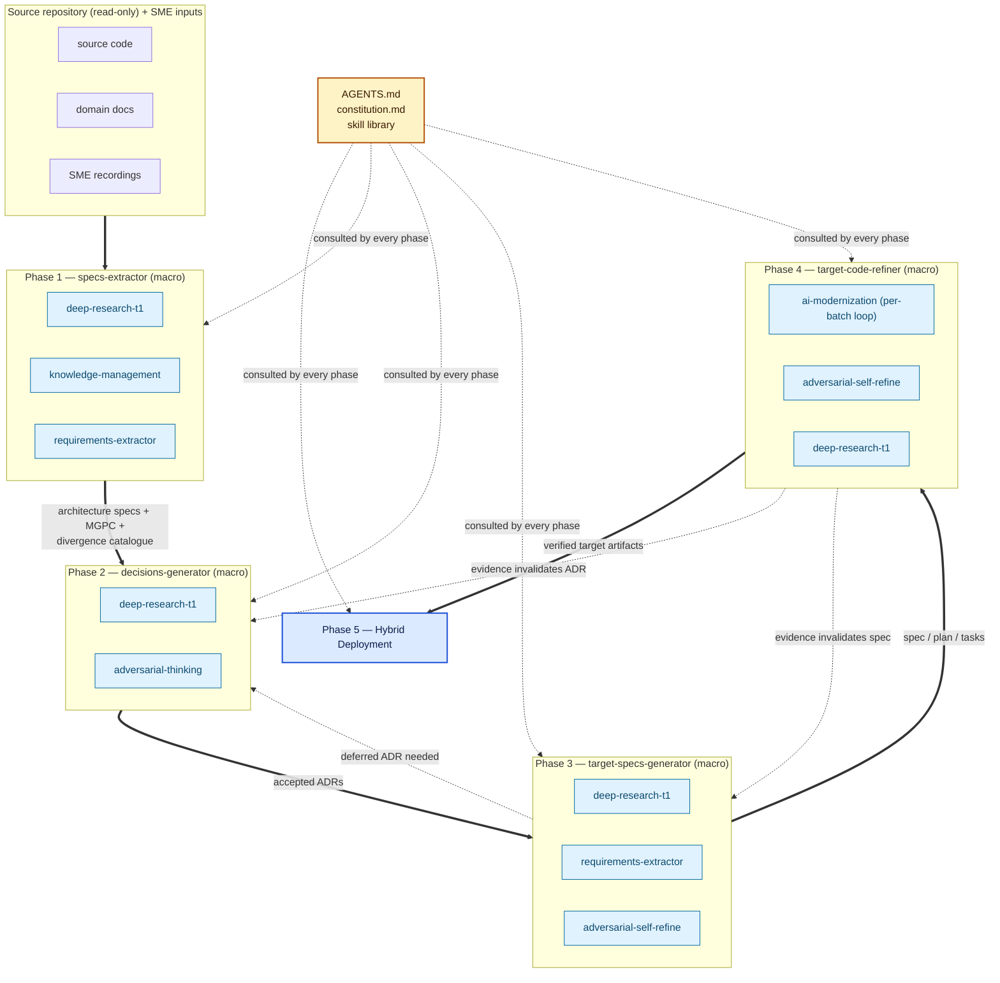
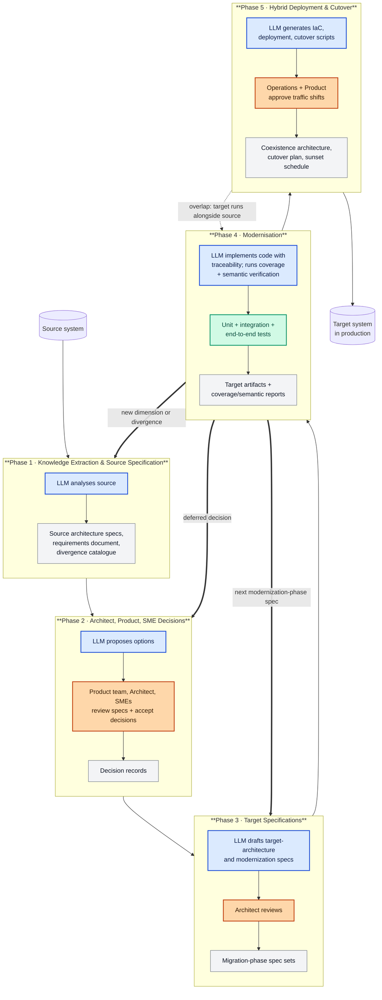
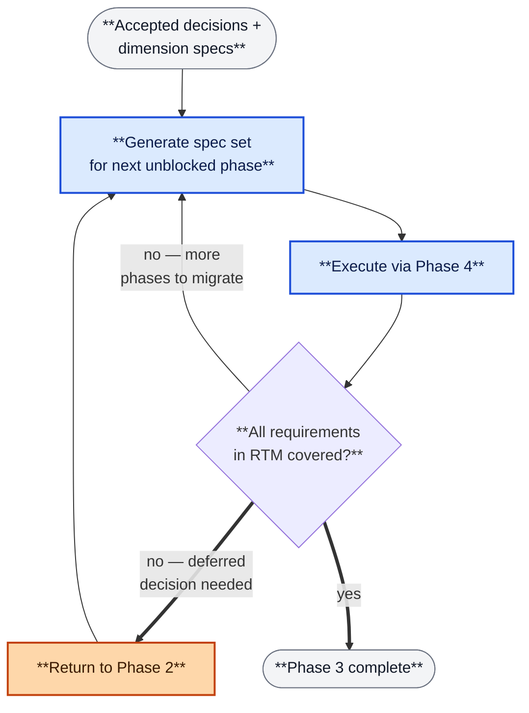
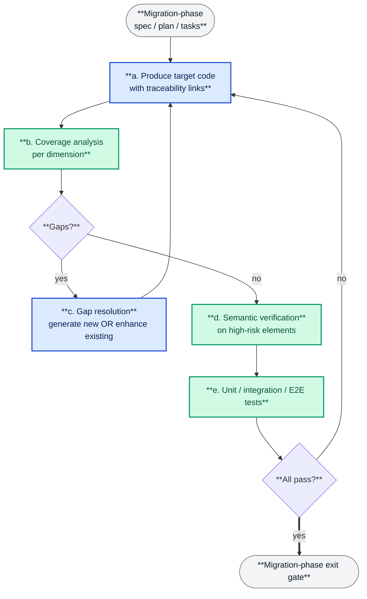
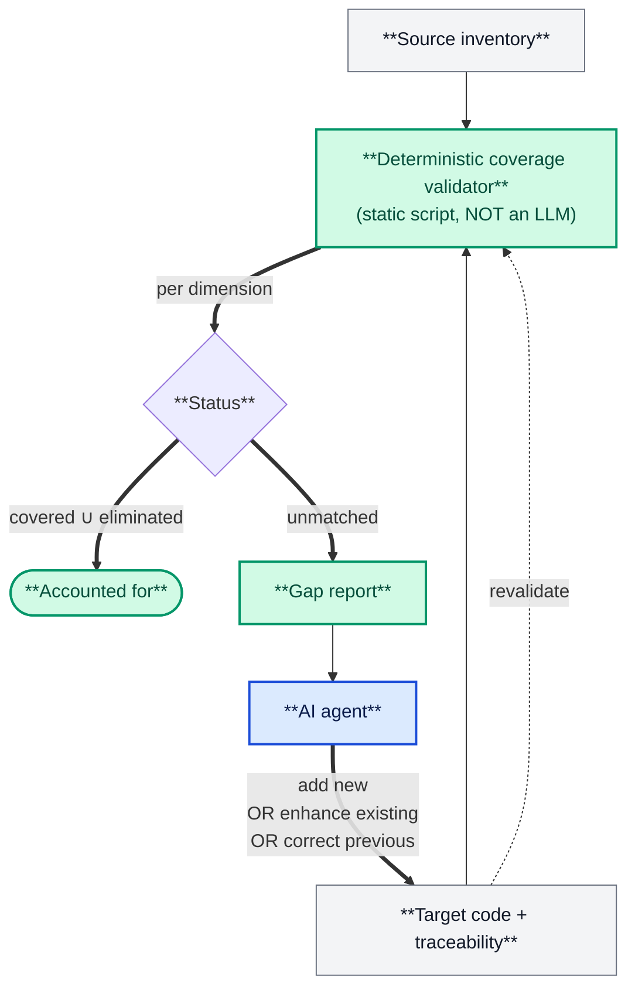
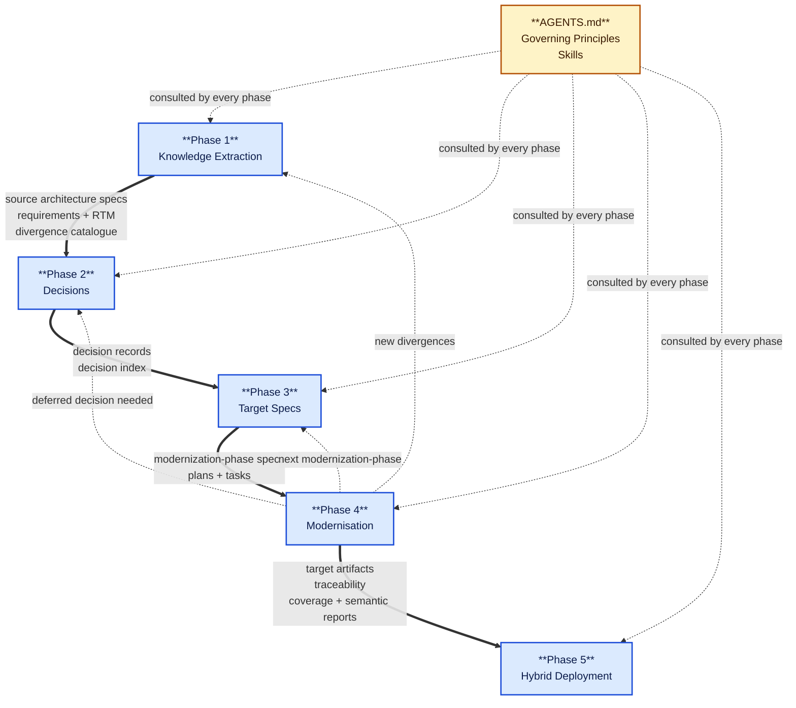
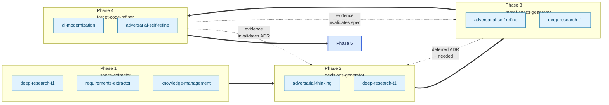

# AI-Assisted Software Modernization Architecture

**A Dimension-Driven, Traceability-First Framework for Migrating Software Systems Across Technology Stacks**

**Version**: 0.9 - Draft

---

## Abstract

This document describes a reproducible architecture for large-scale, AI-assisted software modernization.
The framework is technology-agnostic: the same pipeline applies to language modernizations,
framework shifts, monolith-to-microservices decompositions, ETL-to-streaming-data-mesh rewrites,
federation-overlay modernizations, protocol library ports, and modernisations in which a single
source repository becomes many target repositories (or many sources consolidate into one).

The framework rests on **five architectural pillars**. Each pillar addresses one
failure mode that LLM-driven modernization routinely exhibits, and each contributes
a categorical signal that turns probabilistic agent output into auditable, measurable progress.

**Pillar ① — Dimensions.**
A _dimension_ is a structural axis along which source architecture elements are related
(call graph, data-model graph, service graph, event flow, protocol state machine,
security surface, plugin / hook surface, configuration surface, and so on).
Dimensions are **discovered per project**, not prescribed. The academic lineage is
software-clustering research: Mancoridis's Bunch (IWPC 1998) and Tzerpos & Holt's ACDC
(WCRE 2000) established that automatic clustering of source dependency graphs produces
decompositions a human architect recognises as meaningful subsystems. Modern
community-detection algorithms — Louvain and, with stronger connectivity guarantees,
the Leiden algorithm of Traag, Waltman, and van Eck (Scientific Reports 2019) — partition
each dimension graph into cohesive communities that become natural modernization batches.
An LLM asked to migrate a coherent community reasons over a related slice of the source
rather than an arbitrary file selection. Dimensions drive knowledge extraction in Phase 1,
partition work into modernization phases in Phase 3, and define the per-axis correspondence
checks performed during coverage and semantic verification. See the
[Phase 1](#phase-1--knowledge-extraction) section for how dimensions are inferred and the
full catalogue in [Appendix A](#appendix-a--dimension-catalogue).

**Pillar ② — Traceability (with deterministic coverage validation and gap resolution as sub-disciplines).**
This pillar is the discipline on which the framework's defeat of confirmation bias rests.
The academic basis for the discipline is Stechly, Marquez, and Kambhampati's controlled
experiments on LLM self-verification (NeurIPS 2024 workshop / ICLR 2025), which report
**significant performance collapse under self-critique and significant performance gains
under sound external verification** across reasoning and planning tasks. The framework's
response is to keep the LLM out of the grading loop entirely. The pillar contains three
sub-disciplines:

- **Traceability links.** Every meaningful target element carries a categorical link
  back to the source element(s) that shaped it _and_ to the specification(s) and decision(s)
  under which it was produced. Links are many-to-many, not one-to-one; the representation
  is an implementation choice (inline comments, sidecar index files, graph databases,
  commit-level metadata) and the only architectural requirement is that the links be
  programmatically parseable.
- **Deterministic Coverage Validation.** A static script — _not another LLM_ — performs
  a programmatic comparison of the source inventory against the target traceability graph,
  producing a categorical status (covered / eliminated / unmatched) for every source
  element, broken down _per dimension_, as a percentage the team can verify line by line.
  **The script must be deterministic.** Substituting an LLM grader — even a more capable
  one in a separate session — reproduces the Stechly–Kambhampati failure mode. The script
  is the part of the architecture that the model is structurally forbidden to touch.
- **Gap Resolution.** When the script flags a source element as unmatched, the agent
  treats that as a signal to generate new target code _or_ enhance an already-implemented
  target element. The same cycle fires when a new dimension is discovered, when a deferred
  decision becomes available, or when source/target divergence surfaces during semantic
  verification. This _generate-or-enhance_ property breaks the one-shot ceiling of
  translation-style approaches.

A **platform-divergence catalogue** of behavioural differences between source and target
platforms is seeded in Phase 1 and grown through every later phase. It transforms what
would otherwise be ad-hoc semantic review into a checklist-driven audit with falsifiable
entries, and it feeds back into Gap Resolution.
See [Appendix F](#appendix-f--semantic-discrepancy-taxonomy) for a representative catalogue
from one end-to-end reference project.

**Pillar ③ — Autonomous Cross-Vendor Multi-Agent Architecture.**
The framework executes inside a vendor-neutral multi-agent topology. It runs on any AI
coding tool that supports three capabilities now converging into an industry baseline:
**sub-agents** (isolated contexts and parallel dispatch), the **Model Context Protocol**
(MCP, Anthropic's open standard for connecting models to tools and data, donated to the
Linux Foundation's Agentic AI Foundation in late 2025), and the **Agent Skills** open
standard (Anthropic, October–December 2025). Tools that satisfy all three include
Claude Code, OpenAI Codex CLI, GitHub Copilot CLI, Cursor, Google Gemini CLI, Sourcegraph
Amp, Cognition Devin, Google Jules, and others. Methodology lives in portable skills;
per-vendor wrappers carry only runtime concerns. Four sub-patterns operationalise the
pillar — each grounded in current published research and vendor guidance:

- **Long-running autonomous pipelines** — a skill loads a phase specification and proceeds
  through the inner loop without prompt-by-prompt human supervision. Anthropic's published
  guidance frames this as the workflow-vs-agent distinction and recommends orchestrator-with-
  sub-agents topology for open-ended work (_Building Effective Agents_, Dec 2024;
  _Multi-Agent Research System_, June 2025).
- **LLM cascading for cost optimisation** — a high-capability model performs triage and
  fix-strategy inference; a cheaper, faster model executes the inferred fixes mechanically.
  The academic basis is Chen, Zaharia, and Zou's _FrugalGPT_ (Stanford / TMLR 2024), which
  formalises LLM cascade and reports up to **98 % cost reduction** while matching the
  strongest individual model on representative tasks.
- **Multi-agent ensemble and debate** — parallel sub-agents propose alternative candidates;
  an orchestrator selects the strongest or composes them. The anchoring citations are Du et al.'s
  _Multi-Agent Debate_ (MIT / ICML 2024) for parallel critique improving factual reliability,
  and Wang et al.'s _Mixture-of-Agents_ (Duke / Together AI 2024) for layered ensembles of
  open-source models beating single frontier models on representative benchmarks.
- **Pipeline completeness gates** — the orchestrator must dispatch _every_ phase the
  methodology defines; silently skipping an expensive verification phase to save tokens
  is treated as a structural defect, not a model preference.

State lives in versioned artifacts (specs, decision records, traceability links, coverage
reports), not in agent memory — this is what makes the architecture survive context-window
limits, model swaps, and team handovers.

The full inventory, composition diagram, and authoring rules live in
[Appendix I — Agent Integration](#appendix-i--agent-integration). The cross-vendor
research underpinning the pillar is collected in
[Appendix K — Agent Architecture in 2025 CLI Coding Assistants](#appendix-k--agent-architecture-in-2025-cli-coding-assistants).

**Pillar ④ — Spec-Driven Approach.**
Specs are the durable source of truth that the autonomous agent loop runs against. A spec
survives sessions, models, agents, and team handovers; chat messages do not. Each target
component is described in the **Mission / Goals / Premises / Constraints (MGPC)** shape —
the operational vocabulary of Goal-Oriented Requirements Engineering (GORE) and specifically
of Axel van Lamsweerde's KAOS framework (goals, domain assumptions, constraints, agents
responsible for satisfying them), which is the academic origin of the four-component
decomposition. MGPC composes with the related traditions a project may already use — PMBOK
Project Charter, RUP Vision, INCOSE stakeholder needs and constraints, Lean canvases — so
adopting the framework does not force a new vocabulary on existing governance practice.
(MGPC is sometimes called a _constitution_ in industry usage — for example by GitHub's
Spec-Kit — but that usage should not be confused with Anthropic's _Constitutional AI_,
which is an unrelated training methodology.)

Each project picks its own governance container (charter, vision, project initiation
document, programme vision) and specs framework (GitHub Spec-Kit for constitution-first
work; Fission-AI's OpenSpec for explicitly brownfield delta-style work; bespoke layouts
where the project has strong prior art). The framework is neutral over both choices.
The Spec-Driven pillar scales from one repository to portfolios of many — a microservices
portfolio of 100+ services is modernized by treating each service's spec set as a node in
a cross-repo dependency graph and applying the same five-phase pipeline per node, with
shared cross-repo decision records and cross-repo coverage reports.

**Pillar ⑤ — Flexible Decision-Making with Human-in-the-Loop.**
Decisions are the interface between specs and execution. The framework partitions decisions
into priority classes — P0 (blocks all work, accepted up-front), P1 (blocks a specific
modernization phase, accepted just-in-time), P2 (deferrable, accepted in parallel with
implementation) — and the ability to **defer** the bulk of decisions is what makes
continuous modernization possible. Big-bang modernization is the corner case in which the
deferred set is empty and every decision is treated as P0; for projects of any meaningful
size the default is continuous, with the team choosing which functions to modernize now
and which to defer. The framework's HITL surface is decision-shaped (accept a record once;
proceed autonomously afterwards), not naive-prompt-shaped (ask the human a question every
few steps). The framework spans the full range of team modes, from solo-developer presale
demos to enterprise programmes routed through an established RACI of product, architecture,
security, operations, and SME leads.

Together these five pillars turn AI-assisted modernization from a probabilistic,
best-effort activity into an auditable, measurable process with an explicit and verifiable
notion of _completeness_.

For a catalogue of artifacts produced by an end-to-end application of the framework,
see [Appendix B](#appendix-b--artifacts--lifecycle).

---

## Pipeline Overview

The framework is a five-phase pipeline. Phases 1–3 run once at project inception
(though they may be re-entered iteratively as evidence accumulates).
Phase 4 executes repeatedly — one modernization phase per working session.
Phase 5 begins once enough of the target is ready to run alongside the source.

```text
  +--------------------------------------------------------------------+
  | PHASE 1. Knowledge Extraction                                      |
  |   Deep analysis of the source system across all relevant           |
  |   dimensions; mining of platform-divergence patterns.         |
  |   -> Source architecture specifications (one per dimension)        |
  |   -> Requirements document (Mission / Goals / Premises /           |
  |      Constraints) + Requirements Traceability Matrix               |
  |   -> Platform-divergence catalogue (platform-specific behavioural          |
  |      divergences discovered during research; grows through Phases 2-4) |
  +--------------------------------------------------------------------+
                              v
  +--------------------------------------------------------------------+
  | PHASE 2. Decisions                                                 |
  |   Propose target-architecture and modernization-strategy options;      |
  |   accept each decision with product team, project architect, SMEs. |
  |   -> Decision records (priority-ordered; acceptance may be         |
  |      up-front, just-in-time, or parallel with implementation)      |
  +--------------------------------------------------------------------+
                              v
  +--------------------------------------------------------------------+
  | PHASE 3. Target Specifications                                     |
  |   ONE unified set of specs covering both the target architecture   |
  |   AND modernization strategy (order, partitioning, exit gates).        |
  |   Generated iteratively from accepted decisions; specs for later   |
  |   modernization phases may defer on decisions not yet needed.          |
  |   -> Migration-phase specifications (spec + plan + tasks)          |
  +--------------------------------------------------------------------+
                              v
  +--------------------------------------------------------------------+
  | PHASE 4. Modernization Execution (per-modernization-phase loop)            |
  |   Traceability + Coverage Validation + Gap Resolution +            |
  |   Semantic verification + Integration / End-to-end testing.        |
  |   Loops once per modernization phase; each run produces target         |
  |   artifacts, reports, and a handoff note.                          |
  |   -> Target artifacts (code, schema, IaC, CI/CD, manifests)        |
  |   -> Coverage and semantic verification reports                    |
  |   -> Updates to the platform-divergence catalogue as new divergences surface      |
  +--------------------------------------------------------------------+
                              v
  +--------------------------------------------------------------------+
  | PHASE 5. Hybrid Deployment & Cutover                               |
  |   Staging deployment; source and target coexist in production;     |
  |   traffic is shifted progressively; the source system is           |
  |   decommissioned when all its responsibilities are covered.        |
  |   -> Coexistence architecture; cutover plan; sunset schedule       |
  +--------------------------------------------------------------------+
```

Every arrow in the diagram is a concrete artifact hand-off, not a narrative transition.
The pipeline is iterative: a Phase-4 discovery can send work back to Phase 3
(new modernization-phase spec), Phase 2 (a deferred decision becomes needed),
or Phase 1 (a new dimension or pattern is discovered).
A complete artifact inventory is given in [Appendix B](#appendix-b--artifacts--lifecycle).

---

## Phase 1 — Knowledge Extraction

**Goal.** Produce a complete, evidence-based model of the source system
and bind it to the business intent of the modernization.
Everything downstream is derived from what Phase 1 finds.

**Inputs.** Source repository (treated as read-only), domain documentation,
subject-matter-expert interviews, recorded walkthroughs, production configuration samples,
operational logs, and any external specifications or contracts the system implements.

**Outputs (three artifact families).**

1. **Source architecture specifications** — one per dimension discovered in the source
   (see the dimension sub-sections below).
2. **Requirements document** — Mission / Goals / Premises / Constraints
   plus a Requirements Traceability Matrix (RTM).
3. **Platform-divergence catalogue** — behavioural divergences between the source and target platforms
   (40+ categories in the reference project; see
   [Appendix F](#appendix-f--semantic-discrepancy-taxonomy)).
   The catalogue starts in Phase 1 and grows through every later phase.

Each output is self-contained and cross-references the source by relative path
and line number rather than duplicating source content.

### 1.1 Dimensions — what they are and what they are for

A _dimension_ is any axis along which source elements are related in a way that
materially constrains modernization. Every software system exposes its own set;
the framework does not fix the list in advance.
Dimensions serve four operational purposes across the pipeline:

| Purpose               | Used in phase                                                       | Effect                                                                                        |
| --------------------- | ------------------------------------------------------------------- | --------------------------------------------------------------------------------------------- |
| Knowledge extraction  | Phase 1                                                             | Each dimension becomes a separate specification; together they form the complete source model |
| Phase ordering        | Phase 3 ([Appendix C](#appendix-c--flow-variants))                  | The "driving dimension" chosen as primary determines the flow variant and phase sequence      |
| Coverage verification | Phase 4                                                             | Coverage is reported _per dimension_ — edges, entities, endpoints, hook sites, pipeline steps |
| Semantic verification | Phase 4 ([Appendix G](#appendix-g--integration-pipeline-contracts)) | Integration-pipeline contracts are expressed as traversals of specific dimensions             |

#### Common dimensions

Real projects typically infer six to twelve dimensions; the catalogue in
[Appendix A](#appendix-a--dimension-catalogue) lists twenty-plus,
and [Appendix B](#appendix-b--artifacts--lifecycle) shows
the concrete set produced for one worked example.

| Dimension (examples)                             | Primary purpose it serves                                          |
| ------------------------------------------------ | ------------------------------------------------------------------ |
| Dependency graph between code elements           | Phase ordering + coverage per call-site                            |
| Data-model / entity graph                        | Phase ordering (models before business logic) + schema coverage    |
| Module / package graph                           | Phase ordering + build-order verification                          |
| File relationship graph (include / dynamic load) | File-level partitioning + coverage                                 |
| Frontend / backend coupling graph                | Semantic verification of cross-boundary contracts                  |
| Service dependency graph                         | Phase ordering for microservice decomposition                      |
| Event / message flow graph                       | Phase ordering + topic-by-topic cutover                            |
| Plugin and extension-point graph                 | Hook-site coverage + semantic parity for third-party integrations  |
| Data-pipeline topology (sources → sinks)         | Phase ordering for DAG migrations + pipeline-contract verification |
| Protocol state machine                           | Semantic parity for state transitions and timer behaviour          |
| Configuration / feature-flag surface             | Coverage of runtime toggles                                        |
| Security surface (auth, crypto, session)         | Semantic verification of trust boundaries                          |
| Concurrency and scheduling model                 | Semantic parity for ordering and deadline behaviour                |
| Regulatory / compliance boundary                 | Coverage of mandatory controls                                     |
| Hardware-abstraction layer                       | Phase ordering for embedded / IoT migrations                       |
| API contract surface (inbound / outbound)        | Coverage and semantic parity for external consumers                |

**On the source-file inventory.** Because the file relationship graph is itself a dimension,
there is no separate "table of files" artifact. The file-level view is one dimension
specification among others, produced by the same inventory and analysis step.

### 1.2 Requirements document

The requirements document has four mandatory components. They are **abstract and generic**:
the concrete name of the containing artifact depends on the governance model adopted.
Most current agent tooling (including the widely-adopted spec-kit) defaults to
Agile-flavoured containers; the framework is neutral over the choice — see
[Appendix B.1](#appendix-b--artifacts--lifecycle) for a short list of equivalents.

| Component       | Definition                                                              |
| --------------- | ----------------------------------------------------------------------- |
| **Mission**     | Single-sentence terminal value answering _why_ the modernization exists |
| **Goals**       | Concrete objectives that, if changed, change the solution type          |
| **Premises**    | Assumptions that must hold for the goals to be achievable               |
| **Constraints** | Hard (violation = rejection) and soft (violation = penalty) boundaries  |

The four components are produced by combining bottom-up knowledge expansion
(which surfaces implicit Premises and Constraints) with top-down intent inference
(which identifies the Mission and freezes the Goals). The concrete prompt-engineering
method is documented in the [`requirements-extractor`](.agents/skills/requirements-extractor/)
skill; the framework cares only about the four-component output, not the procedure
that produced it.

Phase 1 also produces a **requirements traceability matrix** linking every requirement
to the dimension specification where it was discovered, the decision record(s)
where trade-offs about it will be resolved (Phase 2), and the modernization-phase
specification(s) where it will be satisfied (Phase 3). The RTM is the primary device
that keeps every later phase mutually consistent.

#### The requirements framework is itself replaceable

The four-component shape (Mission / Goals / Premises / Constraints) is the
framework default because it fits nearly every established governance framework.
Projects with strong prior art in a different tradition may substitute any
equivalent quadruple. In practice even less-structured inputs work — a free-form
narrative inferred by the LLM directly from source, docs, and SME input can
stand in for the four-component document, as long as Phase 2 can still cite
stable "why?", "what?", "assumes?" and "must hold?" elements.

| Tradition               | **Terminal value**    | **Frozen objectives** | **Assumptions**       | **Constraints**        |
| ----------------------- | --------------------- | --------------------- | --------------------- | ---------------------- |
| Default (this document) | Mission               | Goals                 | Premises              | Constraints            |
| RUP Vision Document     | Vision                | Objectives            | Assumptions           | Constraints            |
| PMBOK Project Charter   | Purpose               | Objectives            | Assumptions           | Constraints            |
| Lean canvases           | Problem / Opportunity | Solution              | Key metrics           | Unfair advantages      |
| INCOSE                  | Stakeholder need      | System requirements   | Interface assumptions | Regulatory constraints |

The framework requires only that the substitute preserves three invariants:

- a **terminal value** that justifies all downstream work;
- a **set of frozen objectives** whose change forces re-planning;
- **auditable assumptions** and **auditable constraints** that feed Phase 2 decisions.

When the three invariants hold, the substitute slots in without further adaptation.
When they do not, the framework is either extended or the substitution is rejected
as a Phase-2 decision.

#### Governance-model neutrality

The choice of governance model is itself a first-phase decision.
Different models use different artifact containers for the four components:

| Governance model    | Typical container for the four components             |
| ------------------- | ----------------------------------------------------- |
| Agile               | Project charter; sprint zero charter                  |
| Waterfall           | Project definition plan plus work-breakdown structure |
| PRINCE2             | Project brief plus project initiation document        |
| PMBOK               | Project charter                                       |
| SAFe                | Portfolio vision plus solution intent                 |
| RUP                 | Vision document                                       |
| Regulated programme | Programme vision plus statement of architecture work  |
| Bespoke             | Project-specific container                            |

The framework is neutral over the container; the four components are mandatory;
the container name and the surrounding governance artifacts are project-specific.

### 1.3 Platform-divergence catalogue

Deep research on the source and target platforms invariably surfaces patterns
where the two behave differently despite superficially similar code.
These patterns are the most common source of silent semantic defects during modernization,
and a project-specific catalogue of them pays for itself very quickly.
See [Appendix F](#appendix-f--semantic-discrepancy-taxonomy) for a representative
taxonomy, and [Appendix B](#appendix-b--artifacts--lifecycle) for how a concrete
catalogue was stored in one reference project.

Each catalogue entry records, at minimum:

- a stable code and name;
- the source-platform behaviour;
- the target-platform behaviour and where they diverge;
- a representative source / target code pair;
- an estimated frequency in the codebase;
- the recommended remediation.

The catalogue is a living artifact. It is seeded in Phase 1 from research
and SME input, grows in Phase 4 as new divergences surface during semantic verification,
and feeds every audit checklist thereafter.

---

## Phase 2 — Decisions

**Goal.** Propose every non-trivial target-architecture and modernization-strategy choice,
accept each decision with the right stakeholders, and record the rationale
so that the decision is auditable and re-openable if circumstances change.

### 2.1 Decision records

Each decision is captured as a formal record
(MADR, ISO/IEC/IEEE 42010, Y-statements, or bespoke templates all work)
with the shape: context, considered options, trade-off analysis,
decision, consequences, confirmation criteria.
An index (and where useful, a dependency graph between decisions) is kept
alongside the records so that readers can navigate the full decision log.

### 2.2 Stakeholder acceptance

Decisions are not accepted by the framework — they are accepted by the people
responsible for the outcome. Each decision record nominates the deciders
and the parties consulted and informed. Typical roles are:

| Role                         | Accountable for                                                         |
| ---------------------------- | ----------------------------------------------------------------------- |
| Product team / product owner | Business impact; scope boundaries; feature keep / deprecate / enhance   |
| Project architect            | Target architecture coherence; flow variant; cross-decision consistency |
| Subject-matter experts (SME) | Domain-specific constraints; behavioural parity; regulatory boundaries  |
| Security / compliance lead   | Trust boundaries; credential handling; audit obligations                |
| Operations / platform lead   | Deployment topology; CI/CD; infrastructure-as-code; observability       |
| Development lead             | Implementability within team capability and timeline                    |

Multi-party review is what gives Phase 2 its value; a decision accepted
solely by the implementer is a design note, not a governance artifact.

### 2.3 Priority classes and acceptance modes

| Priority | Scope                                                      | Accepted before          |
| -------- | ---------------------------------------------------------- | ------------------------ |
| P0       | Blocks all work (flow variant, target stack, data engine)  | Phase 3 can begin        |
| P1       | Blocks a specific modernization phase (ORM, auth, workers) | That modernization phase |
| P2       | Deferrable, no blocking dependency                         | The final release        |

**Decisions may be accepted in deferred mode.** A decision does not have to be closed
during inception. The framework supports three acceptance modes explicitly:

- **Up-front.** P0 decisions are normally accepted in Phase 2 itself.
- **Just-in-time.** A P1 decision can remain in _proposed_ state until the modernization phase
  that first needs it; the modernization phase's entry gate then requires its acceptance.
- **Parallel with implementation.** A decision about an incremental concern
  (logging, observability, i18n) may evolve alongside early implementation
  as evidence accumulates; the decision is accepted once the design stabilises.

The framework explicitly supports decisions that are rejected or superseded later
as evidence changes; a superseded decision carries a forward link to its replacement
so that the full history remains auditable.

### 2.4 Option generation and consistency

**Option generation.** Each decision must contain at least two evaluated options
with trade-off analysis. Options can come from human architects, vendor proposals,
prior-art research, or iterative LLM-driven candidate generation.
[Appendix B.3](#appendix-b--artifacts--lifecycle) describes one structured
elimination-and-replacement protocol; the framework is agnostic to how options are sourced.

**Consistency constraint.** When the status of a decision changes
(proposed -> accepted, deprecated, superseded), every document that references that decision
must be updated atomically. Partial status updates are a leading source of
multi-session contradictions and must be treated as a build-breaking defect.
A concrete consistency checklist is captured in [Appendix B.2](#appendix-b--artifacts--lifecycle).

---

## Phase 3 — Target Specifications

**Goal.** Produce a single unified set of specifications that covers both
the target architecture _and_ the modernization strategy — what to build,
in what order, under which decisions, with which exit gates.

### 3.1 Unified spec set

The framework does not separate "target architecture specs" from
"modernization plan specs" — they are the same set of documents. Each modernization
phase is described by three artifacts that together answer every question
a developer or reviewer needs:

- **What should this part of the target look like?** — target structure, interfaces, data contracts
- **What must this part preserve from the source?** — behavioural parity, invariants, edge cases
- **How do we get there?** — order of batches, dependencies, scope boundaries
- **When is it done?** — acceptance criteria, exit-gate checklist, coverage thresholds

> _Example (from the reference project — see [Appendix B.4](#appendix-b--artifacts--lifecycle)):_
> _the modernization-phase spec for authentication answered all four questions in_
> _a single document — target structure (server-side session store), preserved_
> _behaviour (session-cookie compatibility with existing clients), order of_
> _batches (models → verifier → endpoints → tests), and exit gate_
> _(legacy-password upgrade path verified; zero coverage gaps in the auth dimension)._

The three artifact types are:

- a **modernization-phase specification** — user-visible behaviour, functional requirements,
  acceptance criteria, success criteria, explicit scope and anti-scope
- a **modernization-phase plan** — technical context, the decision records the phase depends on,
  the modernization batches in dependency order, risk assessment, entry and exit gates
- a **modernization-phase task list** — actionable steps, parallel markers, and cross-references
  to the source elements each step covers

The primary driver dimension (chosen in Phase 2 as the flow-variant decision)
determines the order in which modernization phases are sequenced. A catalogue of
flow variants and the factors that favour each is given in
[Appendix C](#appendix-c--flow-variants).

### 3.2 Iterative generation

Phase 3 is **not** a single big-bang planning exercise.
Migration-phase specifications are generated iteratively, starting with the
phases that are fully unblocked by already-accepted decisions, and looping
back to Phase 2 whenever a deferred decision becomes needed:

```text
                                         + -----------------------------+
                                         |   accepted deferred decision |
                                         +-----^-----------------------++
                                               |                       |
                                               |                       v
  +-------------+   +---------------+   +-------------+   +------------------+
  |  Phase 1    |-->|  Phase 2      |-->|  Phase 3    |-->|   Phase 4        |
  |  knowledge  |   |  decisions    |   |  generate   |   |   execute spec   |
  |  +          |   |  (P0 now;     |   |  next spec  |   |   + coverage     |
  |  platform-  |   |  P1/P2 may    |   |  set for    |   |   + semantic     |
  |  divergence |   |  be deferred) |   |  first      |   |   + integration  |
  |  catalogue  |   |               |   |  unblocked  |   |   + e2e tests    |
  +-------------+   +-------^-------+   |  phase      |   +---------+--------+
                            |           +------+------+             |
                            |                  |                    |
                            |                  v                    |
                            |           +-------------+             |
                            |           | next phase  |             |
                            +-----------+ needs       |<------------+
                                        | decision    |
                                        | not yet     |
                                        | accepted?   |
                                        +-------------+
```

The loop terminates when the accepted-decisions set plus the already-generated
modernization-phase specs cover every requirement in the RTM.

**Illustrative order** (from the reference project, P0/P1 only):

1. Generate the spec set for the first unblocked phase (often a walking skeleton
   or foundational slice).
2. Execute that phase through Phase 4.
3. Return to Phase 3 to generate the next phase's specs — at this point
   previously deferred decisions may become needed; that triggers a short
   loop back into Phase 2 to accept them.
4. Continue until every modernization phase is complete.

Every spec cites the decisions it depends on so that the dependency is
explicit and auditable.

### 3.3 Exit gates

Every modernization phase has an explicit exit gate listing machine-checkable conditions:
tests passing, coverage thresholds, semantic verification clean,
referenced decisions accepted. The gate is a checklist, not a narrative.

---

## Artifact Flow

The framework produces a small set of artifact kinds, each with a clearly-defined
producer phase and consumer phases. The diagram below shows the producer/consumer
relationships; concrete container names, file layouts, and per-project examples
live in [Appendix B — Artifacts & Lifecycle](#appendix-b--artifacts--lifecycle).

```text
  PHASE 1: Knowledge Extraction
      produces  ->  Source architecture specifications
                    (one per discovered dimension; plus source-element inventory)
                 +  Requirements document
                    (Mission / Goals / Premises / Constraints)
                 +  Requirements Traceability Matrix (RTM)
                 +  Platform-divergence catalogue (grows through Phases 2-5)
                 +  SME knowledge capture (recordings, transcripts, sheets)

  PHASE 2: Decisions
      consumes  <-  Source architecture specifications
                 <- Requirements document
                 <- Platform-divergence catalogue
      produces  ->  Decision records (one per non-trivial choice)
                 +  Decision index / dependency graph

  PHASE 3: Target Specifications
      consumes  <-  Requirements document
                 <- Decision records (P0 required; P1/P2 may be deferred)
                 <- Source architecture specifications
      produces  ->  Migration-phase specifications (one set per modernization phase)
                 +  Migration-phase plans
                 +  Migration-phase task lists
                 [iterative: one modernization-phase spec set at a time;
                  deferred decisions trigger a return to Phase 2]

  PHASE 4: Modernization Execution (one pass per modernization phase)
      consumes  <-  Migration-phase spec / plan / tasks
                 <- Requirements document (RTM lookups)
                 <- Decision records
                 <- Source architecture specifications (per-dimension coverage)
                 <- Platform-divergence catalogue (semantic-verification checklists)
      inner loop (per batch):
                    produce target code with traceability
                 -> coverage analysis (per dimension)
                 -> GAP RESOLUTION (generate new OR enhance existing)
                 -> SEMANTIC VERIFICATION (line-by-line on high-risk elements)
                 -> integration + end-to-end tests
      produces  ->  Target artifacts
                    (code, schema, IaC, CI/CD, deployment manifests)
                 +  Traceability links (source + specs + decisions)
                 +  Coverage report + semantic-verification report
                 +  New entries appended to the platform-divergence catalogue
                 +  Session handoff note (-> next Phase-4 session)

  PHASE 5: Hybrid Deployment & Cutover
      consumes  <-  Target artifacts (from Phase 4)
                 <- Source system still in production
      produces  ->  Coexistence architecture
                 +  Traffic-shift plan; cutover plan; sunset schedule
                 +  Operational reports during coexistence

  GOVERNING FILES (produced once; referenced from every phase):
          AGENTS.md              -> agent instructions (cross-tool OSS standard)
          Governing Principles   -> ordered project principles
          Skill library          -> reusable prompt-engineering methods
```

### Where each kind of artifact lives

| Artifact kind                         | Produced in | Consumed by      | Concrete location (see [Appendix B](#appendix-b--artifacts--lifecycle)) |
| ------------------------------------- | ----------- | ---------------- | ----------------------------------------------------------------------- |
| Source architecture specifications    | Phase 1     | Phases 2, 3, 4   | Project-specific; typically a `specs/architecture/` tree                |
| Requirements document                 | Phase 1     | Phases 2, 3, 4   | Project-specific container (charter, vision, PID, etc.)                 |
| Requirements Traceability Matrix      | Phase 1     | Phases 2, 3, 4   | A table inside or beside the requirements document                      |
| Platform-divergence catalogue         | Phase 1+    | Phases 2, 3, 4   | Project-specific; typically beside the source architecture specs        |
| SME knowledge capture                 | Phase 1     | Phases 2, 4, 5   | Project-specific; often under `docs/` or a media library                |
| Decision records                      | Phase 2     | Phases 3, 4, 5   | Project-specific; typically a `docs/decisions/` tree                    |
| Migration-phase specs / plans / tasks | Phase 3     | Phase 4          | Project-specific; typically a `specs/NNN-<phase>/` tree                 |
| Target artifacts + traceability       | Phase 4     | Phase 5          | Target repositories — one or many, per the accepted topology            |
| Coverage and semantic reports         | Phase 4     | Phase exit gates | Project-specific; emitted as CI/CD artifacts                            |
| Coexistence / cutover plan            | Phase 5     | Operations       | Project-specific; alongside deployment manifests                        |
| AGENTS.md (+ governing principles)    | Once        | Every phase      | Repository root (cross-tool OSS standard)                               |

### Governance file

The framework requires one file at the repository root that declares agent
instructions and ordered project principles. The cross-tool open-source standard
for this file is **AGENTS.md**. All governing principles referenced throughout
this document — _behavioural parity_, _source traceability_, _incremental
verification_, and so on — live inside AGENTS.md unless the project chooses a
different container. Alternative containers (separate principles documents,
framework-specific conventions) are listed in
[Appendix I](#appendix-i--agent-integration).

---

## Phase 4 — Modernization Execution

**Goal.** Turn each modernization-phase spec into verified target artifacts.
Phase 4 runs once per modernization phase from Phase 3. Each run proceeds in a
fresh working session so that context is clean and the session handoff artifact
is the only carrier of cross-phase state. A run may emit artifacts into any
number of target repositories — single-repository, one-to-many, and
many-to-many migrations are all natural outputs of the same loop.

```text
  For each batch in the modernization phase:
    (a) Produce target artifacts with traceability links
    (b) Structural coverage analysis  ->  gap report
    (c) Gap resolution                ->  generate new OR enhance existing
    (d) Semantic verification on high-risk elements
    (e) Build / static analysis / unit tests
    (f) Integration and end-to-end tests at current scope
    (g) If any step fails -> narrow scope, return to (a)
    (h) Otherwise -> next batch

  Migration-phase exit:
    - Coverage report shows zero unmatched in-scope elements
    - All automated tests green (unit + integration + end-to-end)
    - All decision records the phase depended on are in "accepted" status
    - New platform-divergence catalogue entries merged
    - Session handoff note written for the next session
```

Coverage and semantic checks are executed _within_ each batch of the loop,
not at the end of the project. This is how defects are caught while context is hot
rather than during late-stage integration. Integration and end-to-end tests
are part of the exit gate, not a separate later stage.

**Multi-session, multi-agent execution.** The loop is designed for execution across
many working sessions and, where beneficial, across multiple cooperating agents
(reviewer + author, parallel sub-agents per batch, separate agents for coverage vs
semantic verification). Session continuity and agent orchestration are
agentic-system concerns — each AI-coding platform provides its own mechanism
(handoff notes, persistent memory, delegation protocols). The framework only
requires that whatever mechanism is used preserves the phase artifacts
(specs, plans, tasks, decisions, traceability) between sessions.

The three core mechanisms that make this loop auditable —
Traceability, Coverage Validation, and Gap Resolution — are described next.

---

## The Core Mechanism: Traceability, Coverage, and Gap Resolution

### Why AI models miss elements of the source

Even with large-context models capable of loading an entire repository,
source elements are systematically missed during modernization:

- **Attention dilution.** Long source files cause attention to concentrate on prominent
  elements while skipping less prominent ones.
- **False coverage.** File-level correspondence claims coverage of an entire file
  while actually covering only a subset of its elements.
- **Name collision.** Elements with common names are matched by name alone
  across unrelated files (a naive global-name validator makes this failure invisible).
- **Cross-session drift.** Work done in session _N_ may conflict with assumptions
  from session _N − k_.

Structural coverage analysis reveals these gaps directly, and semantic verification
then detects whether the covered code actually preserves behaviour.

### Traceability

Every meaningful target element (function, class, method, model, route, constant,
schema object, pipeline stage, configuration key) carries two kinds of link:

- **Source link** — one or more references to the source element(s)
  from which the target element was derived, together with a categorical
  link type (see below).
- **Specification / decision link** — one or more references to the phase specification,
  dimension specification, or decision record under which the target element was produced.

The second kind of link makes the target _doubly_ traceable: it is possible to ask
_which source shaped this code_ and _which decision justified this shape_.

Source link types, in order of specificity:

| Type         | Meaning                                                           |
| ------------ | ----------------------------------------------------------------- |
| Direct       | Source element maps to a single target element                    |
| Method-level | Source method maps to target method within a class                |
| File-level   | Target module aggregates one source file                          |
| Multi-source | Target element combines logic from multiple source files          |
| Schema-level | Target model derived from a schema definition                     |
| Inferred     | Target code adapted from source patterns; no direct equivalent    |
| New          | Genuinely new code; no source equivalent                          |
| Eliminated   | Source intentionally not ported (dead, deprecated, or superseded) |

Traceability links can be recorded in several ways.
The representation is an implementation choice; the validator only requires that links be
programmatically parseable. Representation options are described in [Appendix D](#appendix-d--traceability-link-representations).

### Structural Coverage Analysis and Gap Resolution

A common misconception is that a traceability-driven pipeline works like a transpiler —
feeding source code line-by-line into an AI agent and receiving target code back.
**It does not.** The pipeline works for any modernization style, including full architectural
redesigns (monolith -> microservices, server-rendered -> SPA, SQL triggers -> stream processing,
single repository -> many repositories).

The key insight:
**traceability is used to detect what has not yet been accounted for;
it is never used to constrain how modernization is done.**
The AI agent is free to redesign, restructure, and re-architect the target system
in whatever way the accepted decisions prescribe. Traceability only tracks
which source elements have been accounted for.

```text
                    SOURCE CODEBASE
                (all elements inventoried)
                           |
                    +------v-------+
                    |  COVERAGE    |
                    |  VALIDATOR   |
                    |              |
                    |  compares    |
                    |  source      |
                    |  inventory   |
                    |  against     |
                    |  target      |
                    |  traceability|
                    |  graph       |
                    +------+-------+
                           |
          +----------------+----------------+
          |                                 |
     ACCOUNTED FOR                    GAP REPORT
     (covered U eliminated)           (unmatched or low-confidence
          |                            source elements)
          |                                 |
          |                           +-----v-----+
          |                           | AI AGENT  |
          |                           | interprets|
          |                           | each gap  |
          |                           | and:      |
          |                           |  - adds a |
          |                           |    new    |
          |                           |    target |
          |                           |    element|
          |                           |  - or     |
          |                           |    enhances|
          |                           |    an     |
          |                           |    existing|
          |                           |    element|
          |                           |  - or     |
          |                           |    corrects|
          |                           |    a      |
          |                           |    previous|
          |                           |    one    |
          |                           +-----+-----+
          |                                 |
          |                           emit target edit +
          |                           traceability link
          |                                 |
          +----------------+----------------+
                           |
                    +------v-------+
                    | RE-VALIDATE  |
                    | coverage     |
                    | increases    |
                    | monotonically|
                    | until 100%   |
                    +--------------+
```

**Worked example.** Suppose the source is a monolith and the target is a set of microservices.
The validator reports that a source function has not been accounted for.
It does _not_ instruct the agent to translate those lines.
Instead the agent:

1. reads the source function to understand its business role;
2. locates the correct target service per the accepted architecture;
3. inspects what the service responsibilities already cover;
4. implements the missing responsibility in the target idiom,
   **or enhances an already-implemented function** when coverage analysis shows
   that the existing implementation is incomplete, inconsistent with a new dimension,
   or contradicted by a later-accepted decision;
5. adds a traceability link so the validator treats the source element as accounted for.

This generate-_or_-enhance property is the decisive advantage of coverage-driven modernization
over direct translation and over purely agentic approaches.
In direct translation, once a target element is produced, further source analysis
cannot correct it without re-running the whole translation.
In purely agentic approaches, there is no categorical signal telling the agent
_which_ existing element requires correction. Coverage analysis provides that signal:
a source element whose current coverage is weak, inconsistent, or contradicted
becomes an input to the next gap-resolution cycle regardless of whether target code
already exists for it. The framework therefore supports gradual enhancement
and correction of already-written code, not just addition of new code —
which is what makes correct modernization and modernization possible at scale.

The mechanism applies equally well to:

- **Near-identical translations** — most elements map 1:1.
- **Framework migrations** — structure changes, elements mostly map.
- **Full redesigns** — source elements scatter across many targets;
  traceability tracks which are accounted for.
- **Technology shifts** — source units become fundamentally different target units
  (triggers -> streaming jobs, stored procedures -> services, monolith functions -> microservice endpoints).
- **Repository topology shifts** — one-to-many (decomposition),
  many-to-one (consolidation), many-to-many (reshaping).

### The Coverage Validator

A source-agnostic validator performs four steps:

1. **Source inventory.** Parse every source artifact to capture an exact element list.
   The parsing technology is an implementation choice
   (agent-built regular expressions, language server indexes, or AST parsers);
   options and trade-offs are described in [Appendix E](#appendix-e--source-inventory-and-validator-implementation).
2. **Target scanning.** Parse every target artifact for traceability links.
3. **Strict matching.** A source element is _covered_ only when the target traceability
   link references the _same source location_. There is no global-name fallback;
   a target element linked to one source file does not cover a same-named element
   in a different source file.
4. **Dimension cross-check.** Verify that dependency edges, entity references,
   and integration points from the dimension specifications are present in the target.

Each source element falls into exactly one of three categories:

| Category   | Definition                                                                |
| ---------- | ------------------------------------------------------------------------- |
| Covered    | Target code with a traceability link pointing to this source element      |
| Eliminated | Documented as dead, deprecated, or superseded; not ported                 |
| Unmatched  | No target equivalent — a gap that must be resolved before the phase exits |

Unmatched elements feed Gap Resolution. The loop continues until
coverage reaches 100% of in-scope elements (eliminated + covered = total)
or until the phase exit gate is explicitly waived with a documented exception.

### Semantic (Behavioral) Verification

Structural coverage proves that every source element has been accounted for.
It does not prove that the target behaves correctly.
A target element can be structurally covered but semantically wrong.

Semantic verification compares source / target element pairs according to a depth tier:

| Tier | Criteria                                            | Depth                            |
| ---- | --------------------------------------------------- | -------------------------------- |
| 1    | Complex logic, many branches, cross-cutting callers | Line-by-line with source quoting |
| 2    | Moderate complexity                                 | Block-level with spot checks     |
| 3    | Simple wrappers, accessors                          | Signature and return type        |
| 4    | Data models, schemas                                | Field-by-field                   |

Tier-1 reviews quote raw source lines from both files.
Summarised reviews without source quotes systematically miss structural defects
(misindented loop bodies, dropped branches, inverted conditions).
A concrete, representative discrepancy taxonomy is given in [Appendix F](#appendix-f--semantic-discrepancy-taxonomy).

### Use of the platform-divergence catalogue

Semantic verification reads from the platform-divergence catalogue
introduced in [Phase 1.3](#13-platform-divergence-catalogue):
the checklist for each element is the set of catalogue entries known to
apply to that element's source pattern. New divergences discovered during
verification are appended to the catalogue so that every subsequent modernization
phase benefits from them.

### Integration-pipeline verification

Per-element verification catches per-element defects.
It does not catch defects that emerge when data flows through multiple elements
with incompatible assumptions — for example, an identifier constructed one way in
function _f_ but looked up differently in function _g_.

The framework defines a small number of end-to-end integration pipelines
and verifies each as an ordered contract: boundary-by-boundary,
the data shape produced at step _k_ must match the shape consumed at step _k + 1_.
[Appendix G](#appendix-g--integration-pipeline-contracts) describes the mechanism in detail.

---

## Functionality Adjustment

**Goal.** Align modernization scope with business needs _before and during_ implementation,
using the same artifact-driven pipeline.

The framework provides three integration points for product and subject-matter-expert input:

1. **Feature scope review** (during Phase 1). Product confirms which features are kept as-is,
   enhanced, deprecated, or eliminated. The outcome is a feature scope matrix
   referenced by all later phases.
2. **SME knowledge ingestion** (any time). Recordings, screenshots, spreadsheets,
   and walkthroughs of the working source application are ingested, transcribed,
   and used to generate end-to-end test scenarios and to discover features
   not visible from source code analysis alone.
3. **Sampled SME verification** (during each phase). Randomly sampled source / target
   element pairs are reviewed by SMEs. This catches divergences that no automated
   check can detect (domain-specific behaviour, undocumented business rules,
   cosmetic expectations).

---

## Skill / Agent Composition

**Goal.** Bind the five-phase pipeline to a small set of reusable AI-agent
skills, arranged so that each phase has a single entry-point skill that
composes lower-level skills in a fixed sequence. The composition is
deliberately thin: every phase's entry-point is a **macro-skill** that
carries no methodology of its own — it sequences atomic skills that do.

This section is normative for the reference implementation and
recommended for new projects that adopt the framework on a platform
that honours the Agent Skills open standard (published December 2025).
Projects on other runtimes MUST translate the composition to their
native primitives but SHOULD preserve the skills-drive-agents layering.

### Why this layering exists

Until October 2025, static per-agent markdown files (Claude's
`.claude/agents/*.md`, Cursor's `.cursor/agents/*.md`, equivalents in
Copilot chatmodes) were the only mechanism for packaging a specialised
agent with its persona, tool whitelist, model choice, and methodology.
Methodology therefore lived in the agent file's body. That is the
**pre-Skills-era pattern**; it is still visible in most public
examples, and it couples methodology to one runtime.

After Skills reached GA on 16 October 2025, and especially after the
Agent Skills open standard was published on 18 December 2025,
methodology can live in a skill that is consumable by Claude Code,
OpenAI Codex CLI, Sourcegraph Amp, Cognition Devin, Google Jules,
Moonshot Kimi, and any compliant runtime. The agent file's remaining
job is runtime binding — the capabilities a cross-platform skill
cannot express:

| Capability                                   | Skill alone | Agent wrapper |
| -------------------------------------------- | :---------: | :-----------: |
| Deliver methodology / playbook               |      ✓      |       —       |
| Progressive disclosure of resources          |      ✓      |       —       |
| Cross-tool portability                       |      ✓      |       ✗       |
| `/command` invocation                        |      ✓      |       ✗       |
| **Enforced tool whitelist**                  |      ✗      |       ✓       |
| **Isolated context window**                  |      ✗      |       ✓       |
| **Per-agent model pin**                      |      ✗      |       ✓       |
| **Session-wide launch** (`claude --agent X`) |      ✗      |       ✓       |
| **Worktree isolation**                       |      ✗      |       ✓       |
| **Per-agent persistent memory**              |      ✗      |       ✓       |
| **Managed / org-tier override**              |      ✗      |       ✓       |

Every row in the right column is a runtime concern. Every row in the
left column is a content concern. The framework places each kind of
artifact in the column where it naturally belongs — skills carry
content, wrappers carry runtime — and treats duplication between them
as a build-breaking defect.

### Atomic skills and macro-skills

The skill library is organised in two layers:

- **Atomic skills** — single-responsibility playbooks usable in any
  project: `deep-research-t1`, `requirements-extractor`,
  `knowledge-management`, `adversarial-thinking`, `adversarial-self-refine`.
- **Macro-skills** — framework-specific compositions that orchestrate
  atomic skills into one phase's worth of work.

| Macro-skill              | Phase                             | Composes                                                                                                                     | Produces                                                                                                              |
| ------------------------ | --------------------------------- | ---------------------------------------------------------------------------------------------------------------------------- | --------------------------------------------------------------------------------------------------------------------- |
| `specs-extractor`        | Phase 1 — Knowledge Extraction    | `deep-research-t1` + `requirements-extractor` + `knowledge-management`                                                       | Source architecture specs (one per dimension), MGPC + RTM, seeded platform-divergence catalogue                       |
| `decisions-generator`    | Phase 2 — Decisions               | `adversarial-thinking` + `deep-research-t1`                                                                                  | Stress-tested ADRs; atomic cross-reference updates across the document set                                            |
| `target-specs-generator` | Phase 3 — Target Specifications   | `adversarial-self-refine` + `deep-research-t1` + `requirements-extractor`                                                    | `spec.md` / `plan.md` / `tasks.md` triplet per unblocked modernization phase, each refined to convergence             |
| `target-code-refiner`    | Phase 4 — Modernization Execution | `ai-modernization` (per-batch loop) + `adversarial-self-refine` + `deep-research-t1`                                         | Verified target artifacts with traceability; coverage and semantic-verification reports; explicit loop-backs          |
| `ai-modernization`       | Spine — Phases 0 → 5              | Provides per-batch execution rules, traceability format, coverage-validator patterns, semantic trap catalogue, directory map | End-to-end modernization reference, plus Phase-0 and Phase-5 playbook content consumed by the four phase macro-skills |

Each macro-skill is described in full in
[Appendix I.3](#appendix-i--agent-integration). The important point
here is compositional: every macro-skill is under one page of
coordination logic, and every line of methodology it relies on lives
in a skill that can be updated in one place.

### Composition diagram



Solid arrows carry forward the artifact set each phase produces.
Dashed arrows are loop-back edges triggered by evidence discovered in
Phase 3 or Phase 4 — a deferred decision that now blocks work
(Phase 3 → Phase 2), a Phase-4 finding that invalidates an accepted
ADR (Phase 4 → Phase 2), or a Phase-4 finding that invalidates the
phase spec itself (Phase 4 → Phase 3). These loop-backs are first-class
behaviour, not exceptions.

### Invocation modes (skill, wrapper, or dynamic spawn)

The same macro-skill can be executed three ways; projects pick the
lightest binding that meets their needs:

| Mode                        | When to use                                                                       | How                                                                       |
| --------------------------- | --------------------------------------------------------------------------------- | ------------------------------------------------------------------------- |
| **Main-thread direct**      | Interactive use; no isolation needed.                                             | `/macro-skill-name` slash command or description-based auto-invocation.   |
| **Static subagent wrapper** | Session-wide persona; enforced tool whitelist; model pin; team-shared review.     | `@agent-name` or `claude --agent agent-name`; wrapper preloads the skill. |
| **Dynamic subagent spawn**  | Parallel fan-out; one-shot isolation; dynamic task parameterisation at call time. | Orchestrator agent calls the `Agent` tool with a task description.        |

Nested subagent spawning is forbidden on Claude Code (a subagent
cannot spawn further subagents) and configurable but discouraged on
Codex CLI. Orchestration therefore runs from the main thread or from a
single top-level orchestrator agent; deeper work is decomposed into
skills the orchestrator invokes in sequence or in parallel. The
research supporting these constraints is in
[Appendix K](#appendix-k--agent-architecture-in-2025-cli-coding-assistants).

### What this buys the framework

- **Single source of truth for every playbook.** Updating a skill
  updates every invocation mode and every tool that honours it.
- **Cross-platform portability by construction.** The playbooks run
  unchanged on Claude Code, Codex CLI, Amp, Devin, Jules, or any
  compliant Agent-Skills runtime; the per-platform wrapper layer is
  the only thing that needs re-binding.
- **Auditability.** A phase spec's claim to have run the adversarial
  refine loop is verifiable — the transcript is retained, the skill
  whose convergence signal was observed is named, and the wrapper
  that enforced tool-whitelist and model pin is version-controlled.
- **Stability of content under churn of runtime.** The 2025 CLI agent
  landscape is moving quickly (Gemini CLI shipped subagents in
  April 2026; Copilot shipped `/fleet` parallel spawning the same
  month); the framework absorbs that churn at the wrapper layer,
  without touching the playbooks.

---

## Phase 5 — Hybrid Deployment & Cutover

**Goal.** Put enough of the target into a real deployment — staging first, then
production alongside the source — to exercise it under realistic load and data,
progressively shift responsibility, and decommission the source system when
every responsibility is covered.

The pipeline treats the coexistence architecture itself as a decision, not a default.
For projects of any meaningful size, source and target must coexist for some period;
continuous, traceable cutover is the norm. **Single-event cutover** is the corner case —
appropriate only for small projects where every behaviour fits in one head and full
regression coverage in one release is feasible. The pipeline is flexible enough to span
the full range of project scales and repository topologies.

### Release modes

| Release mode                  | When appropriate                                                              | Consequence                                                                     |
| ----------------------------- | ----------------------------------------------------------------------------- | ------------------------------------------------------------------------------- |
| **Gradual coexistence**       | The default for non-trivial systems where full cutover risk is unacceptable   | Source and target run side-by-side for months or years with a documented sunset |
| **Incremental traffic shift** | Systems with a gateway, service mesh, or feature-flag layer                   | A percentage of traffic is routed to the target; percentage increases over time |
| **Read-first / write-later**  | Data-heavy systems where writes are the highest risk                          | Target serves reads while source remains authoritative for writes, then flipped |
| **Parallel-run comparison**   | Pipelines, reports, or computations where output correctness is observable    | Both systems process the same inputs; outputs are diffed until convergence      |
| **Single-event cutover**      | Corner case: small projects; full regression coverage feasible in one release | Entire modernization verified in one release; shortest timeline                 |

### Output topology

The framework is **not** a repository-to-repository translator.
It is a knowledge-to-artifacts pipeline whose output is whatever set of repositories,
CI/CD pipelines, infrastructure-as-code (IaC) modules, and deployment manifests
the accepted architecture prescribes. The Phase-1 dimensions and the Phase-2 decisions
together determine the target topology.

| Source topology  | Target topology   | Typical modernization                                                        |
| ---------------- | ----------------- | ---------------------------------------------------------------------------- |
| 1 repository     | 1 repository      | Language or framework modernization; near-identical shape preserved          |
| 1 repository     | _N_ repositories  | Monolith decomposition into services; one repo per service + shared libs     |
| _N_ repositories | 1 repository      | Consolidation of legacy component repositories into a single modular target  |
| _N_ repositories | _M_ repositories  | Full reshaping — service boundaries redrawn, new shared libraries extracted  |
| 1 repository     | 1 repo + IaC repo | Legacy app modernised with a separate operations / infrastructure repository |

For every non-trivial output topology, the pipeline also produces:

- per-repository CI/CD configuration
- infrastructure-as-code modules (Terraform, CloudFormation, Pulumi, Kubernetes manifests, or equivalents)
- service-mesh / gateway configuration when applicable
- data-migration scripts with rollback plans (see [Appendix H](#appendix-h--data-migration-and-transformations))
- observability configuration (logs, metrics, traces) consistent across repositories

### Representative coexistence patterns

| Pattern              | Mechanism                                                         |
| -------------------- | ----------------------------------------------------------------- |
| Web applications     | Shared database; API gateway; compatibility shim                  |
| Microservices        | Service-by-service cutover; contracts preserved at each step      |
| Protocol libraries   | Linked side-by-side; conformance tests against both               |
| Data pipelines       | Parallel runs on a data subset; output equivalence check          |
| Event-driven systems | Dual consumers during transition; producer-by-producer switchover |
| Embedded / firmware  | Dual-image slots; staged rollouts with automatic rollback         |

Every shim, dual-path, or bridge is tracked as a removal item with a documented sunset.

---

## Applicability Across System Types

The pipeline is technology-agnostic. What changes between applications is
the set of dimensions discovered in Phase 1, the decisions taken in Phase 2,
and the flow variant chosen in Phase 3.
[Appendix A](#appendix-a--dimension-catalogue) catalogues dimensions observed across system types;
[Appendix C](#appendix-c--flow-variants) catalogues flow variants.

The three core mechanisms (Traceability, Coverage Validation, Gap Resolution)
apply unchanged to language modernizations, framework shifts, monolith decompositions,
CLI ports, desktop-to-web moves, network-protocol library ports,
data pipeline rewrites, stored-procedure extractions, and embedded / IoT modernisations.

---

## Benefits

The framework's benefits map directly onto its five pillars. Each pillar removes a
specific failure mode and contributes a categorical signal that turns probabilistic
AI output into auditable, measurable modernization progress.

### Fundamental contributions (per pillar)

- **① Dimension-driven, graph-based modernization batches.**
  Each dimension is represented as a graph, and community-detection algorithms
  (Leiden, Louvain) partition each graph into cohesive clusters that become natural
  modernization batches. An LLM asked to migrate a coherent community reasons over a
  related slice of the source rather than an arbitrary file selection. This replaces
  ad-hoc "start somewhere" partitioning with structurally justified ordering.

- **② Completeness as a deterministic predicate.**
  Every source element is in exactly one of three states (covered / eliminated /
  unmatched), graded **by a static script, not another LLM**, broken down _per
  dimension_. The script is the categorical signal that defeats confirmation bias
  structurally — a more capable LLM is still an LLM and inherits the same
  alignment-shaped failure mode. "Done" becomes a programmatically verifiable
  predicate, not a sentence the model wrote about itself.

  This pillar also delivers the **generate-or-enhance** property: unmatched or
  low-confidence coverage on an already-implemented target element triggers
  _correction or enhancement of that element_, not only generation of new code.
  This breaks the one-shot ceiling of translation-style modernization and the
  "no categorical signal" failure mode of purely agentic loops.

- **③ Vendor-neutral autonomous multi-agent execution.**
  The framework runs on any AI coding tool that supports sub-agents, MCP, and
  Skills (Claude Code, Codex CLI, Copilot CLI, Cursor, Gemini CLI, Devin, Jules,
  Amp). Long-running pipelines proceed autonomously through phases without
  prompt-by-prompt human supervision. **Tiered-model collaboration** delivers up
  to an order-of-magnitude cost reduction — high-capability models perform triage
  and fix-strategy inference, cheaper models execute the inferred fixes
  mechanically. **Divergent-then-convergent decision making** runs multiple
  candidate generators in parallel before selection. **Pipeline completeness gates**
  prevent the orchestrator from silently skipping expensive verification phases
  to "save tokens."

- **④ Spec-driven scalability from one repo to portfolios of 100+.**
  Specs are the durable source of truth; chat messages are not. The constitutional
  Mission / Goals / Premises / Constraints framework gives every component the same
  shape, and the framework is neutral over governance container (charter, vision,
  programme vision) and specs framework (Spec-Kit, OpenSpec, bespoke). A portfolio
  of many services is modernized by treating each service's spec set as a node in
  a cross-repo dependency graph and applying the same five-phase pipeline per node.

- **⑤ Continuous modernization through deferred decisions.**
  Priority-classified decisions (P0 up-front, P1 just-in-time, P2 in parallel
  with implementation) make continuous modernization possible. Big-bang modernization
  becomes the corner case in which every decision is treated as P0; the default is
  to start work on the unblocked parts of the system while specific architectural
  choices for later parts of the system remain genuinely open. The HITL surface is
  **decision-shaped** (accept a record once; proceed autonomously afterwards) rather
  than **prompt-shaped** (ask the human a question every few steps).

- **Unified target-architecture and modernization-strategy specification.**
  Phase 3 produces one spec set, not two. The questions "what should this look like?"
  and "how do we migrate to it?" are answered in the same document, which eliminates
  the drift that accumulates when architecture and modernization plans are maintained
  separately.

- **Platform-divergence catalogue as a living artifact.**
  A project-specific catalogue of source/target behavioural divergences is seeded in
  Phase 1 and grown in every later phase. It transforms semantic verification from
  ad-hoc review into a checklist-driven audit with falsifiable entries, and prevents
  the same class of error from recurring across modernization phases.

### Standard benefits (delivered as side effects of the contributions above)

- **Explicit trade-offs.** Every non-trivial choice is recorded as a decision with analysis,
  reviewable by non-specialist stakeholders and re-openable when business needs change.
- **Early error detection.** Errors are caught within the same session they are introduced,
  not during final integration.
- **Test-coverage uplift for legacy systems.** The target ends with richer automated test
  coverage than the source ever had — modernization becomes a quality event, not a risk event.
- **Flexible output topology.** The pipeline produces whatever set of repositories,
  CI/CD pipelines, infrastructure-as-code, and deployment manifests the accepted
  architecture prescribes — single-repo, one-to-many, many-to-one, or many-to-many.

---

## Appendices

All appendices are either catalogues, illustrative examples, or implementation notes.
Each real project will instantiate its own versions of these tables.
Nothing in the appendices is prescriptive.

---

### Appendix A — Dimension Catalogue

Dimensions commonly discovered during Phase 1.
Every real project should infer its own set.

#### Structural dimensions (common to most systems)

| Dimension                  | Captures                                            | Migration impact                       |
| -------------------------- | --------------------------------------------------- | -------------------------------------- |
| Call graph                 | Which elements call which others                    | Dependency order for modernization     |
| Data model / entity graph  | Tables, schemas, relationships, clusters            | Models required before business logic  |
| Module / package graph     | Import and include chains between packages          | Build order; circular-dependency risk  |
| File relationship graph    | Static include and dynamic load edges between files | File-level partitioning                |
| Service dependency graph   | Inter-service calls                                 | Distributed-system modernization order |
| Event / message flow graph | Producers, topics, subscribers                      | Event-driven modernization order       |
| Infrastructure dependency  | Services <-> infrastructure (DB, cache, queue)      | Cloud / platform modernization         |

#### Domain-specific dimensions (examples)

| Dimension                            | Example system types                             |
| ------------------------------------ | ------------------------------------------------ |
| Frontend / backend coupling          | Web apps with server-rendered HTML or SPAs       |
| Plugin / extension-point graph       | Applications with hook points and extension APIs |
| Protocol state machine               | Network-protocol implementations                 |
| Data pipeline topology               | ETL, stream processors, trigger chains           |
| Configuration / feature-flag surface | Systems with extensive config or feature flags   |
| Security surface                     | Auth flows, encryption, session management       |
| Concurrency and scheduling model     | Multi-threaded, async, event-driven              |
| API contract surface (inbound)       | Public APIs with external consumers              |
| API contract surface (outbound)      | Integrations with third-party services           |
| Regulatory / compliance boundary     | Regulated industries (finance, health, defence)  |
| Hardware abstraction layer           | Embedded / IoT                                   |
| Data warehouse / OLAP cubes          | Analytics platforms                              |
| File-based persistent state          | Legacy systems with disk-backed state            |
| Search index topology                | Systems with dedicated search infrastructure     |
| Object-storage key namespace         | Systems with substantial blob storage            |
| Scheduler / cron graph               | Systems with time-driven background work         |
| Multi-tenant isolation boundary      | SaaS platforms                                   |
| Observability topology               | Systems with custom metrics / log pipelines      |

#### Applicability matrix

| System type                | Typical primary dimension   | Typical secondary dimensions         |
| -------------------------- | --------------------------- | ------------------------------------ |
| Web application (MVC)      | Entity graph                | Call graph, frontend coupling        |
| Server-rendered app        | Frontend / backend coupling | Entity graph, template system        |
| Desktop application        | UI event model              | Call graph, persistence              |
| CLI tool                   | Call graph                  | Argument parsing, I/O model          |
| Data processing pipeline   | Pipeline topology           | Data model, checkpoint semantics     |
| Network protocol library   | Protocol state machine      | Timer semantics, packet encoding     |
| Microservices              | Service dependency graph    | API contracts, message topics        |
| Stored-procedure system    | Pipeline topology           | Entity graph, transaction boundaries |
| Event-driven architecture  | Message topics              | Service graph, event schema          |
| Embedded / IoT             | Hardware abstraction        | Call graph, memory model             |
| Analytics warehouse        | OLAP cube / DAG topology    | Data model, scheduler graph          |
| SaaS multi-tenant platform | Tenant isolation boundary   | Service graph, data-model graph      |

---

### Appendix B — Artifacts & Lifecycle

This appendix gathers everything about the artifacts the framework produces:
the per-phase lifecycle they follow, a concrete inventory from one reference project,
and the decision-evaluation protocol that feeds Phase 2.

### B.1 Spec-driven lifecycle

Every phase flows through the same six-step lifecycle:

```text
Principles -> Specification -> Planning -> Tasks -> Execution -> Validation
```

| Step          | Artifact             | Content                                                                        |
| ------------- | -------------------- | ------------------------------------------------------------------------------ |
| Principles    | Governing principles | Ordered project-level rules (behavioural parity, traceability, etc.)           |
| Specification | Phase specification  | Behaviour, functional requirements, acceptance criteria, success criteria      |
| Planning      | Phase plan           | Technical context, batches, risks, entry and exit gates, decision dependencies |
| Tasks         | Phase task list      | Checkboxed actions, parallel markers, source cross-references                  |
| Execution     | Target artifacts     | Code, schema, pipelines, infrastructure-as-code, CI / CD                       |
| Validation    | Exit gate            | Tests green, coverage validated, semantic verification clean                   |

### B.2 Consistency rule

When any status, decision, or phase changes, all referencing locations must be
updated atomically: decision record, decision index, requirements document,
dimension specifications, session memory. Partial updates create contradictions
that compound across sessions. The consistency check is a machine-checkable
checklist that enumerates every document that references the affected status field.

### B.3 Iterative decision evaluation

For critical decisions (typically P0 and some P1), the framework can generate
multiple candidate options and refine them through structured comparison:

1. Generate three initial candidates, each optimising for a different trade-off axis
   (time-to-market, technical excellence, behavioural fidelity).
2. Review each candidate independently for fatal flaws and unaddressed constraints.
3. In each round, eliminate the weakest candidate (fewest favourable pairwise comparisons)
   and replace it with a new candidate addressing flaws identified in prior rounds.
4. Repeat with two survivors plus one new challenger. Each round has constant cost:
   exactly three candidates, three pairwise comparisons.
5. Iterate until candidates converge or diminishing returns are observed.

This is one way to generate options; they may also come from human architects,
vendor proposals, or prior-art research. The framework requires at least two
evaluated options per decision but is agnostic to how they are produced.
Pattern files and runtime harnesses for this protocol live in
[`.agents/skills/adversarial-thinking/`](.agents/skills/adversarial-thinking/)
and [`.agents/skills/adversarial-self-refine/`](.agents/skills/adversarial-self-refine/).

### B.4 Reference project — artifact inventory

One concrete end-to-end application of the framework produced the artifact
set below. The inventory is indicative, not prescriptive; each real project
produces a different set depending on its discovered dimensions and accepted
decisions.

**Summary metrics.**

| Metric                                       | Value                                                                                     |
| -------------------------------------------- | ----------------------------------------------------------------------------------------- |
| Source lines of code                         | ~18,600                                                                                   |
| Source files                                 | 138                                                                                       |
| Database tables                              | 35 (31 active, 4 deprecated / eliminated)                                                 |
| Plugin hooks                                 | 24                                                                                        |
| Inbound API endpoints                        | 17 REST, 40+ RPC                                                                          |
| Working sessions                             | 19                                                                                        |
| Dimension specifications                     | 15 (architecture root + per-dimension documents)                                          |
| Phase specifications                         | 6                                                                                         |
| Architecture decisions                       | 19                                                                                        |
| Automated tests at completion                | 1,474 (unit + integration + end-to-end)                                                   |
| Platform-divergence entries catalogued       | 40 categories, 600+ affected call sites                                                   |
| Integration pipelines verified               | 8                                                                                         |
| Final structural coverage                    | 100% (458 / 458 in-scope elements)                                                        |
| Eliminated source elements                   | 27+                                                                                       |
| Security modernizations during modernization | Password-hash upgrade, credential encryption, prepared statements, CSRF, security headers |

**Phase 1 — Source architecture specifications.**

| Path                                              | Content                                                              |
| ------------------------------------------------- | -------------------------------------------------------------------- |
| specs/architecture/01-architecture.md             | Application layering, patterns, request lifecycle                    |
| specs/architecture/02-database.md                 | Entity / schema dimension                                            |
| specs/architecture/03-api-routing.md              | Inbound API contract surface                                         |
| specs/architecture/04-frontend.md                 | Frontend / backend coupling                                          |
| specs/architecture/05-plugin-system.md            | Plugin / extension-point graph                                       |
| specs/architecture/06-security.md                 | Security surface                                                     |
| specs/architecture/07-caching-performance.md      | Caching, concurrency, scheduling                                     |
| specs/architecture/08-deployment.md               | Deployment topology                                                  |
| specs/architecture/09-source-index.md             | File relationship graph (roles, dependencies, annotations)           |
| specs/architecture/10-modernization-dimensions.md | Call-graph communities; cross-dimension synthesis                    |
| specs/architecture/11-business-rules.md           | Business-rule inventory                                              |
| specs/architecture/12-testing-strategy.md         | Test-category matrix                                                 |
| specs/architecture/13-decomposition-map.md        | Source-element -> target-module decomposition                        |
| specs/architecture/14-semantic-discrepancies.md   | 40-category discrepancy taxonomy, semantic traps, pipeline contracts |
| specs/architecture/15-sme-review.md               | Feature inventory from SME walkthrough                               |

**Phase 1 — Requirements document.**

| Path                                     | Content                                                                                   |
| ---------------------------------------- | ----------------------------------------------------------------------------------------- |
| specs/architecture/00-project-charter.md | Mission, Goals, Premises, Constraints, requirements traceability matrix (Agile container) |

**Phase 2 — Decision records.**
`docs/decisions/0001-modernization-flow-variant.md` through `0019-preferences-modal-pattern.md`,
plus `docs/decisions/README.md` (index and dependency graph) and
`docs/decisions/compliance-review-response.md` (cross-decision review).

**Phase 3 — Migration-phase specifications.**

| Path                                                 | Scope                                                                 |
| ---------------------------------------------------- | --------------------------------------------------------------------- |
| specs/001-foundation/{spec,plan,tasks}.md            | Models, auth, DB bootstrap, app factory                               |
| specs/002-core-logic/{spec,plan,tasks}.md            | Feed parsing, counter cache, filters, labels, sanitisation            |
| specs/003-business-logic/{spec,plan,tasks}.md        | Preferences CRUD, digests, OPML                                       |
| specs/004-api-handlers/{spec,plan,tasks}.md          | 17 API operations, authentication guards, tree-building algorithms    |
| specs/005-semantic-verification/{spec,plan,tasks}.md | 40-category taxonomy, 105+ remediations, 598 tests, 0 unresolved gaps |
| specs/006-deployment/{spec,plan,tasks}.md            | CI, coverage gate, Docker / Compose / reverse proxy, data migration   |

**Governing files (produced once, referenced from every phase).**

| Path                                            | Role                                                                |
| ----------------------------------------------- | ------------------------------------------------------------------- |
| AGENTS.md                                       | Cross-tool agent instructions (OSS standard)                        |
| Ordered principles (in AGENTS.md or standalone) | Project-level rules consulted at every phase gate                   |
| `.agents/skills/`                               | Reusable prompt-engineering methods (requirements extraction, etc.) |

### B.5 Representative artifact shapes

**Decision record excerpt (one of several equivalent templates):**

```markdown
# 0002 — Select Target Web Framework

## Considered Options

1. Framework A — closest match to source handler dispatch; native session and CSRF
2. Framework B — modern async; no built-in sessions; requires client-side changes for CSRF
3. Framework C — full-featured but over-engineered for this codebase

## Decision: Framework A

Rationale: minimises translation distance; preserves client-server contract.
```

**Traceability link examples (representation: inline comment):**

```text
# Direct match
# Source: <source path>:<qualified name> (lines 706-771)
# Specs:  specs/architecture/06-security.md, specs/001-foundation/spec.md
# Decisions: 0008-password-migration.md

# Multi-source
# Source: <source1>:<name> (lines 45-120)
#       + <source2>:<name> (lines 200-450)
# Specs: specs/architecture/02-database.md, specs/architecture/03-api-routing.md

# Inferred
# Inferred from: <source pattern>; no direct source equivalent
# Specs: specs/001-foundation/spec.md
# Decisions: 0007-session-management.md

# New (no source equivalent)
# New; no source equivalent — schema migration infrastructure
# Specs: specs/006-deployment/spec.md

# Eliminated
# Eliminated: <source path>:<name> — removed per ADR 0003 (target uses single DB engine)
```

---

### Appendix C — Flow Variants

The overall order of phases is itself an architecture decision.
Each project discovers its own optimal flow based on its dimensions.
The list below is illustrative — real projects frequently combine or adapt entries.

| Variant                   | Strategy                                   | Typical scenario                  | Primary risk                              |
| ------------------------- | ------------------------------------------ | --------------------------------- | ----------------------------------------- |
| Entity-first              | Models / schemas -> logic -> handlers      | Database-heavy, stable data model | Long time to first runnable code          |
| Call-graph-first          | Entry points -> fill in dependencies       | API-heavy systems, microservices  | Stub accumulation                         |
| Vertical slice            | End-to-end features, one at a time         | Large team, parallel workstreams  | Cross-cutting concerns extracted too late |
| Minimal runnable first    | Smallest working system, then expand       | Small team, layered architecture  | More upfront planning                     |
| One-dimension-per-pass    | Each pass addresses one dimension          | Large team with specialists       | High coordination overhead                |
| Protocol-structure-driven | Packet structures, state machines first    | Network protocol libraries        | —                                         |
| Service-graph-driven      | Leaf services first, work inward           | Microservice decomposition        | —                                         |
| DAG-topology-driven       | Sinks first, then transforms, then sources | Data pipeline migrations          | —                                         |
| Contract-first            | API contracts first, implementation second | Systems with external consumers   | —                                         |
| Message-topic-driven      | By event type or topic cluster             | Event-driven architectures        | —                                         |
| Risk-first                | Highest-risk components first              | Safety-critical modernisations    | —                                         |
| Compliance-first          | Regulated boundaries first                 | Finance, health, defence          | —                                         |
| Repository-split          | One dimension per target repository        | Monolith-to-microservices         | Cross-repository CI complexity            |

#### Factors that favour each variant

| Factor                    | Favours                                      |
| ------------------------- | -------------------------------------------- |
| Small team                | Minimal runnable first (fast feedback)       |
| Large team                | Vertical slices or one-dimension-per-pass    |
| External API consumers    | Contract-first                               |
| Time-to-market pressure   | Minimal runnable first                       |
| Regulatory constraints    | Entity-first or compliance-first (stability) |
| High safety stakes        | Risk-first                                   |
| Repository topology shift | Repository-split or service-graph-driven     |

---

### Appendix D — Traceability Link Representations

The representation of traceability links is an implementation choice,
not part of the framework normative contract.
The validator only requires programmatic parseability. Options include:

| Representation                    | Description                                                                 | Trade-offs                                           |
| --------------------------------- | --------------------------------------------------------------------------- | ---------------------------------------------------- |
| Inline source comments            | Structured comment blocks above each target element                         | No extra files; travels with the code; clutters code |
| Sidecar index files               | JSON / YAML / TOML index mapping target paths to source + decision metadata | Target code stays clean; requires index discipline   |
| Dedicated graph database          | Nodes for source and target elements; edges for traceability links          | Rich querying; infrastructure overhead               |
| Commit-level metadata             | Traceability encoded in commit messages or Git notes                        | History-preserving; requires VCS tooling             |
| Specification-side mapping tables | Mapping tables stored inside phase specifications                           | Human-readable; coupling to specs                    |
| Hybrid                            | Lightweight inline pointer + authoritative sidecar index                    | Best of both; duplication risk                       |

The reference project used inline comments for source links and inline references
for specification and decision links. Projects with substantial existing tooling
(Bazel, Buck2, language-server ecosystems) may prefer sidecar indexes
or graph databases.

---

### Appendix E — Source Inventory and Validator Implementation

The coverage validator needs an exact inventory of source elements with boundary information.
Several implementation strategies exist, in increasing order of rigour:

| Strategy                                    | Description                                                                 | Best for                          |
| ------------------------------------------- | --------------------------------------------------------------------------- | --------------------------------- |
| Agent-built regex sweep                     | The AI agent builds language-specific regexes and enumerates elements       | Small codebases; prototypes       |
| Language server / indexer                   | Use IDE-grade indexers to enumerate symbols                                 | Languages with mature tooling     |
| AST parsing                                 | Parse each source file to a full syntax tree and extract element boundaries | Large, heterogeneous codebases    |
| Compiler-produced symbol graphs             | Extract symbols from compiler intermediate representations                  | Compiled languages with stable IR |
| Query over existing code-intelligence graph | Query an existing source-graph store (e.g. SCIP, stack-graphs, CodeQL)      | Projects already instrumented     |

Naive strategies (name-based grep without file scoping) produce false-positive coverage;
strict strategies (full AST with exact start and end boundaries and file-scoped matching)
produce reliable coverage. The trade-off is engineering effort versus precision.
The validator output shape is the same regardless of strategy:
covered / eliminated / unmatched, with a citation for every claim.

---

### Appendix F — Semantic Discrepancy Taxonomy

A real project will discover its own taxonomy. The pattern is that discrepancies cluster
into a small number of categories (fewer than 50 in most systems),
so a per-project catalogue pays for itself quickly.
A representative 40-category taxonomy observed in the reference project ([Appendix B](#appendix-b--artifacts--lifecycle))
spans six domains:

| Domain               | Example categories                                                                                                                                                        |
| -------------------- | ------------------------------------------------------------------------------------------------------------------------------------------------------------------------- |
| SQL semantics        | Missing JOIN, wrong WHERE, missing ORDER BY, wrong LIMIT / OFFSET, missing owner-scope guard, SQL dialect remnant, transaction-boundary change, parameter type divergence |
| Type system          | Language-specific truthiness, coercion rules, numeric-boundary off-by-one, null vs empty, array vs map semantics                                                          |
| Data flow            | Identifier construction mismatch, content priority inversion, field truncation, timestamp validation, encoding normalisation                                              |
| Session / state      | Session state elimination, session fallback, config constant mapping, profile-aware queries, global-variable elimination, in-memory cache elimination                     |
| Return values        | Wrong shape, wrong field names, return materialisation, error envelope, HTTP header omission, JSON response structure                                                     |
| Features / behaviour | Feature absent, hook argument mismatch, hook call-site missing, side-effect order, error-recovery model, DOM / parsing model, transactional semantics                     |

Each taxonomy entry is a pattern with a code, a name, a description,
a representative source / target pair, and an estimated frequency in the codebase.
The taxonomy drives two things:

- semantic verification checklists applied to each element according to its tier;
- a remediation catalogue telling the agent how to rewrite each pattern correctly.

---

### Appendix G — Integration Pipeline Contracts

Per-element verification catches per-element defects.
Defects also emerge at element boundaries: data produced in one element
does not match the shape consumed in the next.

The framework defines a small set of end-to-end integration pipelines
and verifies each as an ordered contract. Each pipeline is a chain of steps;
the contract for step _k_ to step _k + 1_ is the exact shape of the data at that boundary,
the invariants that must hold, and the side effects that must have completed.

Representative pipelines (from the reference project — see [Appendix B](#appendix-b--artifacts--lifecycle)):

| Pipeline          | Steps                                                                                       |
| ----------------- | ------------------------------------------------------------------------------------------- |
| Feed update       | Schedule -> fetch -> parse -> sanitise -> dedup -> persist -> update counters -> fire hooks |
| Article search    | Query build -> SQL -> pagination -> hydrate -> permission check -> response                 |
| API request       | Authenticate -> dispatch -> validate -> handle -> shape response -> sequence echo           |
| Authentication    | Credential -> hash verify -> session create -> cookie -> hydrate state                      |
| Counter cache     | Event -> invalidate -> recompute -> publish                                                 |
| OPML roundtrip    | Import parse -> validate -> persist <-> export query -> serialise                           |
| Digest generation | Query due -> render -> send -> mark sent                                                    |
| Plugin lifecycle  | Discover -> load -> initialise -> register hooks -> invoke hooks                            |

Each pipeline contract is stored as a table of boundary shapes.
Verification walks the pipeline end-to-end, checking that neighbouring steps agree.

---

### Appendix H — Data Migration and Transformations

Data migration covers all forms of persistent and streaming state —
not just relational databases. The approach depends on the data type.

#### Database migration

1. **Schema mapping.** Source schema analysed dimension-by-dimension;
   target models generated and reviewed.
2. **Transformation rules.** When schemas differ, transformations are documented
   as decisions with rollback plans.
3. **Subset migration** for development and testing. Seed data per entity cluster,
   foreign-key-ordered insertion, personally-identifiable-information anonymisation.
4. **Verification.** Post-migration row counts, foreign-key integrity, spot-check queries.

#### Other data types

| Data type                    | Considerations                                                             |
| ---------------------------- | -------------------------------------------------------------------------- |
| Message schemas              | Schema versioning, consumer / producer compatibility, dead-letter handling |
| ETL pipelines / stored procs | Topology preservation, checkpoint / restart, idempotency, backfill         |
| Data warehouse / OLAP cubes  | Materialised-view recreation, aggregation equivalence, historical backfill |
| File-based state             | Format conversion, directory structure, permission model                   |
| Search indexes               | Index schema, re-indexing strategy, relevance-tuning validation            |
| Object storage               | Key namespace, metadata preservation, access-policy translation            |

Each data-migration type is documented as a decision with transformation rules,
a rollback plan, and verification criteria.

---

### Appendix I — Agent Integration

This appendix gathers the artifacts that connect the framework to the
underlying AI agent: the governance file at the repository root, the
library of reusable skills (atomic and macro), and the thin
Claude-specific agent wrappers that bind those skills to one runtime.

The structural background — why the framework splits methodology
(skills) from runtime binding (agent wrappers), and why macro-skills
compose atomic skills rather than reimplementing them — is covered in
the main document's [Skill / Agent Composition](#skill--agent-composition)
section. This appendix is the inventory and the authoring rules.

#### I.1 Governance file — AGENTS.md and alternatives

AGENTS.md is the cross-tool open-source standard for AI-agent instructions,
stewarded since 9 December 2025 by the Linux Foundation's Agentic AI
Foundation (founding members AWS, Anthropic, Block, Bloomberg, Cloudflare,
Google, Microsoft, OpenAI). It is honoured by most modern AI coding agents.
A single AGENTS.md at the repository root is the recommended container for
both agent instructions and the project's ordered governing principles.

Projects with a pre-existing governance convention may substitute an equivalent
container, provided agents can find it. Common alternatives:

| Container                               | Origin / convention                    |
| --------------------------------------- | -------------------------------------- |
| `AGENTS.md` (recommended)               | Cross-tool OSS standard                |
| `AGENTS.md` + separate `PRINCIPLES.md`  | Larger projects that separate concerns |
| `.github/copilot-instructions.md`       | GitHub Copilot convention              |
| `CLAUDE.md`                             | Anthropic Claude Code convention       |
| `.cursorrules` / `.cursor/rules/`       | Cursor convention                      |
| `constitution.md` + `AGENTS.md` pointer | Spec-kit convention (Agile-flavoured)  |
| Bespoke governance document             | Regulated-industry programmes          |

The framework is neutral over the physical container — it only requires that
principles be version-controlled, ordered, and cited by every phase that
depends on them.

**On Claude Code and AGENTS.md.** As of late 2025, Claude Code does not
read `AGENTS.md` natively; it reads `CLAUDE.md`. The Anthropic-documented
pattern is a one-line `CLAUDE.md` containing `@AGENTS.md`, which imports
the cross-tool file. The reference project uses this pattern. Other
vendors (Codex CLI, Cursor, Windsurf, Amp, Devin, Jules, Kimi, Zed)
read AGENTS.md directly. See [Appendix K](#appendix-k--agent-architecture-in-2025-cli-coding-assistants)
for the full cross-vendor table.

#### I.2 Skill library — atomic skills

Atomic skills are single-responsibility playbooks usable in any project.
They are copied into `.agents/skills/` within this project for
self-containment, and are consumable by any runtime that honours the
Agent Skills open standard (Anthropic, 18 December 2025).

| Skill                     | Purpose                                                                                                         |
| ------------------------- | --------------------------------------------------------------------------------------------------------------- |
| `requirements-extractor`  | Two-phase (bottom-up Chain-of-Knowledge -> top-down intent) Mission / Goals / Premises / Constraints derivation |
| `deep-research-t1`        | Tier-1 deep research pipeline for grounding decisions in authoritative sources                                  |
| `knowledge-management`    | Chain-of-Knowledge saturation across a large corpus                                                             |
| `adversarial-thinking`    | Multi-candidate divergent design with attacker / defender stress-testing and pairwise comparison                |
| `adversarial-self-refine` | Isolated CRITIC / AUTHOR loop for iterative output refinement with emergent termination via author defence      |

Each atomic skill is self-describing and includes its own termination
conditions and anti-patterns. Atomic skills must **not** reference
macro-skills; the dependency direction is macro → atomic only.

#### I.3 Skill library — macro-skills (phase compositions)

Macro-skills are framework-specific compositions that orchestrate atomic
skills into one phase's worth of work. Each macro-skill is under one
page of coordination logic; every line of methodology it invokes lives
in an atomic skill.

| Macro-skill              | Phase                             | Composes                                                                                                                     | Produces                                                                                                                    |
| ------------------------ | --------------------------------- | ---------------------------------------------------------------------------------------------------------------------------- | --------------------------------------------------------------------------------------------------------------------------- |
| `specs-extractor`        | Phase 1 — Knowledge Extraction    | `deep-research-t1` + `requirements-extractor` + `knowledge-management`                                                       | Source architecture specs (one per dimension), MGPC + RTM, seeded platform-divergence catalogue                             |
| `decisions-generator`    | Phase 2 — Decisions               | `adversarial-thinking` + `deep-research-t1`                                                                                  | Stress-tested ADRs with divergent candidates + attacker/defender rounds; atomic cross-reference updates                     |
| `target-specs-generator` | Phase 3 — Target Specifications   | `adversarial-self-refine` + `deep-research-t1` + `requirements-extractor`                                                    | `spec.md` / `plan.md` / `tasks.md` triplet per unblocked modernization phase, each refined to convergence                   |
| `target-code-refiner`    | Phase 4 — Modernization Execution | `ai-modernization` (per-batch loop) + `adversarial-self-refine` + `deep-research-t1`                                         | Verified target artifacts with traceability; coverage + semantic verification reports; explicit loop-backs                  |
| `ai-modernization`       | Spine — Phases 0 → 5              | Provides per-batch execution rules, traceability format, coverage-validator patterns, semantic trap catalogue, directory map | End-to-end modernization reference, plus Phase-0 and Phase-5 playbook content consumed by the four phase macro-skills above |

**Composition invariant.** A macro-skill contains only (a) when-to-use
guidance, (b) input / output contract, (c) a numbered ∆-step sequence
that invokes atomic skills, (d) termination signals, (e) anti-patterns.
Any methodology that leaks from an atomic skill into a macro-skill is a
defect — fix by moving the content back into the atomic skill.

**Loop-backs as first-class edges.** Macro-skills explicitly enumerate
their loop-back edges. For example, `target-code-refiner` (Phase 4)
declares two loop-back triggers: semantic-verification failure rooted
in an ADR's assumption → re-enter `decisions-generator` and supersede
the ADR with a forward link; coverage gap that reveals a wrong phase
spec → re-enter `target-specs-generator` and revise the triplet.
Loop-backs are the mechanism by which Phase-4 evidence feeds back into
Phases 2 and 3; they are not exceptions.

**Generative dimension discovery.** The Phase-1 macro-skill
(`specs-extractor`) does not produce a predetermined list of spec
filenames. It follows a ten-step workflow: (1) source inventory and
application-archetype detection, (2) external-knowledge grounding via
`deep-research-t1` (three fan-outs: source-platform patterns,
target-platform best practices, pitfalls for this source→target pair),
(3) dimension inference from archetype + research + source evidence —
using an archetype → candidate-dimensions starter table but dropping
rows without source evidence and adding rows the source reveals,
(4) per-dimension graph extraction via AST parsing + NetworkX + Leiden
community detection (reference implementation: the PHP graph builder
at `tools/graph_analysis/build_php_graphs.py`; adapt per source language
by swapping the AST parser), (5) community research budget and
grouping with a hard cap of 50 research passes, (6) per-community
deep research, (7) source-corpus saturation via `knowledge-management`,
(8) dimension-spec synthesis — one file per discovered dimension named
by the dimension itself, (9) modernization-dimensions synthesis with
flow variants derived from actual community structure, (10)
`requirements-extractor` for MGPC + RTM, plus the seeded
platform-divergence catalogue. See
`.agents/skills/specs-extractor/SKILL.md` and its `references/`
directory for the full playbook plus the archetype-dimensions table,
per-dimension extraction strategies, and community-research budget
heuristics.

#### I.4 Claude agent wrappers — thin runtime harnesses

Agent wrappers live in `.claude/agents/*.md` and carry only
Claude-Code-specific runtime concerns. Each file is ≤ 80 lines of body,
preloads one macro-skill via the `skills:` frontmatter, and declares
what it does and does not do. **None of these files carries
methodology content** — that would couple the playbook to one runtime.

| Wrapper                         | Primary preloaded skill  | Phase | Model | Isolation | Purpose                                                    |
| ------------------------------- | ------------------------ | :---: | :---: | :-------: | ---------------------------------------------------------- |
| `modernization-orchestrator.md` | `ai-modernization`       | 0 – 5 | opus  |     —     | End-to-end phase detection and dispatch                    |
| `specs-extractor.md`            | `specs-extractor`        |   1   | opus  |     —     | Source knowledge extraction (dimensions, MGPC, divergence) |
| `decisions-generator.md`        | `decisions-generator`    |   2   | opus  |     —     | ADR drafting via adversarial stress-testing                |
| `target-specs-generator.md`     | `target-specs-generator` |   3   | opus  |     —     | Per-phase spec / plan / tasks triplet with critic / author |
| `target-code-refiner.md`        | `target-code-refiner`    |   4   | opus  | worktree  | Per-batch execution, coverage, semantic verification       |

Each wrapper also preloads the sub-skills its macro-skill composes with
(`deep-research-t1`, `adversarial-thinking`, `adversarial-self-refine`,
`requirements-extractor`, `knowledge-management`,
`requirements-extractor`, `knowledge-management`), so those sub-skills
are available without additional discovery round-trips during a
multi-step run.

#### I.5 Contrast with the pre-Skills-GA era

Before Agent Skills reached GA on 16 October 2025, the only mechanism
for packaging a specialised agent with its persona, methodology,
tool whitelist, and model choice was a static markdown file per agent
(Claude's `.claude/agents/*.md`, Cursor's `.cursor/agents/*.md`,
Copilot VS Code chatmodes, Windsurf personas). Methodology therefore
lived in the agent file's body. That pattern is still visible in the
majority of public examples and in most community blog posts.

| Axis                            | Pre-Skills-GA pattern                                                | Post-Skills-GA pattern (this framework)                                                                                                                                                                    |
| ------------------------------- | -------------------------------------------------------------------- | ---------------------------------------------------------------------------------------------------------------------------------------------------------------------------------------------------------- |
| **Where methodology lives**     | Inside the agent file body (`.claude/agents/<name>.md`, ~500+ lines) | Inside the skill file (`.agents/skills/<name>/SKILL.md`); agent file is a ≤ 80-line runtime harness                                                                                                        |
| **Portability across runtimes** | None — each vendor's agent file schema is incompatible               | Skills portable across every Agent-Skills-compliant runtime (Claude Code, Codex CLI, Amp, Devin, Jules, Kimi)                                                                                              |
| **Single source of truth**      | Duplicated per-vendor if the project targets multiple tools          | One skill; the wrapper layer is replaced per vendor                                                                                                                                                        |
| **Update cost**                 | Edit every vendor's agent file                                       | Edit one skill; every invocation mode benefits                                                                                                                                                             |
| **Review surface**              | Long agent file; hard to diff                                        | Short wrapper diff + skill diff tracked separately                                                                                                                                                         |
| **Nested delegation**           | Attempted via agent-body instructions; constrained by runtime        | Explicit: macro-skill orchestrates from main thread; wrapper carries no orchestration logic; Claude's no-nested-subagent rule is not a problem because the skill invokes other skills, not other subagents |
| **Composition**                 | Copy-paste between agent files                                       | Macro-skill lists composed skills in frontmatter; one compositional graph                                                                                                                                  |
| **Auditability**                | Agent file is reviewed; skill-use is implicit                        | Skill convergence signal and wrapper tool-whitelist are both version-controlled                                                                                                                            |
| **Tool-whitelist enforcement**  | Declared in agent file, same file as methodology — easy to skip      | Enforced by wrapper frontmatter; methodology is in a file that does not have authority to change tools                                                                                                     |

The framework adopts the post-Skills-GA pattern universally. Appendix K
collects the 2025 cross-vendor research that makes this choice
defensible: skills are now portable (Agent Skills published as an open
standard on 18 December 2025), agent file formats diverge across
vendors (Claude's MD+YAML vs Codex's TOML vs Cursor's MD+YAML-with-
different-fields vs Copilot's `.agent.md`), and nested subagent spawning
is forbidden or tightly gated on every mainstream runtime.

#### I.6 Authoring rules

1. **Methodology in skills, runtime in wrappers.** If a claim can be
   expressed in plain Markdown and would be useful to an agent on any
   runtime, it goes in a skill. If it depends on `.claude/*` paths, the
   `Agent` tool, or the `claude --agent` launch semantics, it goes in a
   wrapper.
2. **Atomic before macro.** When writing a new playbook, first check
   whether the logic belongs in an existing atomic skill; only escalate
   to a new macro-skill if the work is genuinely a phase-scale
   composition specific to this framework.
3. **Macro-skills declare composition in frontmatter.** The
   `composes: [ ... ]` list is the dependency declaration; CI can use
   it to verify no macro-skill references a non-existent atomic skill.
4. **Wrappers preload skills, not instructions.** The wrapper's
   `skills:` frontmatter is how content arrives in the subagent's
   context; the body is only the runtime-binding rationale plus the
   return contract.
5. **Loop-backs are typed edges, not prose.** A macro-skill's
   Termination section lists loop-back signals (BLOCKED-ADR,
   BLOCKED-SPEC, REOPENED, SESSION-END) and the target skill each
   signal routes to. Prose-only descriptions of loop-back behaviour
   are a defect.
6. **Consistency rule applies to this appendix.** When the macro-skill
   inventory, atomic-skill inventory, or wrapper inventory changes,
   the corresponding table in `.agents/skills/README.md` and the
   `AGENTS.md` skill index MUST be updated in the same commit. Partial
   updates create contradictions.
7. **No inlining of atomic playbooks.** A macro-skill that begins to
   paste in deep-research or adversarial-thinking steps is a defect.
   The macro-skill is a sequencer, not a repository.

#### I.7 Directory layout (reference project)

```text
.agents/skills/
├── README.md                       ← skill inventory + authoring notes
│
├── adversarial-self-refine/        ← atomic
├── adversarial-thinking/           ← atomic
├── deep-research-t1/               ← atomic
├── knowledge-management/           ← atomic
├── requirements-extractor/         ← atomic
│
├── ai-modernization/                   ← spine (Phases 0 → 5 reference)
│
├── specs-extractor/                ← macro, Phase 1
├── decisions-generator/            ← macro, Phase 2
├── target-specs-generator/         ← macro, Phase 3
└── target-code-refiner/            ← macro, Phase 4

.claude/agents/
├── README.md                       ← wrapper pattern + inventory
├── modernization-orchestrator.md       ← end-to-end
├── specs-extractor.md              ← wraps specs-extractor skill
├── decisions-generator.md          ← wraps decisions-generator skill
├── target-specs-generator.md       ← wraps target-specs-generator skill
└── target-code-refiner.md          ← wraps target-code-refiner skill
```

Other AI runtimes replace `.claude/agents/` with their native wrapper
layer (Codex `.codex/agents/*.toml`, Cursor `.cursor/agents/*.md`,
etc.); the `.agents/skills/` tree is left untouched and is consumed
directly.

---

### Appendix J — Presentation Deck

A slide-per-section distillation of this document, intended as speaker notes
or a handout. Each `### Slide` heading below is one slide.
Diagrams are given in Mermaid; text slides use short theses only.

---

#### Slide 1 — Title

**AI-Assisted Software Modernization & Modernization**

An auditable, measurable approach for LLM-driven migrations and modernizations.

**What it solves**

- Missed source functionality that traditional LLM-driven migrations silently drop
- Behavioral divergences between source and target that only show up in production
- Untracked decisions and untraceable target code that block audit and hand-off
- Locked-in output shape (single-repo ports, monolith → microservices splits,
  consolidations, and full reshapes are all supported by the same pipeline)

**What you get**

- Complete, reviewable source knowledge — the starting point for every decision
- Explicitly accepted architecture and modernization decisions with named stakeholders
- Target code that is traceable back to source, to specs, and to decisions
- Progressive deployment alongside the source system until full cutover

---

#### Slide 2 — The five pillars

Five concepts turn AI-assisted modernization from a one-shot translation into an
**auditable, measurable modernization** process. Each pillar answers one
hazard that LLM-driven migrations routinely fail on.

| Pillar                                                 | Hazard it neutralizes                                                           | What stakeholders gain                                                                                       |
| ------------------------------------------------------ | ------------------------------------------------------------------------------- | ------------------------------------------------------------------------------------------------------------ |
| **① Dimensions**                                       | Modernization planned on the wrong axis; blind spots in source                  | Structured source model with graph-based community decomposition; modernization order that respects reality  |
| **② Traceability** (incl. coverage and gap resolution) | Target code of unknown provenance; "N% done" self-assessments; one-shot ceiling | Per-dimension covered / eliminated / unmatched count, **graded by a deterministic script, not an LLM**       |
| **③ Autonomous Cross-Vendor Multi-Agent Architecture** | Chat-driven prompt-by-prompt work; vendor lock-in; uniform-tier model waste     | Long-running autonomous pipelines portable across Claude, Codex, Copilot, Cursor, Gemini, Devin; tiered-cost |
| **④ Spec-Driven Approach**                             | Ad-hoc instructions; session drift; no cross-repo coordination                  | Specs as durable source of truth, scalable from one repo to portfolios of 100+                               |
| **⑤ Flexible Decision-Making with Human-in-the-Loop**  | Naive HITL-by-Q&A; big-bang scope; decisions frozen before evidence exists      | Priority-classified decisions with deferred acceptance — continuous modernization by default                 |

> **Phases run concurrently and can re-enter one another.**
> The five phases that follow are not strictly sequential. Work in Phase 4
> routinely triggers short returns to Phase 2 (accept a deferred decision),
> Phase 3 (generate the next modernization-phase spec), or Phase 1
> (a new dimension or divergence is discovered). Phase 5 overlaps Phase 4
> once enough target is ready to deploy alongside the source.

The next two slides zoom into the two pillars most distinctive to this framework:
Slide 3 — **Dimensions** · Slide 4 — **Traceability + Coverage + Gap Resolution**.
Pillars ③–⑤ are operationalized through Appendices I and K.

---

#### Slide 3 — Pillar ① Dimensions

A _dimension_ is a structural axis along which **source architecture elements**
are related. Dimensions are **discovered per project**, not prescribed,
and they determine modernization order, partitioning, and what "complete" means.

**Examples** (named by the relationship they capture):

- **Code** — caller ↔ callee relationships between functions, classes, modules
- **Data** — foreign-key and joinable-column relationships between tables
- **API** — client ↔ endpoint relationships (inbound and outbound)
- **Events** — producer → topic → consumer relationships
- **Plugins / hooks** — hook-site ↔ handler relationships
- **Protocol state** — transitions and timers between states
- **Security** — principal ↔ resource ↔ permission relationships
- **Configuration** — feature-flag ↔ code-path relationships

**Graph-based community detection.** Each dimension is naturally a graph, and modern
community-detection algorithms (Leiden, Louvain, hierarchical variants) partition each
graph into cohesive clusters that become natural modernization batches. An LLM asked
to migrate _"the authentication community"_ reasons over a coherent slice of the source
rather than an arbitrary file selection. The reference engagement used NetworkX with
Leiden detection over five dimension graphs (call, class, schema, hook, include) to
produce the per-community modernization plan; supplemental graph and community files
travel alongside the dimension specifications.

**From the reference project (PHP → Python web application):** Phase 1 discovered
fifteen dimensions, each stored as a separate source architecture specification:

- `specs/architecture/02-database.md` — the data dimension (foreign-key relationships)
- `specs/architecture/05-plugin-system.md` — the plugin/hook dimension
- `specs/architecture/06-security.md` — the security dimension
- ...and twelve more, listed together in
  [Appendix B.4](#appendix-b--artifacts--lifecycle)

---

#### Slide 4 — Pillar ② Traceability + Coverage + Gap Resolution

The traceability pillar combines three sub-disciplines into one auditable loop.
This is the discipline that defeats confirmation bias structurally.

- **2.1 Traceability links** — every target element links back to its source origin
  **and** to the specs and decisions under which it was produced. Many-to-many,
  not one-to-one. Representation is an implementation choice (inline comments,
  sidecar indexes, graph databases, commit-level metadata) — only programmatic
  parseability is required.
  _SME benefit:_ review becomes a mechanical walk of cited pairs — no more
  hunting for "where did this code come from?"

- **2.2 Deterministic Coverage Validation** — a **static script, not another LLM**
  classifies every source architecture element as _covered_ · _eliminated_ ·
  _unmatched_, reported **per dimension** as a percentage. Substituting an LLM
  grader — even a more capable one — re-introduces confirmation bias, the
  failure mode the framework exists to defeat.
  _Stakeholder benefit:_ "done" is a predicate, not a percentage; missing
  hook sites or unmapped tables are flagged immediately.

- **2.3 Modernization-Gap Resolution** — unmatched or low-confidence elements
  trigger either **new** target code or **correction / enhancement** of
  already-generated target code; new source ↔ target divergences feed the
  project's divergence catalogue so every later phase benefits.
  _Team benefit:_ confidence to iterate — the target is not frozen after
  first generation; modernization continues as knowledge deepens.

---

#### Slide 5 — The five phases at a glance

For each phase: **who works**, **what they produce**, **how it is validated**.



> **Bold thick arrows** mark mid-phase re-entries; Phase 4 routinely loops back
> to Phases 1-3, and Phase 5 overlaps Phase 4 during the coexistence period.

**Colour legend:** blue = LLM work · orange = human judgement · green = automated validation · grey = artifacts produced.

**Validation per phase**

- Phase 1 output is reviewed by the Product team, Architect and SMEs **inside Phase 2**
  as part of accepting decisions — that is how knowledge extraction is gated.
- Phases 3 onwards are validated by automated tests (unit + integration + end-to-end)
  run inside the Phase 4 loop, after every batch of implemented code.

---

#### Slide 6 — Phase 1 · Knowledge Extraction & Source Specification

**Input:** source repository, domain docs, SME recordings, configs, logs.

**Output (three artifact families):**

- **Source architecture specifications** — one per dimension
- **Requirements document** — Mission / Goals / Premises / Constraints + traceability matrix
- **Platform-divergence catalogue** — behavioural divergences between source and target
  platforms (living artifact; grows through every later phase)

**Reference project example artifacts:**

- `specs/architecture/00-project-charter.md` — requirements document
- `specs/architecture/01-architecture.md` .. `15-sme-review.md` — source architecture specs
- `specs/architecture/14-semantic-discrepancies.md` — platform-divergence catalogue

---

#### Slide 7 — Phase 2 · Architect, Product, SME Team Decisions

**Input:** Phase-1 artifacts; research findings.

**Output:** decision records (context, options, trade-offs, decision, consequences),
plus a decision index linking them together.

**Who accepts each decision:**

| Role                       | Accountable for                                |
| -------------------------- | ---------------------------------------------- |
| Product team               | Business impact; scope; keep/deprecate/enhance |
| Project architect          | Target architecture coherence; flow variant    |
| Subject-matter experts     | Domain constraints; behavioural parity         |
| Security / Ops / Dev leads | Trust; deployment; implementability            |

**Acceptance modes:** up-front · just-in-time · parallel with implementation.

**Reference project example artifacts:**

- `docs/decisions/README.md` — decision index and dependency graph
- `docs/decisions/0001-modernization-flow-variant.md` — a P0 decision (flow variant)
- `docs/decisions/0002-python-framework.md` — a P0 decision (target framework)
- `docs/decisions/0014-feed-parsing-library.md` — a P1 decision (accepted just-in-time)

---

#### Slide 8 — Phase 3 · Target Specifications

Each modernization phase gets a spec set of three files that describe the same
target scope from two angles:

- **Migration-phase spec** — behaviour, functional requirements, acceptance criteria
  (_"what the target should look like"_)
- **Migration-phase plan** — batches in dependency order, entry and exit gates
  (_"how we get there"_)
- **Migration-phase tasks** — actionable steps with source cross-references
  (_"the work to do"_)

Generated **iteratively**: one modernization phase at a time; decisions that are
still deferred trigger a short loop back to Phase 2.

**Reference project example artifacts:**

- `specs/001-foundation/{spec,plan,tasks}.md` — foundation (walking skeleton)
- `specs/002-core-logic/{spec,plan,tasks}.md` — core business logic
- `specs/004-api-handlers/{spec,plan,tasks}.md` — API layer
- `specs/005-semantic-verification/{spec,plan,tasks}.md` — verification phase
- `specs/006-deployment/{spec,plan,tasks}.md` — deployment phase

---

#### Slide 9 — Phase 3 · Iteration



---

#### Slide 10 — Phase 4 · Modernization Execution (per modernization-phase loop)



Exit gate: zero unmatched in-scope elements · all tests green · all required decisions accepted.

**Reference project example artifacts:**

- `target-repos/ttrss-python/` — target code with inline traceability links
- `tools/graph_analysis/validate_coverage.py` — the coverage validator
- `docs/reports/semantic-verification.md` — the semantic verification report

---

#### Slide 11 — The core mechanism: traceability, coverage, gap resolution



The validator is a **deterministic static script**, not another LLM — this is what
defeats confirmation bias structurally. The agent is **not** told to translate lines.
It is told **which source element has not been accounted for**, and decides where it
belongs in the target.

---

#### Slide 12 — Why generate-or-enhance matters

When the coverage validator flags a source element as unmatched or low-confidence,
the agent treats that as a signal to **correct or enhance the existing target element**
as well as to add new code. This differs from approaches that can only generate new
code in response to a new gap:

| Capability                                   | Pure LLM generation | Pure agentic loop | This framework                         |
| -------------------------------------------- | ------------------- | ----------------- | -------------------------------------- |
| Can correct already-produced target code     | No                  | In principle      | **Yes**                                |
| Has a categorical signal for _which_ element | No                  | No                | **Yes (per-dimension coverage delta)** |
| Detects silent behavioural divergence        | No                  | Ad-hoc            | **Checklist-driven against catalogue** |

Result: gradual **modernisation**, not only line-for-line translation.

---

#### Slide 13 — Phase 5 · Hybrid Deployment & Cutover

**Goal.** Run the target alongside the source under realistic conditions;
shift traffic progressively; decommission the source.

Release modes (choose per project; **continuous coexistence is the default**,
single-event cutover is the corner case for small projects):

- Gradual coexistence (default for non-trivial systems)
- Incremental traffic shift (gateway / service mesh / feature flag)
- Read-first / write-later
- Parallel-run comparison
- Single-event cutover (corner case: small projects only)

Output topology may reshape the repository set — single repo, one-to-many,
many-to-one, or many-to-many.

**Reference project example artifacts:**

- `specs/006-deployment/plan.md` — staging + cutover plan
- `target-repos/ttrss-python/docker-compose.prod.yml` — production compose
- `target-repos/ttrss-python/nginx/nginx.conf` — reverse-proxy config
- `target-repos/ttrss-python/pgloader.load` — data-migration script

---

#### Slide 14 — Artifact flow



---

#### Slide 15 — Example artifact: a dimension spec

```markdown
# specs/architecture/02-database.md

## Entity / schema dimension

- Tables: 35 (31 active + 4 deprecated)
- Foreign-key graph: ttrss_users → ttrss_feeds → ttrss_entries → ttrss_user_entries
- Migration ordering implied: users first, feeds next, entries last
- Deprecated tables (not ported): legacy themes, v1 labels, v1 filters, ...
```

Source-file cross-references by relative path + line number; no duplication.

---

#### Slide 16 — Example artifact: a decision record

```markdown
# 0002 — Select Target Web Framework

## Considered Options

1. Framework A — closest match to source handler dispatch
2. Framework B — modern async, but no built-in sessions
3. Framework C — full-featured but over-engineered

## Decision: Framework A

Rationale: minimises translation distance; preserves client-server contract.

## Consequences

- zero client-side changes

* synchronous runtime; async deferred to workers
```

Every non-trivial choice recorded; accepted by named stakeholders.

---

#### Slide 17 — Example artifact: a traceability link

```python
# Source: ttrss/include/functions.php:authenticate_user (lines 706-771)
# Specs:  specs/architecture/06-security.md, specs/001-foundation/spec.md
# Decisions: 0008-password-migration.md
def authenticate_user(login: str, password: str) -> Optional[User]:
    ...
```

Two links:

- **Source link** — what source shaped this code
- **Specs / Decisions link** — which spec and decision justified this shape

---

#### Slide 18 — Example artifact: a modernization-phase spec

```markdown
# specs/001-foundation/spec.md

## Modernization Phase 1: Foundation (walking skeleton)

### What the target looks like

- App factory + dependency injection
- Core 10 ORM models (users, feeds, entries, ...)
- Server-side session store

### What must be preserved from the source

- Existing client-server contract unchanged
- Password upgrade path (legacy hash → modern hash on next login)

### How we get there

1. Models (`ttrss/models/`)
2. Auth verifier
3. Login endpoint
4. Test suite

### Exit gate

- All unit tests green · zero coverage gaps in `auth/` dimension
- ADR-0007, ADR-0008 accepted
```

---

#### Slide 19 — Fundamental Benefits

- **① Graph-based dimensional batches.** Community detection (Leiden) on each dimension
  graph yields cohesive modernization batches — not arbitrary file selections.
- **② Deterministic completeness.** A static script (not an LLM) reports covered /
  eliminated / unmatched per dimension. Confirmation bias is defeated structurally.
- **② Generate-or-enhance.** Coverage signals drive correction, not only generation.
- **③ Vendor-neutral autonomous pipelines.** Same skills run on Claude, Codex, Copilot,
  Cursor, Gemini, Devin. Tiered-model collaboration cuts cost by an order of magnitude.
- **④ Spec-driven, multi-repo scale.** One spec format from single repo to portfolios of 100+.
- **⑤ Deferred decisions → continuous modernization.** Big-bang is the corner case;
  continuous batch-by-batch progress is the default.
- **Unified target-arch and modernization-strategy specs.** No drift between two sets of docs.
- **Platform-divergence catalogue.** Ad-hoc review becomes checklist-driven audit.

---

#### Slide 20 — Applicability

| System type               | Primary relationships that drive modernization   |
| ------------------------- | ------------------------------------------------ |
| Web application           | Data — table joins, foreign keys                 |
| CLI tool                  | Code — caller / callee                           |
| Network protocol library  | State — transitions and timers between states    |
| Microservices             | Services — inter-service call and contract edges |
| Data pipeline             | Data flow — source → transform → sink            |
| Event-driven architecture | Events — producer → topic → consumer             |
| Embedded / IoT            | Hardware — device ↔ driver ↔ application         |
| Stored-procedure system   | Data flow — trigger → procedure → procedure      |

Same five-phase pipeline; only the dimensions and decisions change.

---

#### Slide 21 — When the framework fits

**Fits:** large codebases, regulated industries, long-running migrations,
modernisation (not just translation), projects where "completeness" must be auditable.

**Over-kill:** small one-off ports (<5,000 LOC), pure code-style refactors, prototypes.

**Unique strengths:**

- Supports architectural redesign (not only 1:1 translation)
- Provides a per-dimension completeness signal, not a single percentage
- Produces auditable records for every decision and every target element

---

#### Slide 22 — How to start

1. **Install the governance file** (AGENTS.md) and skill library at the repository root.
2. **Run Phase 1** — deep research on the source + first pass at dimensions.
3. **Run Phase 2** — accept P0 decisions only; defer the rest.
4. **Run Phase 3** for the first unblocked modernization phase (often a walking skeleton).
5. **Run Phase 4** — implement, validate, verify, test.
6. **Iterate** — later modernization phases trigger loops back to Phase 2 when needed.
7. **Run Phase 5** — hybrid deployment once enough target is ready.

---

#### Slide 23 — Summary

> Dimensions make the source system inspectable;
> traceability makes the target auditable;
> coverage and gap-resolution together make **completeness** a measurable, achievable property —
> which is what turns AI-assisted modernization into something you can actually ship.

---

#### Slide 24 — Skill / Agent Composition

The framework's methodology lives in a library of **skills** (portable,
cross-tool). Each phase has a single-entry **macro-skill** that
orchestrates atomic skills; a thin **wrapper** per Claude agent file
adds runtime concerns only.



- Playbook in the **skill** (portable, one file, cross-tool).
- Runtime (tools, model, isolation) in the **wrapper** (Claude-specific).
- Update a skill → every invocation mode and every runtime benefits.
- Remove a wrapper → skills still work; invoke directly in main thread.

---

#### Slide 25 — Pre-Skills-GA vs Post-Skills-GA pattern

Before Anthropic's Agent Skills GA (16 October 2025) and the open-standard
publication (18 December 2025), static per-agent markdown files carried
the full playbook in their body. After GA, methodology moves into skills
and the agent file becomes a thin runtime harness.

| Axis                         | Pre-Skills-GA                            | Post-Skills-GA (this framework)                                        |
| ---------------------------- | ---------------------------------------- | ---------------------------------------------------------------------- |
| **Methodology lives in**     | Agent file body (~500 lines)             | `SKILL.md` (portable)                                                  |
| **Portability across tools** | None — per-vendor schema                 | Yes — Agent Skills standard                                            |
| **Single source of truth**   | Duplicated per-vendor                    | One skill; wrapper replaced per vendor                                 |
| **Update cost**              | Edit every vendor's agent file           | Edit one skill                                                         |
| **Review surface**           | Long agent file; hard to diff            | Short wrapper diff + skill diff                                        |
| **Nested delegation**        | Instructed in prose; runtime-constrained | Skills invoke skills; wrappers never nest (Claude forbids it anyway)   |
| **Tool whitelist**           | Same file as methodology — easy to drift | Enforced by wrapper; methodology file has no authority to change tools |

**What this buys the framework.** Content portability (skills run on
Claude Code, Codex CLI, Amp, Devin, Jules, Kimi); audit evidence
(convergence signals + wrapper tool-whitelist both version-controlled);
stability of playbooks under CLI-landscape churn (Gemini CLI shipped
subagents April 2026; Copilot shipped `/fleet` April 2026 — the
framework absorbs that at the wrapper layer, not the playbook layer).

See `docs/ai-assisted-modernization-architecture.md` §"Skill / Agent
Composition" and Appendix I for inventory and authoring rules;
Appendix K for the 2025 cross-vendor research.

---

### Appendix K — Agent Architecture in 2025 CLI Coding Assistants

This appendix records the cross-vendor research that underpins the
Skill / Agent Composition design. It is a reference appendix — a future
reader should be able to verify that the design is defensible against
the state of the CLI-agent ecosystem as of late 2025 / early 2026
without re-running the research.

The research was performed in December 2025 with fan-out across four
parallel deep-research sub-agents (Claude Code agent system; OpenAI /
Google / GitHub CLI agents; secondary-tier agents including Cursor,
Windsurf, Amp, Zed, Devin, Jules, Kimi; AGENTS.md standard and the
static-vs-dynamic paradigm debate). Citations are T1 (vendor primary
sources — docs.claude.com, developers.openai.com, GitHub docs, Google
Developers Blog, vendor doc sites) where available, T2 (reputable
tech press) otherwise, T3 (community analysis) only when T1 is silent.

#### K.1 Claude Code agent system (late 2025)

- **Subagents** live at `.claude/agents/*.md` (project) or
  `~/.claude/agents/` (user). Frontmatter: `name`, `description` required;
  `tools`, `disallowedTools`, `model`, `permissionMode`, `maxTurns`,
  `skills`, `mcpServers`, `hooks`, `memory`, `effort`, `isolation`,
  `color` optional. Each runs in its own isolated context window. The
  spawning tool is `Agent` (renamed from `Task` in v2.1.63; old name is
  an alias). [T1 docs.claude.com/en/docs/claude-code/sub-agents]
- **Subagents cannot spawn other subagents.** The platform filters the
  `Agent` tool from subagent contexts; the docs state this three times
  on the sub-agents page: "Subagents cannot spawn other subagents. If
  your workflow requires nested delegation, use Skills or chain
  subagents from the main conversation."
  [T1 docs.claude.com/en/docs/claude-code/sub-agents]
- **Skills** launched on 16 October 2025; published as an open
  standard on 18 December 2025. They live at `.claude/skills/*/SKILL.md`
  (or, portably, at `.agents/skills/*/SKILL.md`). Invocation is
  "model-invoked" with progressive disclosure: only the YAML
  `description` (~100 tokens) is pre-loaded; the full `SKILL.md` body
  loads when Claude judges the skill relevant; bundled files load only
  when referenced. [T1 anthropic.com/news/skills;
  T1 anthropic.com/engineering/equipping-agents-for-the-real-world-with-agent-skills]
- **Plugins** launched on 9 October 2025 (public beta). Plugins bundle
  commands + subagents + skills + hooks + MCP servers via
  `.claude-plugin/plugin.json`. Plugin wrappers are Claude-proprietary;
  the Skills they contain are portable as Agent Skills.
  [T1 anthropic.com/news/claude-code-plugins]
- **AGENTS.md is not read natively** by Claude Code. The official
  memory docs state: "Claude Code reads `CLAUDE.md`, not `AGENTS.md`.
  If your repository already uses `AGENTS.md`, create a `CLAUDE.md`
  that imports it." The recommended shim is `@AGENTS.md` as the first
  line of `CLAUDE.md`. [T1 docs.claude.com/en/docs/claude-code/memory]

#### K.2 Other CLI coding assistants (late 2025 / Q1 2026)

- **OpenAI Codex CLI** reads AGENTS.md natively with hierarchical
  discovery (`~/.codex/AGENTS.md` + git-root-to-cwd walk) and an
  `AGENTS.override.md` extension. Subagents ship as TOML files under
  `.codex/agents/*.toml`; spawning is gated by `agents.max_depth`
  (default 1, explicitly discouraged from raising).
  [T1 developers.openai.com/codex/guides/agents-md;
  T1 developers.openai.com/codex/multi-agent]
- **Google Gemini CLI** uses `GEMINI.md` natively; can read AGENTS.md
  via the `context.fileName` config. Custom slash commands are TOML
  under `.gemini/commands/`. Subagents shipped in April 2026 at
  `.gemini/agents/*.md` with YAML frontmatter and `@agent-name`
  invocation. [T1 github.com/google-gemini/gemini-cli;
  T1 developers.googleblog.com/subagents-have-arrived-in-gemini-cli]
- **GitHub Copilot** (CLI + Coding Agent) reads AGENTS.md since
  28 August 2025 (GitHub Changelog). Custom agents for Copilot CLI
  live at `.github/agents/*.agent.md` (MD + YAML). `/fleet` parallel
  subagent dispatch shipped April 2026. VS Code has a separate
  `.chatmode.md` convention (IDE-only, not the CLI/cloud-agent
  analogue). [T1 github.blog/changelog/2025-08-28-copilot-coding-agent-now-supports-agents-md-custom-instructions]
- **Cursor** reads AGENTS.md (root and nested). Subagents at
  `.cursor/agents/*.md`; Cursor 2.5+ allows child subagents. Cursor is
  the only vendor that cross-reads `.claude/agents/` and `.codex/agents/`.
  [T1 cursor.com/docs/agent/subagents]
- **Windsurf** auto-scopes AGENTS.md (root = always-on, subdir = glob).
  Single Cascade agent with Code / Plan / Ask modes; no user-defined
  subagent files. [T1 docs.windsurf.com]
- **Amp** (now independent from Sourcegraph) reads AGENTS.md across
  cwd / parent / subtree / home / system. Skills at `.agents/skills/SKILL.md`.
  Subagents via generic Task tool, not markdown files.
  [T1 ampcode.com/manual]
- **Zed** uses the Agent Client Protocol (ACP) to host external agents
  (Gemini CLI, Claude, Codex, Copilot); `.rules` fallback list includes
  AGENTS.md. [T1 zed.dev/docs/ai/rules]
- **Devin** reads AGENTS.md; skills discovered in seven locations
  including `.agents/skills/`, `.claude/skills/`, `.codex/skills/`.
  Agent loop not openly documented. [T1 docs.devin.ai/onboard-devin/agents-md]
- **Jules** (Google async agent) reads AGENTS.md; no user-authored
  subagent files. Jules Tools CLI shipped October 2025.
  [T1 jules.google/docs]
- **Moonshot Kimi / Kimi Code CLI** reads AGENTS.md; exposes agent
  via ACP (`kimi acp`). Built on Kimi K2 (open-weight).
  [T1 moonshotai.github.io/kimi-cli; T1 kimi.com/blog/kimi-k2]

#### K.3 AGENTS.md cross-tool standard

- **Steward**: Linux Foundation's Agentic AI Foundation, since
  9 December 2025. Founding platinum members: AWS, Anthropic, Block,
  Bloomberg, Cloudflare, Google, Microsoft, OpenAI.
  [T1 linuxfoundation.org/press/linux-foundation-announces-the-formation-of-the-agentic-ai-foundation]
- **Origin**: OpenAI, August 2025, initially for Codex CLI.
- **Adoption**: ~60,000 open-source repositories; 30+ tools listed on
  agents.md as native readers. [T1 agents.md]
- **Spec shape**: Plain Markdown; no required fields, no frontmatter,
  no schema. Nested AGENTS.md for monorepos with closest-to-edited-file
  precedence. [T1 agents.md FAQ]
- **Intended content**: project overview, tech stack, build / test /
  lint commands, code style, boundaries. **NOT** for: session logs,
  retrospectives, operational status, continuation narratives.

#### K.4 Static vs dynamic agent paradigm

- **Static** (one markdown file per agent, pre-wired) is supported by
  Claude, Codex, Cursor, Copilot, Gemini CLI (April 2026).
  Advantages: reviewable, version-controlled, enforced tool whitelist,
  session-wide launch, org-managed override tier. Limits: prompt is
  largely fixed, schemas diverge per vendor, and — critically — on
  Claude a static subagent cannot spawn further subagents.
- **Dynamic** (master inlines sub-agent task at dispatch time) is
  supported by Claude (`Agent` tool), Codex (`spawn_agent`,
  `spawn_agents_on_csv`), Copilot CLI (`/fleet`), Gemini CLI
  (`@agent-name` auto-routing). Advantages: full context control,
  parametrisable, composable. Limits: no review surface.
- **Hybrid** (static shape + dynamic task payload + preloaded skills)
  is the pattern Anthropic's November 2025 "Skills explained" post
  endorses: "A code-review subagent can use Skills for language-specific
  best practices, combining the independence of a subagent with the
  portable expertise of Skills." [T1 claude.com/blog/skills-explained]
- **Portability of static agent files** across vendors: effectively
  none. Claude MD+YAML, Codex TOML, Cursor MD+YAML-with-different-
  fields, Copilot `.agent.md`. Cursor is the only cross-reader.
  Proposed cross-tool standards (OSSA, JSON Agents / PAM, ADP, ccpkg)
  are unadopted as of early 2026.
- **Portability of Claude plugins**: none. The plugin wrapper
  (`.claude-plugin/plugin.json`, marketplace format, hooks schema, MCP
  bundle) is Claude-specific. Only the Skills inside a plugin are
  portable. [T1 docs.claude.com/en/docs/claude-code/plugins]

#### K.5 Skills vs agents as the orchestration unit

Anthropic's stated position (T1, November 2025): "Use Skills to teach
expertise that any agent can apply; use subagents when you need
independent task execution with specific tool permissions and context
isolation." And: "In Claude Code and the Agent SDK, subagents can
access and use Skills just like the main agent."
[T1 claude.com/blog/skills-explained]

Anthropic does **not** frame skills as a replacement for subagents.
Community posts that do (e.g., "Don't Build Agents, Build Skills
Instead" on Medium, January 2026) overstate the official position.

Decision matrix distilled from T1 sources:

| Need                                              |               →                |
| ------------------------------------------------- | :----------------------------: |
| Portable expertise reused across agents           |             Skill              |
| Context isolation from parent                     |            Subagent            |
| Platform-enforced tool whitelist                  |       Subagent (wrapper)       |
| Parallel fan-out across N items                   |       Subagent (dynamic)       |
| Procedural knowledge (how to format X, convert Y) |             Skill              |
| Deterministic linear workflow                     |             Skill              |
| Verbose intermediate output, not wanted in main   |            Subagent            |
| Org policy enforcement                            | Static subagent (managed tier) |

#### K.6 What the research changes about this framework

- **Validates the skill-driven layering.** The framework's decision to
  keep every playbook in a skill is defensible given (a) the Agent
  Skills open standard exists, (b) no cross-vendor standard exists for
  static agent files, (c) Anthropic explicitly endorses the
  "subagent wraps skill" pattern.
- **Validates the no-nested-subagents design.** The reference
  implementation's orchestration runs from the main thread / top-level
  orchestrator agent; all deeper work is skill-invocation. This is
  correct under Claude's hard rule and under Codex's
  `agents.max_depth: 1` default.
- **Validates the AGENTS.md + CLAUDE.md shim.** Claude Code does not
  read AGENTS.md natively; the `@AGENTS.md` import pattern in
  CLAUDE.md is the documented workaround. The reference project
  already uses this pattern.
- **Highlights one real divergence the framework must watch**:
  "nested AGENTS.md" semantics differ between Codex (startup-only
  root→cwd walk) and Copilot (subtree-scoped application). If the
  framework's governance file grows beyond a single root AGENTS.md,
  this divergence will matter.

#### K.7 Contradictions exposed rather than resolved

1. **"Skills replace subagents"** (community framing) vs **"Skills and
   subagents are complementary"** (Anthropic T1). T1 position wins.
2. **AGENTS.md adoption count**: agents.md says "60k+"; SiliconANGLE
   (9 Dec 2025) says "over 40k". 60k is the current number; 40k was a
   Q3 2025 snapshot.
3. **Codex `AGENTS.override.md`** (Codex-specific extension) vs
   agents.md canonical "nearest wins" — same outcome, different
   mechanism, not documented as a divergence by either side.
4. **Sub-agent nesting**: Claude hard-bans; Codex configurable with
   depth=1 default; Copilot allowlist-gated. A real philosophical
   split, not a spec conflict.

---
