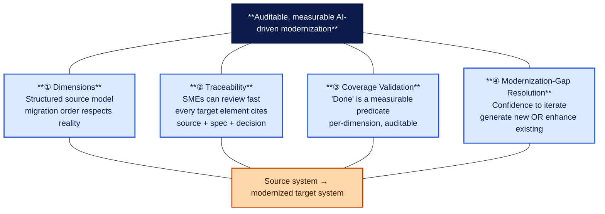
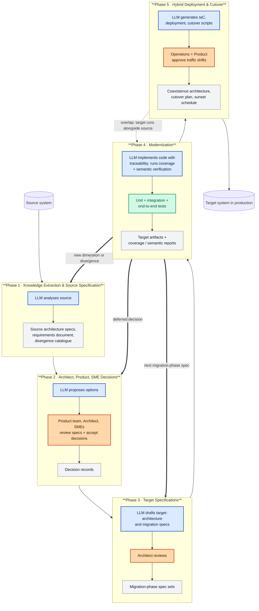
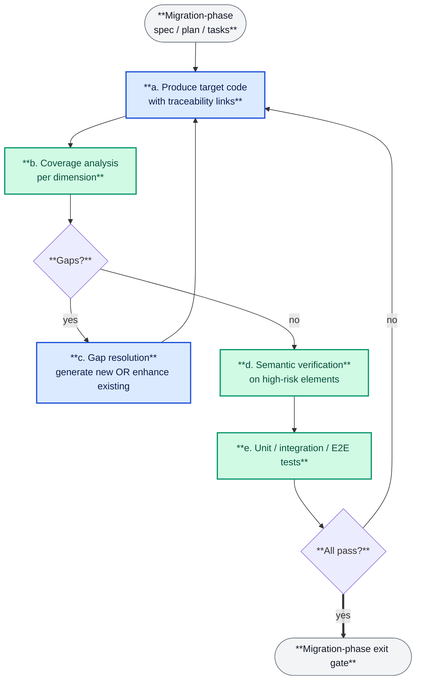
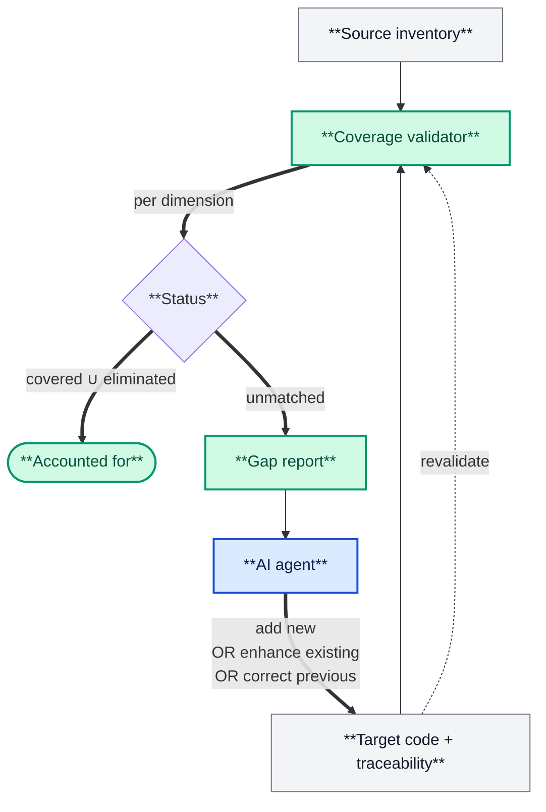
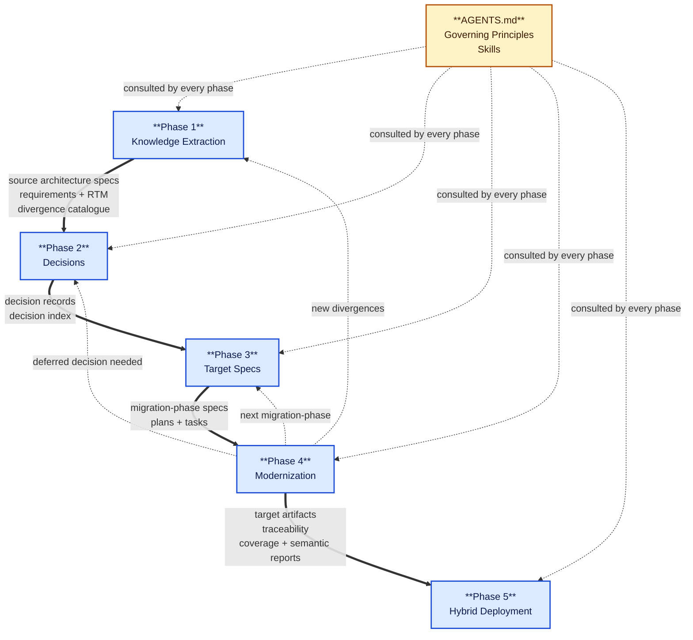

# Image Prompts — Companion to the Article

This file holds the six image prompts referenced as placeholders in
`ai-modernization-architecture-article.md` (`Image 1` … `Image 6`).
It also gives a short, opinionated recommendation on which generation tool
to use for each image.

---

## Tool recommendation

You asked specifically about **2Slides** versus **Nano Banana** (Gemini 2.5 Flash Image).
Short version:

| Tool                                     | Best for in this article            | Why                                                                                                                                                                                                                                                        |
| ---------------------------------------- | ----------------------------------- | ---------------------------------------------------------------------------------------------------------------------------------------------------------------------------------------------------------------------------------------------------------- |
| **2Slides**                              | All technical diagrams (Images 2–6) | Slide-style output, clean typography, consistent colour palette, renders boxes/arrows/tables crisply, accepts structured Mermaid-like input. It is purpose-built for the kind of structured infographics this article needs.                               |
| **Nano Banana** (Gemini 2.5 Flash Image) | The hero cover (Image 1)            | Excellent at conceptual / metaphorical imagery, very strong text integration inside images, supports iterative refinement with a single anchor image, and produces results closer to magazine-cover aesthetic than pure-diagram tools.                     |
| **Alternatives**                         | —                                   | _Midjourney v7_: best hero aesthetics but weak at integrating English text into images; _Flux.1 Pro_: closer to Nano Banana for text-in-image; _DALL-E 3_: middle of the road on both; _Mermaid → PNG_: free baseline if generation tools are unavailable. |

**Concrete plan:**

- **Image 1 (hero cover)** → **Nano Banana**.
- **Images 2–6 (architecture diagrams)** → **2Slides** for the highest quality.
  If 2Slides is not available for a given image, the same prompt works in
  Nano Banana with a slight loss of typographic crispness.

Where helpful, every prompt below carries a short Mermaid block that can be
pasted directly into 2Slides as the structural starting point, plus a free-form
prompt for hero / metaphorical imagery.

---

## Image 1 — Hero cover (Nano Banana)

**Use:** full-page cover on page 1, above the title.

**Prompt:**

```
Editorial magazine cover illustration, conceptual / metaphorical.

Foreground: two software-system silhouettes facing each other across a vertical
gap. On the left, a weathered stone building made of densely-stacked code blocks
in a cool slate-gray palette — this represents a legacy source system. On the
right, the same building reassembled from glowing, semi-transparent blue blocks
that are floating into place from above, organised in clean geometric clusters —
this represents the modernized target system.

Between the two buildings, a fine luminous mesh of horizontal threads connects
each block on the left to one or more blocks on the right; the threads form a
clear, ordered fabric, not a chaotic tangle. Faint glowing labels on a few
threads spell short words: "source", "spec", "decision".

Above the buildings: a soft top-light, like dawn, in warm orange-to-cyan gradient.

Below the buildings: small ground-line silhouettes of a human architect, an SME
with a tablet, and a product owner — visible but not dominant — observing the
transfer.

Style: editorial / Capgemini-magazine, minimal palette (slate, cyan, warm amber
accents), painterly but clean, vector-friendly look, 9:16 portrait orientation
suitable for a full-page magazine cover. No raw code text; thread labels are
the only legible text.
```

**Negative prompt:**

```
no garbled text, no realistic faces, no logos, no UI mockups, no screenshots,
no overly busy detail, no rainbow colours, no random typography
```

---

## Image 2 — The four pillars (2Slides; alt Nano Banana)

**Use:** illustrating the "Four Pillars" section.

**Structure (2Slides input):**



**Stylistic guidance for 2Slides:**

- Render as **four vertical columns / pillars** holding up the dark navy capstone
  ("Auditable, measurable AI-driven modernization") and resting on the orange base
  ("Source → target"). The four boxes are the four pillars in blue.
- Use the colour palette: navy `#0c1c4a`, pillar fill `#dbeafe`, pillar border
  `#1d4ed8`, base fill `#fed7aa`, base border `#c2410c`.
- The pillar numbers (① ② ③ ④) should be large and bold inside each pillar.
- Title above the figure: **"The Four Pillars"**.

**Free-form prompt (if rendering in Nano Banana instead):**

```
Clean editorial infographic: a stylised Greek temple with four blue columns,
each labelled with a circled number ① ② ③ ④. The columns hold up a dark navy
capstone labelled "Auditable, measurable AI-driven modernization", and rest
on a warm-amber base labelled "Source system → modernized target system".
Each column is annotated with a short phrase in clean sans-serif type:
"Dimensions", "Traceability", "Coverage Validation", "Modernization-Gap
Resolution". Minimal, flat, magazine-infographic style; navy / blue / amber
palette; 16:9 horizontal layout. Crisp text rendering.
```

---

## Image 3 — The five phases at a glance (2Slides)

**Use:** main pipeline diagram in the "Pipeline" section.

**Structure (2Slides input — Mermaid):**



**Stylistic guidance for 2Slides:**

- Render top-to-bottom, five subgraph blocks, each titled in bold with the phase number and name.
- Use the colour key:
  - **Blue** (`#dbeafe` fill, `#1d4ed8` border) — LLM / agent work
  - **Orange** (`#fed7aa` fill, `#c2410c` border) — human judgement
  - **Green** (`#d1fae5` fill, `#059669` border) — automated validation
  - **Grey** (`#f3f4f6` fill, `#6b7280` border) — artifacts produced
- Bold thick arrows (`==>`) for the three mid-phase re-entries from Phase 4
  back to Phase 1 / 2 / 3, drawn so the loop is visually obvious.
- Dotted arrow for Phase 5 ↔ Phase 4 overlap.
- Below the diagram, a small colour-legend caption.
- Title above figure: **"The Five Phases at a Glance"**.

---

## Image 4 — The Phase-4 modernization loop (2Slides)

**Use:** inner-loop diagram in the "Phase 4 — Modernization" section.

**Structure (2Slides input):**



**Stylistic guidance:**

- Same colour key as Image 3.
- The two diamonds (`Gaps?` / `All pass?`) should be visually distinct.
- The bold `==>` arrow to "Migration-phase exit gate" should stand out as the success path.
- Title above figure: **"The Phase-4 Modernization Loop"**.

---

## Image 5 — Coverage + Gap Resolution mechanism (2Slides)

**Use:** illustrating "The Core Mechanism" section.

**Structure (2Slides input):**



**Stylistic guidance:**

- This is the article's most important conceptual diagram — give it visual weight.
- Two boxes feed the validator (Source inventory + Target traceability).
- The validator emits two outputs: "Accounted for" and "Gap report".
- "Gap report" routes back into "AI agent" which writes back into "Target code".
- Title above figure: **"The Core Mechanism: Coverage + Gap Resolution Loop"**.
- Below the diagram, a one-line caption: _"The agent is never told to translate
  lines. It is told which source element has not yet been accounted for, and
  decides where it belongs in the target."_

---

## Image 6 — Artifact flow (2Slides)

**Use:** illustrating the reference-project walkthrough section.

**Structure (2Slides input):**



**Stylistic guidance:**

- Five blue phase boxes, vertical chain top to bottom.
- A yellow "AGENTS.md / Governing Principles / Skills" box on the right side,
  with dotted arrows fanning out to all five phases.
- Bold thick arrows for the main flow (`==>`), dotted arrows for re-entries and
  governance consultations.
- Title above figure: **"Artifact Flow Across the Pipeline"**.

---

## Production checklist

Before sending images for layout, double-check the following per image:

- [ ] Title and caption text in image matches the article body verbatim.
- [ ] Colour palette is consistent across Images 2–6 (navy / blue / orange / green / grey / amber-yellow).
- [ ] No legacy logos or screenshots.
- [ ] No raw code text inside figures (use the article body for code samples).
- [ ] Figure proportions: Image 1 = portrait 9:16 for full-page cover;
      Images 2–6 = landscape 16:9 (or 4:3 if the layout calls for it).
- [ ] Bold subgraph / phase headings are visibly bolder than node body text.
- [ ] Every arrow has a label (no unlabelled arrows except the obvious
      sequential chain in Image 3).
