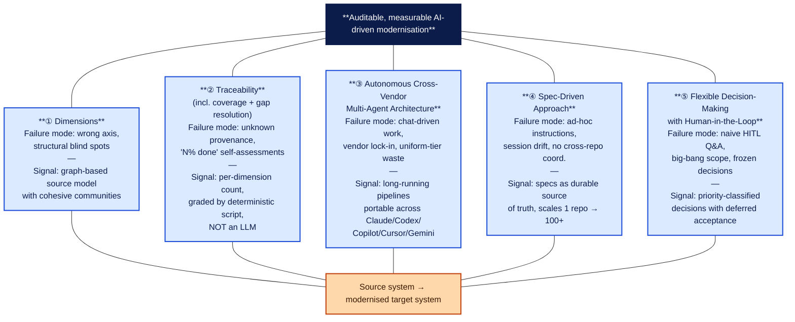
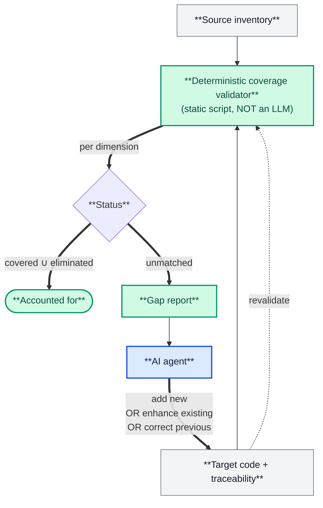
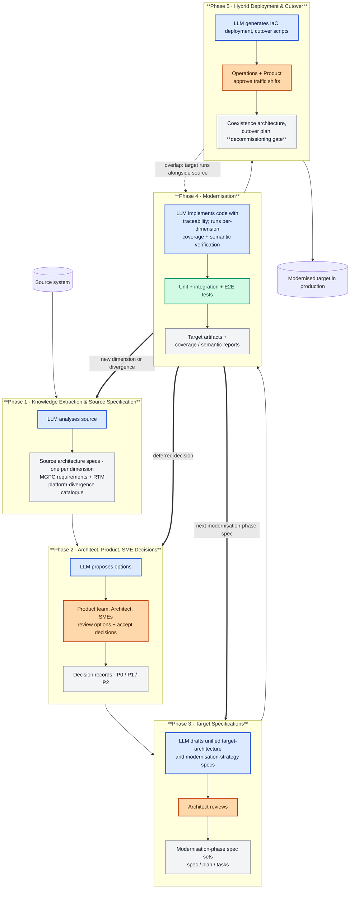
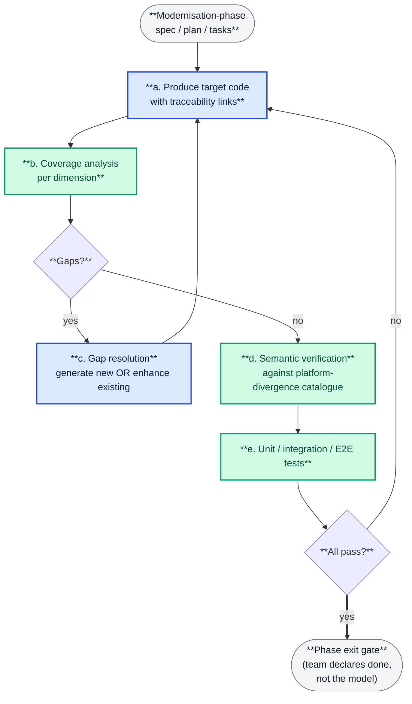
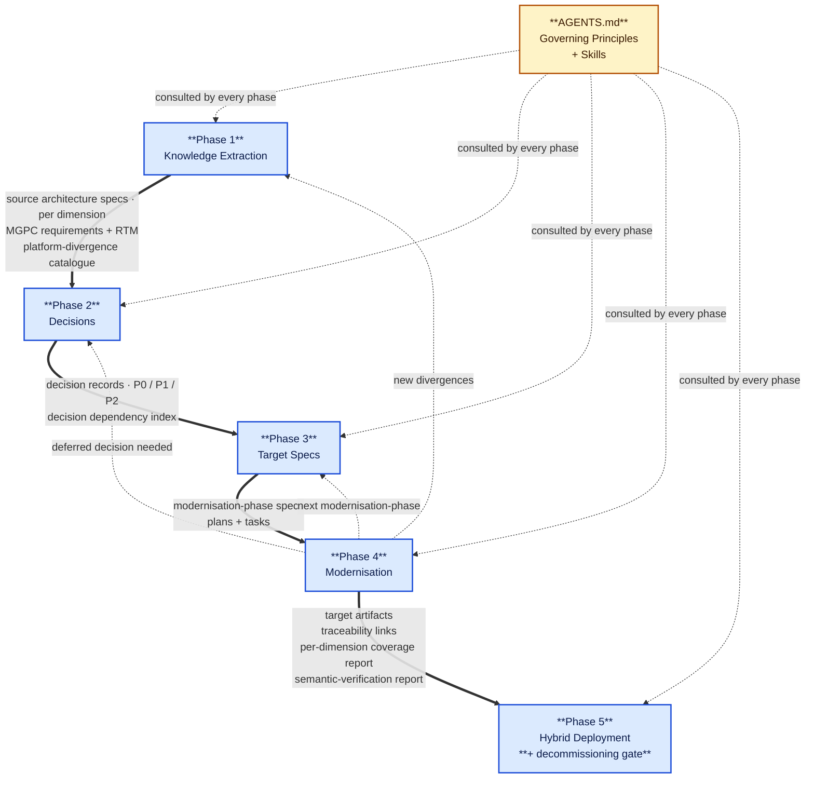

# Image Prompts — Companion to the Article

This file holds the six image prompts referenced as placeholders in
`ai-modernization-architecture-article.md` (`Image 1` … `Image 6`).
It also gives a short, opinionated recommendation on which generation tool
to use for each image.

The article was restructured to broaden its scope (the modernisation
opening now spans Oracle→Postgres, 2PC→Temporal, batch→streaming,
COBOL→AI-assisted refactor, multi-region active-active, SAML→OIDC,
classical→post-quantum crypto, alongside the dev-platform version bumps).
The hazards column became a failure-mode column. The Stakeholder Benefits
table was retired and spread inline. The Core Mechanism diagram now lives
inside Pillar ④. These changes are reflected in the prompts below.

---

## Tool recommendation

| Tool                                     | Best for in this article            | Why                                                                                                                                                                                                                                                        |
| ---------------------------------------- | ----------------------------------- | ---------------------------------------------------------------------------------------------------------------------------------------------------------------------------------------------------------------------------------------------------------- |
| **2Slides**                              | All technical diagrams (Images 2–6) | Slide-style output, clean typography, consistent colour palette, renders boxes/arrows/tables crisply, accepts structured Mermaid-like input. It is purpose-built for the kind of structured infographics this article needs.                               |
| **Nano Banana** (Gemini 2.5 Flash Image) | The hero cover (Image 1)            | Excellent at conceptual / metaphorical imagery, very strong text integration inside images, supports iterative refinement with a single anchor image, and produces results closer to magazine-cover aesthetic than pure-diagram tools.                     |
| **Alternatives**                         | —                                   | _Midjourney v7_: best hero aesthetics but weak at integrating English text into images; _Flux.1 Pro_: closer to Nano Banana for text-in-image; _DALL-E 3_: middle of the road on both; _Mermaid → PNG_: free baseline if generation tools are unavailable. |

**Concrete plan:**

- **Image 1 (hero cover)** → **Nano Banana**.
- **Images 2–6 (architecture diagrams)** → **2Slides** for the highest quality.
  If 2Slides is not available for a given image, the same prompt works in
  Nano Banana with a slight loss of typographic crispness.

Where helpful, every prompt below carries a short Mermaid block that can be
pasted directly into 2Slides as the structural starting point, plus a free-form
prompt for hero / metaphorical imagery.

---

## Image 1 — Hero cover (Nano Banana)

**Use:** full-page cover on page 1, above the title.

**Concept:** the article's modernisation scope has broadened well beyond a
language version bump. The hero must convey that breadth — data, transactions,
streaming, mainframe, deployment topology, security, crypto — not just
"old building → new building." The image is a single coherent transformation
in which multiple modernisation axes are happening at once, each rendered
as a distinct visual motif on the same canvas.

**Prompt:**

```
Editorial magazine cover illustration, conceptual / metaphorical.

Single architectural scene rendered in editorial / Capgemini-magazine style:
a weathered industrial complex on the left, mid-transformation, with each
quadrant of the complex undergoing a different kind of modernisation.

Quadrant top-left: a heavy stone vault representing a monolithic database,
being broken up into a cluster of lighter, glowing data-cubes that drift
into formation as a database-per-service constellation.

Quadrant top-right: a tangled mechanical clockwork of brass gears (two-phase
commits) being replaced by a clean, luminous sequence of saga steps marching
along a horizontal rail — durable execution.

Quadrant bottom-left: a row of overnight cargo carts (batch ETL) being
overtaken by a single continuous river of luminous data flowing into a
crystalline lakehouse structure (Iceberg / Paimon) on the horizon.

Quadrant bottom-right: an old mainframe tower (COBOL) being unwrapped
layer-by-layer by small luminous architect-figures who lay each layer
back down as modern microservice tiles on a cloud-shaped substrate.

Threading through all four quadrants: a fine luminous mesh of horizontal
threads connecting individual blocks on the left side of the scene to one
or more blocks on the right; the threads form a clear, ordered fabric, not
a chaotic tangle. Faint glowing labels on a few threads spell short words:
"source", "spec", "decision".

Above the scene: a soft top-light, like dawn, in warm orange-to-cyan gradient.

Below the scene: small ground-line silhouettes of a human architect, an
SME with a tablet, and a product owner — visible but not dominant —
observing the transfer.

Style: editorial, minimal palette (slate, cyan, warm amber accents),
painterly but clean, vector-friendly look, 9:16 portrait orientation
suitable for a full-page magazine cover. No raw code text; thread labels
are the only legible text.
```

**Negative prompt:**

```
no garbled text, no realistic faces, no logos, no UI mockups, no screenshots,
no overly busy detail, no rainbow colours, no random typography
```

---

## Image 2 — The five pillars (2Slides; alt Nano Banana)

**Use:** illustrating the "Five Pillars" section.

**Note on changes:** the pillars table was restructured. Coverage Validation
and Modernisation-Gap Resolution are no longer separate pillars; they are
sub-disciplines of Pillar ② Traceability. Three new pillars have been added:
Autonomous Cross-Vendor Multi-Agent Architecture, Spec-Driven Approach, and
Flexible Decision-Making with Human-in-the-Loop. The image should reflect
this updated five-column structure.

**Structure (2Slides input):**



**Stylistic guidance for 2Slides:**

- Render as **five vertical columns / pillars** holding up the dark navy
  capstone ("Auditable, measurable AI-driven modernisation") and resting
  on the orange base ("Source → modernised target"). Each column body
  has two stacked sections separated by a thin divider: the failure mode
  on top, the categorical signal on the bottom.
- Use the colour palette: navy `#0c1c4a`, pillar fill `#dbeafe`, pillar
  border `#1d4ed8`, base fill `#fed7aa`, base border `#c2410c`.
- The pillar numbers (① ② ③ ④ ⑤) should be large and bold inside each pillar.
- Title above the figure: **"The Five Pillars"**.

**Free-form prompt (if rendering in Nano Banana instead):**

```
Clean editorial infographic: a stylised classical temple with five blue
columns, each labelled with a circled number ① ② ③ ④ ⑤. The columns hold up
a dark navy capstone labelled "Auditable, measurable AI-driven modernisation",
and rest on a warm-amber base labelled "Source system → modernised target system".
Each column is annotated in two stacked panes — the upper pane states the
failure mode the pillar addresses; the lower pane states the categorical
signal the pillar emits. Short labels in clean sans-serif type: "Dimensions",
"Traceability", "Autonomous Multi-Agent", "Spec-Driven", "Flexible Decisions".
Minimal, flat, magazine-infographic style; navy / blue / amber palette;
16:9 horizontal layout. Crisp text rendering.
```

---

## Image 3 — Coverage + Gap Resolution mechanism (2Slides)

**Use:** illustrating Pillar ② (Traceability sub-disciplines 2.2 and 2.3).

**Note on placement:** this diagram lives inside Pillar ② (Traceability),
illustrating the deterministic coverage validation and gap-resolution loop
that together form the discipline's audit core. Note: the validator is a
**static script, not another LLM** — the diagram should make this visually clear.

**Structure (2Slides input):**



**Stylistic guidance:**

- This is the article's most important conceptual diagram — give it visual weight.
- Two boxes feed the validator (Source inventory + Target traceability).
- The validator emits two outputs: "Accounted for" and "Gap report".
- "Gap report" routes back into "AI agent" which writes back into "Target code".
- Title above figure: **"Pillar ④ — Coverage + Gap Resolution Loop"**.
- Below the diagram, a one-line caption: _"The agent is never told to
  translate lines. It is told which source element has not yet been
  accounted for, and decides where it belongs in the target idiom
  — including generating new code, enhancing existing target code,
  or correcting a previous pass."_

---

## Image 4 — The five phases at a glance (2Slides)

**Use:** main pipeline diagram in the "Pipeline" section.

**Note on changes:** Phase 1 output now explicitly includes the
Mission / Goals / Premises / Constraints (MGPC) requirements document.
Phase 5's terminal output now emphasises the decommissioning gate.
The body of the article uses "modernisation-phase" rather than
"migration-phase" throughout — update all callout labels.

**Structure (2Slides input — Mermaid):**



**Stylistic guidance for 2Slides:**

- Render top-to-bottom, five subgraph blocks, each titled in bold with the phase number and name.
- Use the colour key:
  - **Blue** (`#dbeafe` fill, `#1d4ed8` border) — LLM / agent work
  - **Orange** (`#fed7aa` fill, `#c2410c` border) — human judgement
  - **Green** (`#d1fae5` fill, `#059669` border) — automated validation
  - **Grey** (`#f3f4f6` fill, `#6b7280` border) — artifacts produced
- Bold thick arrows (`==>`) for the three mid-phase re-entries from Phase 4
  back to Phase 1 / 2 / 3, drawn so the loop is visually obvious.
- Dotted arrow for Phase 5 ↔ Phase 4 overlap.
- The Phase 5 artifact box should give visual weight to the
  "decommissioning gate" line — it is the moment the legacy system is
  retired in full and the article's framing turns on it.
- Below the diagram, a small colour-legend caption.
- Title above figure: **"The Five Phases at a Glance"**.

---

## Image 5 — The Phase-4 modernisation loop (2Slides)

**Use:** inner-loop diagram in the "Phase 4 — Modernisation" section.

**Note on changes:** the seven-step loop in the article body is unchanged
in shape; only labels are updated. Step 4 (semantic verification) now
explicitly cross-checks against the platform-divergence catalogue. The
exit-gate label drops the "migration-phase" prefix.

**Structure (2Slides input):**



**Stylistic guidance:**

- Same colour key as Image 4.
- The two diamonds (`Gaps?` / `All pass?`) should be visually distinct.
- The bold `==>` arrow to "Phase exit gate" should stand out as the
  success path. The sub-text _"team declares done, not the model"_ is
  load-bearing for the article's argument and should be clearly legible.
- Title above figure: **"The Phase-4 Modernisation Loop"**.

---

## Image 6 — Artifact flow (2Slides)

**Use:** illustrating "The Architecture and Framework in Practice" section
(the reference engagements walkthrough).

**Note on changes:** Phase 1 artifacts now include MGPC explicitly. Phase 5
emphasises the decommissioning gate. The section title in the article
changed from "From Architecture to Practice" to
"The Architecture and Framework in Practice"; mirror that elevation in
the figure title.

**Structure (2Slides input):**



**Stylistic guidance:**

- Five blue phase boxes, vertical chain top to bottom.
- A yellow "AGENTS.md / Governing Principles + Skills" box on the right
  side, with dotted arrows fanning out to all five phases.
- Bold thick arrows for the main flow (`==>`); dotted arrows for
  re-entries and governance consultations.
- Phase 5's "+ decommissioning gate" sub-label should be visually
  emphasised — it is what allows the steering committee to retire the
  legacy system.
- Title above figure: **"Artifact Flow Across the Pipeline"**.

---

## Production checklist

Before sending images for layout, double-check the following per image:

- [ ] Title and caption text in image matches the article body verbatim
      (including the "Modernisation-Gap Resolution" pillar name and the
      "decommissioning gate" terminology in Phase 5).
- [ ] Colour palette is consistent across Images 2–6 (navy / blue / orange / green / grey / amber-yellow).
- [ ] No legacy logos or screenshots.
- [ ] No raw code text inside figures (use the article body for code samples).
- [ ] Figure proportions: Image 1 = portrait 9:16 for full-page cover;
      Images 2–6 = landscape 16:9 (or 4:3 if the layout calls for it).
- [ ] Bold subgraph / phase headings are visibly bolder than node body text.
- [ ] Every arrow has a label (no unlabelled arrows except the obvious
      sequential chain in Image 4).
- [ ] Image 1 hero conveys the **breadth** of modernisation (data, transactions,
      streaming, mainframe), not just a code-to-code translation metaphor.
- [ ] Image 5 caption clearly states that the **team**, not the model,
      declares the phase done at the exit gate.
- [ ] Image 3 caption emphasises the three modes the agent has at the
      gap-resolution step: generate new, enhance existing, correct previous.
